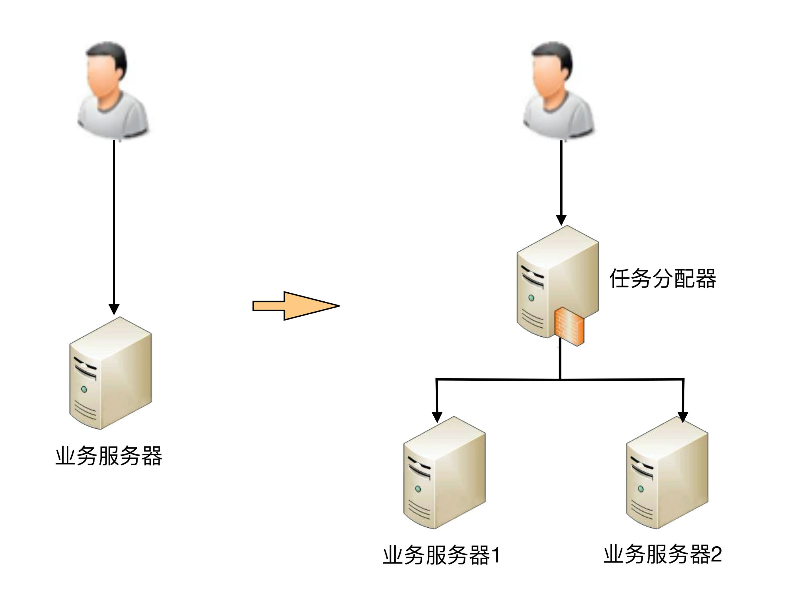
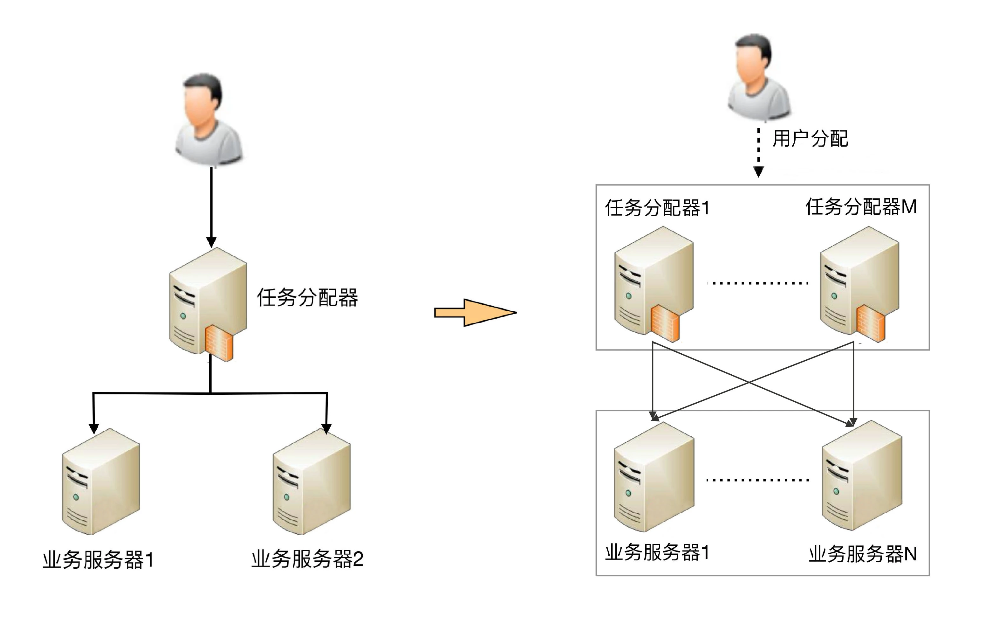
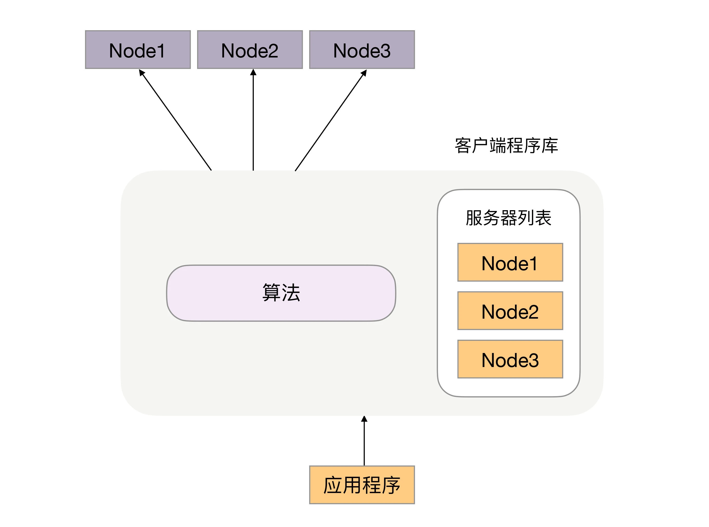
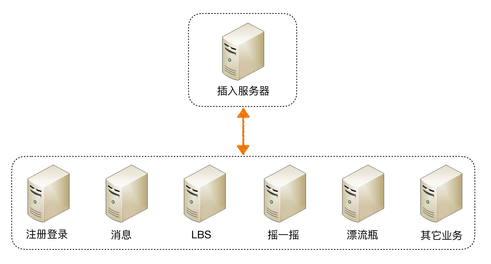
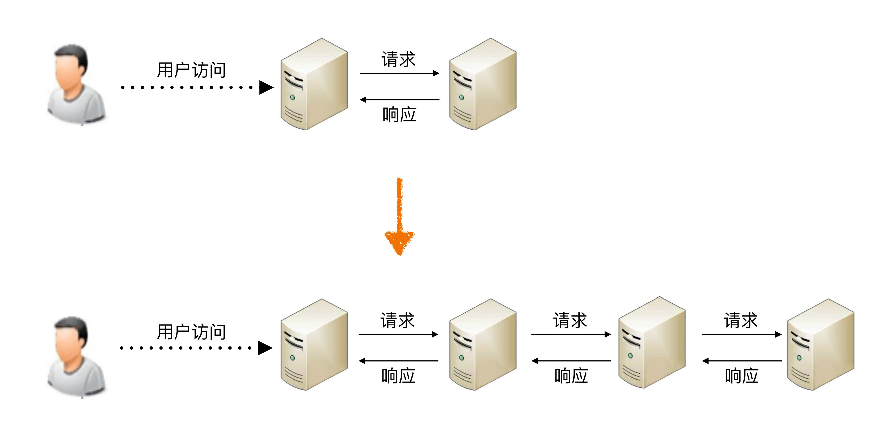

## 原文

周四，我为你讲了架构设计的主要目的是为了解决软件系统复杂度带来的问题。那么从今天开始，我将为你深入分析复杂度的 6 个来源，先来聊聊**复杂度的来源之一高性能**。

对性能孜孜不倦的追求是整个人类技术不断发展的根本驱动力。例如计算机，从电子管计算机到晶体管计算机再到集成电路计算机，运算性能从每秒几次提升到每秒几亿次。但伴随性能越来越高，相应的方法和系统复杂度也是越来越高。现代的计算机 CPU 集成了几亿颗晶体管，逻辑复杂度和制造复杂度相比最初的晶体管计算机，根本不可同日而语。

软件系统也存在同样的现象。最近几十年软件系统性能飞速发展，从最初的计算机只能进行简单的科学计算，到现在 Google 能够支撑每秒几万次的搜索。与此同时，软件系统规模也从单台计算机扩展到上万台计算机；从最初的单用户单工的字符界面 Dos 操作系统，到现在的多用户多工的 Windows 10 图形操作系统。

当然，技术发展带来了性能上的提升，不一定带来复杂度的提升。例如，硬件存储从纸带→磁带→磁盘→SSD，并没有显著带来系统复杂度的增加。因为新技术会逐步淘汰旧技术，这种情况下我们直接用新技术即可，不用担心系统复杂度会随之提升。只有那些并不是用来取代旧技术，而是开辟了一个全新领域的技术，才会给软件系统带来复杂度，因为软件系统在设计的时候就需要在这些技术之间进行判断选择或者组合。就像汽车的发明无法取代火车，飞机的出现也并不能完全取代火车，所以我们在出行的时候，需要考虑选择汽车、火车还是飞机，这个选择的过程就比较复杂了，要考虑价格、时间、速度、舒适度等各种因素。

软件系统中高性能带来的复杂度主要体现在两方面，一方面是**单台计算机内部为了高性能带来的复杂度**；另一方面是**多台计算机集群为了高性能带来的复杂度**。

### 单机复杂度

计算机内部复杂度最关键的地方就是操作系统。计算机性能的发展本质上是由硬件发展驱动的，尤其是 CPU 的性能发展。著名的“摩尔定律”表明了 CPU 的处理能力每隔 18 个月就翻一番；而将硬件性能充分发挥出来的关键就是操作系统，所以操作系统本身其实也是跟随硬件的发展而发展的，操作系统是软件系统的运行环境，操作系统的复杂度直接决定了软件系统的复杂度。

操作系统和性能最相关的就是**进程**和**线程**。最早的计算机其实是没有操作系统的，只有输入、计算和输出功能，用户输入一个指令，计算机完成操作，大部分时候计算机都在等待用户输入指令，这样的处理性能很显然是很低效的，因为人的输入速度是远远比不上计算机的运算速度的。

为了解决手工操作带来的低效，批处理操作系统应运而生。批处理简单来说就是先把要执行的指令预先写下来（写到纸带、磁带、磁盘等），形成一个指令清单，这个指令清单就是我们常说的“任务”，然后将任务交给计算机去执行，批处理操作系统负责读取“任务”中的指令清单并进行处理，计算机执行的过程中无须等待人工手工操作，这样性能就有了很大的提升。

批处理程序大大提升了处理性能，但有一个很明显的缺点：计算机一次只能执行一个任务，如果某个任务需要从 I/O 设备（例如磁带）读取大量的数据，在 I/O 操作的过程中，CPU 其实是空闲的，而这个空闲时间本来是可以进行其他计算的。

为了进一步提升性能，人们发明了“进程”，用进程来对应一个任务，每个任务都有自己独立的内存空间，进程间互不相关，由操作系统来进行调度。此时的 CPU 还没有多核和多线程的概念，为了达到多进程并行运行的目的，采取了分时的方式，即把 CPU 的时间分成很多片段，每个片段只能执行某个进程中的指令。虽然从操作系统和 CPU 的角度来说还是串行处理的，但是由于 CPU 的处理速度很快，从用户的角度来看，感觉是多进程在并行处理。

多进程虽然要求每个任务都有独立的内存空间，进程间互不相关，但从用户的角度来看，两个任务之间能够在运行过程中就进行通信，会让任务设计变得更加灵活高效。否则如果两个任务运行过程中不能通信，只能是 A 任务将结果写到存储，B 任务再从存储读取进行处理，不仅效率低，而且任务设计更加复杂。为了解决这个问题，进程间通信的各种方式被设计出来了，包括管道、消息队列、信号量、共享存储等。

多进程让多任务能够并行处理任务，但本身还有缺点，单个进程内部只能串行处理，而实际上很多进程内部的子任务并不要求是严格按照时间顺序来执行的，也需要并行处理。例如，一个餐馆管理进程，排位、点菜、买单、服务员调度等子任务必须能够并行处理，否则就会出现某个客人买单时间比较长（比如说信用卡刷不出来），其他客人都不能点菜的情况。为了解决这个问题，人们又发明了线程，线程是进程内部的子任务，但这些子任务都共享同一份进程数据。为了保证数据的正确性，又发明了互斥锁机制。有了多线程后，操作系统调度的最小单位就变成了线程，而进程变成了操作系统分配资源的最小单位。

多进程多线程虽然让多任务并行处理的性能大大提升，但本质上还是分时系统，并不能做到时间上真正的并行。解决这个问题的方式显而易见，就是让多个 CPU 能够同时执行计算任务，从而实现真正意义上的多任务并行。目前这样的解决方案有 3 种：SMP（Symmetric Multi-Processor，对称多处理器结构）、NUMA（Non-Uniform Memory Access，非一致存储访问结构）、MPP（Massive Parallel Processing，海量并行处理结构）。其中 SMP 是我们最常见的，目前流行的多核处理器就是 SMP 方案。

操作系统发展到现在，如果我们要完成一个高性能的软件系统，需要考虑如多进程、多线程、进程间通信、多线程并发等技术点，而且这些技术**并不是最新的就是最好的，也不是非此即彼的选择**。在做架构设计的时候，需要花费很大的精力来结合业务进行分析、判断、选择、组合，这个过程同样很复杂。举一个最简单的例子：Nginx 可以用多进程也可以用多线程，JBoss 采用的是多线程；Redis 采用的是单进程，Memcache 采用的是多线程，这些系统都实现了高性能，但内部实现差异却很大。

### 集群的复杂度

虽然计算机硬件的性能快速发展，但和业务的发展速度相比，还是小巫见大巫了，尤其是进入互联网时代后，业务的发展速度远远超过了硬件的发展速度。例如：

+ 2016 年“双 11”支付宝每秒峰值达 12 万笔支付。
+ 2017 年春节微信红包收发红包每秒达到 76 万个。

要支持支付和红包这种复杂的业务，单机的性能无论如何是无法支撑的，必须采用机器集群的方式来达到高性能。例如，支付宝和微信这种规模的业务系统，后台系统的机器数量都是万台级别的。

通过大量机器来提升性能，并不仅仅是增加机器这么简单，让多台机器配合起来达到高性能的目的，是一个复杂的任务，我针对常见的几种方式简单分析一下。1

1. 任务分配

任务分配的意思是指每台机器都可以处理完整的业务任务，不同的任务分配到不同的机器上执行。

我从最简单的一台服务器变两台服务器开始，来讲任务分配带来的复杂性，整体架构示意图如下。

从图中可以看到，1 台服务器演变为 2 台服务器后，架构上明显要复杂多了，主要体现在：

+ 需要增加一个任务分配器，这个分配器可能是硬件网络设备（例如，F5、交换机等），可能是软件网络设备（例如，LVS），也可能是负载均衡软件（例如，Nginx、HAProxy），还可能是自己开发的系统。选择合适的任务分配器也是一件复杂的事情，需要综合考虑性能、成本、可维护性、可用性等各方面的因素。
+ 任务分配器和真正的业务服务器之间有连接和交互（即图中任务分配器到业务服务器的连接线），需要选择合适的连接方式，并且对连接进行管理。例如，连接建立、连接检测、连接中断后如何处理等。
+ 任务分配器需要增加分配算法。例如，是采用轮询算法，还是按权重分配，又或者按照负载进行分配。如果按照服务器的负载进行分配，则业务服务器还要能够上报自己的状态给任务分配器。

这一大段描述，即使你可能还看不懂，但也应该感受到其中的复杂度了，更何况还要真正去实践和实现。

上面这个架构只是最简单地增加 1 台业务机器，我们假设单台业务服务器每秒能够处理 5000 次业务请求，那么这个架构理论上能够支撑 10000 次请求，实际上的性能一般按照 8 折计算，大约是 8000 次左右。

如果我们的性能要求继续提高，假设要求每秒提升到 10 万次，上面这个架构会出现什么问题呢？是不是将业务服务器增加到 25 台就可以了呢？显然不是，因为随着性能的增加，任务分配器本身又会成为性能瓶颈，当业务请求达到每秒 10 万次的时候，单台任务分配器也不够用了，任务分配器本身也需要扩展为多台机器，这时的架构又会演变成这个样子。

这个架构比 2 台业务服务器的架构要复杂，主要体现在：

+ 任务分配器从 1 台变成了多台（对应图中的任务分配器 1 到任务分配器 M），这个变化带来的复杂度就是需要将不同的用户分配到不同的任务分配器上（即图中的虚线“用户分配”部分），常见的方法包括 DNS 轮询、智能 DNS、CDN（Content Delivery Network，内容分发网络）、GSLB 设备（Global Server Load Balance，全局负载均衡）等。
+ 任务分配器和业务服务器的连接从简单的“1 对多”（1 台任务分配器连接多台业务服务器）变成了“多对多”（多台任务分配器连接多台业务服务器）的网状结构。
+ 机器数量从 3 台扩展到 30 台（一般任务分配器数量比业务服务器要少，这里我们假设业务服务器为 25 台，任务分配器为 5 台），状态管理、故障处理复杂度也大大增加。

上面这两个例子都是以业务处理为例，实际上“任务”涵盖的范围很广，**可以指完整的业务处理，也可以单指某个具体的任务**。例如，“存储”“运算”“缓存”等都可以作为一项任务，因此存储系统、运算系统、缓存系统都可以按照任务分配的方式来搭建架构。此外，“任务分配器”也并不一定只能是物理上存在的机器或者一个独立运行的程序，也可以是嵌入在其他程序中的算法，例如 Memcache 的集群架构。

2. 任务分解

通过任务分配的方式，我们能够突破单台机器处理性能的瓶颈，通过增加更多的机器来满足业务的性能需求，但如果业务本身也越来越复杂，单纯只通过任务分配的方式来扩展性能，收益会越来越低。例如，业务简单的时候 1 台机器扩展到 10 台机器，性能能够提升 8 倍（需要扣除机器群带来的部分性能损耗，因此无法达到理论上的 10 倍那么高），但如果业务越来越复杂，1 台机器扩展到 10 台，性能可能只能提升 5 倍。造成这种现象的主要原因是业务越来越复杂，单台机器处理的性能会越来越低。为了能够继续提升性能，我们需要采取第二种方式：**任务分解**。

继续以上面“任务分配”中的架构为例，“业务服务器”如果越来越复杂，我们可以将其拆分为更多的组成部分，我以微信的后台架构为例。

通过上面的架构示意图可以看出，微信后台架构从逻辑上将各个子业务进行了拆分，包括：接入、注册登录、消息、LBS、摇一摇、漂流瓶、其他业务（聊天、视频、朋友圈等）。

通过这种任务分解的方式，能够把原来大一统但复杂的业务系统，拆分成小而简单但需要多个系统配合的业务系统。从业务的角度来看，任务分解既不会减少功能，也不会减少代码量（事实上代码量可能还会增加，因为从代码内部调用改为通过服务器之间的接口调用），那为何通过任务分解就能够提升性能呢？

主要有几方面的因素：

+ **简单的系统更加容易做到高性能**

系统的功能越简单，影响性能的点就越少，就更加容易进行有针对性的优化。而系统很复杂的情况下，首先是比较难以找到关键性能点，因为需要考虑和验证的点太多；其次是即使花费很大力气找到了，修改起来也不容易，因为可能将 A 关键性能点提升了，但却无意中将 B 点的性能降低了，整个系统的性能不但没有提升，还有可能会下降。

+ **可以针对单个任务进行扩展**

当各个逻辑任务分解到独立的子系统后，整个系统的性能瓶颈更加容易发现，而且发现后只需要针对有瓶颈的子系统进行性能优化或者提升，不需要改动整个系统，风险会小很多。以微信的后台架构为例，如果用户数增长太快，注册登录子系统性能出现瓶颈的时候，只需要优化登录注册子系统的性能（可以是代码优化，也可以简单粗暴地加机器），消息逻辑、LBS 逻辑等其他子系统完全不需要改动。

既然将一个大一统的系统分解为多个子系统能够提升性能，那是不是划分得越细越好呢？例如，上面的微信后台目前是 7 个逻辑子系统，如果我们把这 7 个逻辑子系统再细分，划分为 100 个逻辑子系统，性能是不是会更高呢？

其实不然，这样做性能不仅不会提升，反而还会下降，最主要的原因是如果系统拆分得太细，为了完成某个业务，系统间的调用次数会呈指数级别上升，而系统间的调用通道目前都是通过网络传输的方式，性能远比系统内的函数调用要低得多。我以一个简单的图示来说明。

从图中可以看到，当系统拆分 2 个子系统的时候，用户访问需要 1 次系统间的请求和 1 次响应；当系统拆分为 4 个子系统的时候，系统间的请求次数从 1 次增长到 3 次；假如继续拆分下去为 100 个子系统，为了完成某次用户访问，系统间的请求次数变成了 99 次。

为了描述简单，我抽象出来一个最简单的模型：假设这些系统采用 IP 网络连接，理想情况下一次请求和响应在网络上耗费为 1ms，业务处理本身耗时为 50ms。我们也假设系统拆分对单个业务请求性能没有影响，那么系统拆分为 2 个子系统的时候，处理一次用户访问耗时为 51ms；而系统拆分为 100 个子系统的时候，处理一次用户访问耗时竟然达到了 149ms。

虽然系统拆分可能在某种程度上能提升业务处理性能，但提升性能也是有限的，不可能系统不拆分的时候业务处理耗时为 50ms，系统拆分后业务处理耗时只要 1ms，因为最终决定业务处理性能的还是业务逻辑本身，业务逻辑本身没有发生大的变化下，理论上的性能是有一个上限的，系统拆分能够让性能逼近这个极限，但无法突破这个极限。因此，任务分解带来的性能收益是有一个度的，并不是任务分解越细越好，而对于架构设计来说，如何把握这个粒度就非常关键了。

### 小结

今天我给你讲了软件系统中高性能带来的复杂度主要体现的两方面，一是单台计算机内部为了高性能带来的复杂度；二是多台计算机集群为了高性能带来的复杂度，希望对你有所帮助。

这就是今天的全部内容，留一道思考题给你吧。你所在的业务体系中，高性能的系统采用的是哪种方式？目前是否有改进和提升的空间？

## 读者观点

> **三军:**
面试官: 小伙子，说下进程和线程？
我:
1， 早期的计算机是没有操作系统的，只有输入，计算，输出。手工输入速度远低于计算机的计算速度。
2， 于是出现了批处理操作系统，通过纸带，磁带等工具预先写入指令，形成一个指令清单（即任务）交给计算机处理。但批处理系统的缺点是只能有一个任务，而且当计算机在进行I/O处理时，CPU是空闲的。
3， 世人发明了进程，一个进程就代表一个任务，多个进程通过分时操作能让用户认为并行操作多任务，进程间的资源是独立单元，但是可以通过介质进行通信。缺点：进程内只进行串行处理，无法很好地分工合作提高处理效率。
4， 于是就有了操作系统调度的最小单元-线程，线程能够使进程内的子任务能够共享进程内的资源，并并行工作，大大提高操作系统的性能。
区别：
线程是任务调度的最小单元，共用进程内的资源。
进程是资源分配的最小单元，与其他进程资源互相独立。

> **loveluckystar:**
之前我们的系统是all-in的单系统模式，虽然水平扩展了大量机器，但是仍然存在性能问题，比如类似秒杀之类的活动，几乎会在瞬间把整个系统的数据库连接耗尽，导致其他服务发生卡顿甚至不可用；并且全在一个业务系统中，开发部属效率极低，扩展性也存在问题。
于是我们将系统进行了拆分，起初是按照业务拆分成几个核心系统，同时针对不同业务的负载情况进行了合理的水平扩展，整个系统的性能得到了提升，扩展性得到了保证，并且开发部署效率也得到了极大的提高。
但是随着业务的发展，之前的系统拆分不能满足现有业务，同时随着公司很多老员工的离开，之前的架构设计思路没有人清楚，于是就变成了走一步看一步的推进模式，衍生出了各种独立的服务达40个左右，这样系统之间的边界越来越模糊，甚至出现了服务间的循环调用，白白浪费时间。而且一次调用链路过长，发生问题很难定位。
所以我觉得我们的系统就是一个活生生的，没有搞好架构设计的例子，前期是没有设计导致性能瓶颈，后期是过度设计导致系统复杂。

> **Sean:**
架构无处不在，生活中也有很多例子。就比如去快餐厅去吃饭，涉及的任务就有打饭，选菜，付款，找座位。
普通的快餐厅，比如**缘，就是单线程，所有必须排队进行，最原始的系统架构。所以你会发现效率低，通常会拍队列，体验就不好。
而去**王吃饭，进去就有一个引导员(负载均衡)，提前帮你分配座位，发点餐单，而且有多个引导员同时工作(负载均衡集群)，而且各种菜系可以同时进行(并行)。另外一些需要等待的菜，会让你边吃边等(异步)。所以看上去人好多，很少有在排队的现象。可见，这位老板也是位不错的架构师。

> **作者:**
单台服务器性能打八折.经验值，而且很多时候还达不到这个值

## 我的观点