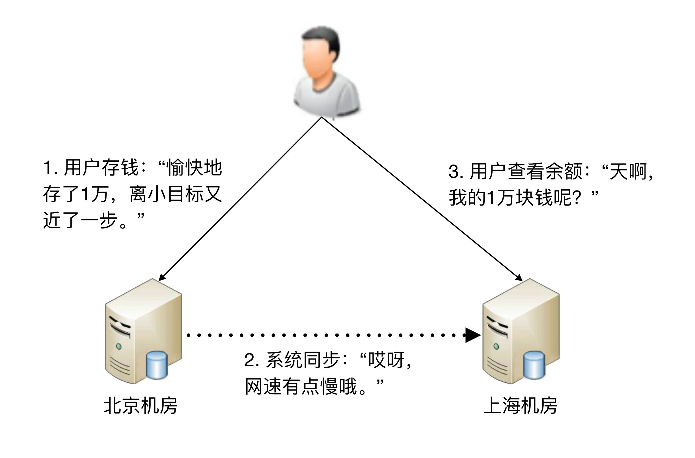

## 原文

今天，我们聊聊复杂度的第二个来源**高可用**。

参考维基百科，先来看看高可用的定义。

> 系统无中断地执行其功能的能力，代表系统的可用性程度，是进行系统设计时的准则之一。

这个定义的关键在于“**无中断**”，但恰好难点也在“无中断”上面，因为无论是单个硬件还是单个软件，都不可能做到无中断，硬件会出故障，软件会有 bug；硬件会逐渐老化，软件会越来越复杂和庞大……

除了硬件和软件本质上无法做到“无中断”，外部环境导致的不可用更加不可避免、不受控制。例如，断电、水灾、地震，这些事故或者灾难也会导致系统不可用，而且影响程度更加严重，更加难以预测和规避。

所以，系统的高可用方案五花八门，但万变不离其宗，**本质上都是通过“冗余”来实现高可用**。通俗点来讲，就是一台机器不够就两台，两台不够就四台；一个机房可能断电，那就部署两个机房；一条通道可能故障，那就用两条，两条不够那就用三条（移动、电信、联通一起上）。高可用的“冗余”解决方案，单纯从形式上来看，和之前讲的高性能是一样的，都是通过增加更多机器来达到目的，但其实本质上是有根本区别的：**高性能增加机器目的在于“扩展”处理性能；高可用增加机器目的在于“冗余”处理单元**。

通过冗余增强了可用性，但同时也带来了复杂性，我会根据不同的应用场景逐一分析。

### 计算高可用

这里的“计算”指的是业务的逻辑处理。计算有一个特点就是**无论在哪台机器上进行计算，同样的算法和输入数据，产出的结果都是一样的**，所以将计算从一台机器迁移到另外一台机器，对业务并没有什么影响。既然如此，计算高可用的复杂度体现在哪里呢？我以最简单的单机变双机为例进行分析。先来看一个单机变双机的简单架构示意图。

你可能会发现，这个双机的架构图和上期“高性能”讲到的双机架构图是一样的，因此复杂度也是类似的，具体表现为：

+ 需要增加一个任务分配器，选择合适的任务分配器也是一件复杂的事情，需要综合考虑性能、成本、可维护性、可用性等各方面因素。
+ 任务分配器和真正的业务服务器之间有连接和交互，需要选择合适的连接方式，并且对连接进行管理。例如，连接建立、连接检测、连接中断后如何处理等。
+ 任务分配器需要增加分配算法。例如，常见的双机算法有主备、主主，主备方案又可以细分为冷备、温备、热备。

上面这个示意图只是简单的双机架构，我们再看一个复杂一点的高可用集群架构。

这个高可用集群相比双机来说，分配算法更加复杂，可以是 1 主 3 备、2 主 2 备、3 主 1 备、4 主 0 备，具体应该采用哪种方式，需要结合实际业务需求来分析和判断，并不存在某种算法就一定优于另外的算法。例如，ZooKeeper 采用的就是 1 主多备，而 Memcached 采用的就是全主 0 备。

### 存储高可用

对于需要存储数据的系统来说，整个系统的高可用设计关键点和难点就在于“存储高可用”。存储与计算相比，有一个本质上的区别：**将数据从一台机器搬到到另一台机器，需要经过线路进行传输**。线路传输的速度是毫秒级别，同一机房内部能够做到几毫秒；分布在不同地方的机房，传输耗时需要几十甚至上百毫秒。例如，从广州机房到北京机房，稳定情况下 ping 延时大约是 50ms，不稳定情况下可能达到 1s 甚至更多。

虽然毫秒对于人来说几乎没有什么感觉，但是对于高可用系统来说，就是本质上的不同，这意味着整个系统在某个时间点上，数据肯定是不一致的。按照“**数据 + 逻辑 = 业务**”这个公式来套的话，数据不一致，即使逻辑一致，最后的业务表现就不一样了。以最经典的银行储蓄业务为例，假设用户的数据存在北京机房，用户存入了 1 万块钱，然后他查询的时候被路由到了上海机房，北京机房的数据没有同步到上海机房，用户会发现他的余额并没有增加 1 万块。想象一下，此时用户肯定会背后一凉，马上会怀疑自己的钱被盗了，然后赶紧打客服电话投诉，甚至打 110 报警，即使最后发现只是因为传输延迟导致的问题，站在用户的角度来说，这个过程的体验肯定很不好。

除了物理上的传输速度限制，传输线路本身也存在可用性问题，传输线路可能中断、可能拥塞、可能异常（错包、丢包），并且传输线路的故障时间一般都特别长，短的十几分钟，长的几个小时都是可能的。例如，2015 年支付宝因为光缆被挖断，业务影响超过 4 个小时；2016 年中美海底光缆中断 3 小时等。在传输线路中断的情况下，就意味着存储无法进行同步，在这段时间内整个系统的数据是不一致的。

综合分析，无论是正常情况下的传输延迟，还是异常情况下的传输中断，都会导致系统的数据在某个时间点或者时间段是不一致的，而数据的不一致又会导致业务问题；但如果完全不做冗余，系统的整体高可用又无法保证，所以**存储高可用的难点不在于如何备份数据，而在于如何减少或者规避数据不一致对业务造成的影响**。

分布式领域里面有一个著名的 CAP 定理，从理论上论证了存储高可用的复杂度。也就是说，存储高可用不可能同时满足“一致性、可用性、分区容错性”，最多满足其中两个，这就要求我们在做架构设计时结合业务进行取舍。

### 高可用状态决策

无论是计算高可用还是存储高可用，其基础都是“**状态决策**”，即系统需要能够判断当前的状态是正常还是异常，如果出现了异常就要采取行动来保证高可用。如果状态决策本身都是有错误或者有偏差的，那么后续的任何行动和处理无论多么完美也都没有意义和价值。但在具体实践的过程中，恰好存在一个本质的矛盾：**通过冗余来实现的高可用系统，状态决策本质上就不可能做到完全正确**。下面我基于几种常见的决策方式进行详细分析。

1. 独裁式

独裁式决策指的是存在一个独立的决策主体，我们姑且称它为“决策者”，负责收集信息然后进行决策；所有冗余的个体，我们姑且称它为“上报者”，都将状态信息发送给决策者。

独裁式的决策方式不会出现决策混乱的问题，因为只有一个决策者，但问题也正是在于只有一个决策者。当决策者本身故障时，整个系统就无法实现准确的状态决策。如果决策者本身又做一套状态决策，那就陷入一个递归的死循环了。

2. 协商式

协商式决策指的是两个独立的个体通过交流信息，然后根据规则进行决策，最常用的协商式决策就是主备决策。

这个架构的基本协商规则可以设计成：

+ 2 台服务器启动时都是备机。
+ 2 台服务器建立连接。
+ 2 台服务器交换状态信息。
+ 某 1 台服务器做出决策，成为主机；另一台服务器继续保持备机身份。

协商式决策的架构不复杂，规则也不复杂，其难点在于，如果两者的信息交换出现问题（比如主备连接中断），此时状态决策应该怎么做。

+ 如果备机在连接中断的情况下认为主机故障，那么备机需要升级为主机，但实际上此时主机并没有故障，那么系统就出现了两个主机，这与设计初衷（1 主 1 备）是不符合的。

+ 如果备机在连接中断的情况下不认为主机故障，则此时如果主机真的发生故障，那么系统就没有主机了，这同样与设计初衷（1 主 1 备）是不符合的。

+ 如果为了规避连接中断对状态决策带来的影响，可以增加更多的连接。例如，双连接、三连接。这样虽然能够降低连接中断对状态带来的影响（注意：只能降低，不能彻底解决），但同时又引入了这几条连接之间信息取舍的问题，即如果不同连接传递的信息不同，应该以哪个连接为准？实际上这也是一个无解的答案，无论以哪个连接为准，在特定场景下都可能存在问题。

综合分析，协商式状态决策在某些场景总是存在一些问题的。

3. 民主式

民主式决策指的是多个独立的个体通过投票的方式来进行状态决策。例如，ZooKeeper 集群在选举 leader 时就是采用这种方式。

民主式决策和协商式决策比较类似，其基础都是独立的个体之间交换信息，每个个体做出自己的决策，然后按照“**多数取胜**”的规则来确定最终的状态。不同点在于民主式决策比协商式决策要复杂得多，ZooKeeper 的选举算法 ZAB，绝大部分人都看得云里雾里，更不用说用代码来实现这套算法了。

除了算法复杂，民主式决策还有一个固有的缺陷：脑裂。这个词来源于医学，指人体左右大脑半球的连接被切断后，左右脑因为无法交换信息，导致各自做出决策，然后身体受到两个大脑分别控制，会做出各种奇怪的动作。例如：当一个脑裂患者更衣时，他有时会一只手将裤子拉起，另一只手却将裤子往下脱。脑裂的根本原因是，原来统一的集群因为连接中断，造成了两个独立分隔的子集群，每个子集群单独进行选举，于是选出了 2 个主机，相当于人体有两个大脑了。

从图中可以看到，正常状态的时候，节点 5 作为主节点，其他节点作为备节点；当连接发生故障时，节点 1、节点 2、节点 3 形成了一个子集群，节点 4、节点 5 形成了另外一个子集群，这两个子集群的连接已经中断，无法进行信息交换。按照民主决策的规则和算法，两个子集群分别选出了节点 2 和节点 5 作为主节点，此时整个系统就出现了两个主节点。这个状态违背了系统设计的初衷，两个主节点会各自做出自己的决策，整个系统的状态就混乱了。

为了解决脑裂问题，民主式决策的系统一般都采用“投票节点数必须超过系统总节点数一半”规则来处理。如图中那种情况，节点 4 和节点 5 形成的子集群总节点数只有 2 个，没有达到总节点数 5 个的一半，因此这个子集群不会进行选举。这种方式虽然解决了脑裂问题，但同时降低了系统整体的可用性，即如果系统不是因为脑裂问题导致投票节点数过少，而真的是因为节点故障（例如，节点 1、节点 2、节点 3 真的发生了故障），此时系统也不会选出主节点，整个系统就相当于宕机了，尽管此时还有节点 4 和节点 5 是正常的。

综合分析，无论采取什么样的方案，状态决策都不可能做到任何场景下都没有问题，但完全不做高可用方案又会产生更大的问题，如何选取适合系统的高可用方案，也是一个复杂的分析、判断和选择的过程。

### 小结

今天我给你讲了复杂度来源之一的高可用，分析了计算高可用和存储高可用两个场景，给出了几种高可用状态决策方式，希望对你有所帮助。

这就是今天的全部内容，留一道思考题给你吧。高性能和高可用是很多系统的核心复杂度，你认为哪个会更复杂一些？理由是什么？

## 读者观点

**公号-技术夜未眠：**
今日心得

需求驱动驱动；而高可用与高性能，是架构设计中两个非常重要的决策因素。因此，面对不同业务系统的不同需求，对高可用与高性能也会有不同的决策结论，其实现的复杂度也各不相同。支付宝业务，对于可用性和性能就会有很高的要求，在可用性方面希望能提供7＊24不间断服务，在高性能方面则希望能实时收付款；而对于一个学生管理系统，在可用性与性能方面就不一定要有多高的要求，比如晚上可关机，几秒内能查询到信息也可接受。为此，高可用性与高性能的复杂度讨论需要结合业务需求。

1 WHAT - 什么是可用性？
定义可用性，可以先定义什么是不可用。需要经历若干环节，网站的页面才能呈现在最终的用户面前；而其中的任何一个环节出现了故障，都可能会导致网站的页面不可访问，也就是出现了网站不可用的情况。昨夜iOS版本QQ出现大面积闪退就是一个系统不可用的典型案例。

我们可以利用百分比来对网站可用性进行度量：
网站不可用时间=完成故障修复的时间点 - 故障发现的时间点
网站年度可用时间=年度总时间 - 网站不可用时间
网站年度可用性=(网站年度可用时间/年度总时间) x 100%

举例：一些知名大型网站的可用性可达到99.99%（俗称4个9），我们可以算一下一年下来留给处理故障的时间有多少？
年度总时间=365*24*60=525600分钟
网站不可用时间=525600*(1-99.99%)=52.56分钟
也就是，如果网站要达到4个9的可用性，一年下来网站不可用时间最多53分钟（也就是不足1个小时）。

可见，高可用性就是技术实力的象征，高可用性就是竞争力。

2 WHY - 为什么会出现不可用？
硬件故障。网站多运行在普通的商用服务器，而这些服务器本身就不具备高可用性，再加之网站系统背后有数量众多服务器，那么一定时间内服务器宕机是大概率事件，直接导致部署在该服务器上的服务受影响。

软件BUG或网站更新升级发布。BUG不能消灭，只能减少；上线后的系统在运行过程中，难免会出现故障，而这些故障同样直接导致某些网站服务不可用；此外，网站更新升级发布也会引起相对较频繁的服务器宕机。

不可抗拒力。如地震、水灾、战争等。

3 HOW - 如何做到高可用
核心思想：网站高可用的主要技术手段是服务与数据的冗余备份与失效转移。同一服务组件部署在多台服务器上；数据存储在多台服务器上互相备份。通过上述技术手段，当任何一台服务器宕机或出现各种不可预期的问题时，就将相应的服务切换到其他可用的服务器上，不影响系统的整体可用性，也不会导致数据丢失。

从架构角度看可用性：当前网站系统多采用经典的分层模型，从上到下为：应用层、服务层与数据层。应用层主要实现业务逻辑处理；服务层提供可复用的服务；数据层负责数据读写；在部署架构上常采用应用和数据分离部署，应用会部署到不同服务器上，这些服务器被称为应用层的服务器；这些可复用的服务也会各自部署在不同服务器上，称为服务层的服务器；而各类数据库系统、文件柜等数据则部署在数据层的服务器。

硬件故障方面引起不可用的技术解决措施：(1)应用服务器。可通过负载均衡设备将多个应用服务器构建为集群对外提供服务（前提是这些服务需要设计为无状态，即应用服务器不保存业务的上下文信息，而仅根据每次请求提交的数据进行业务逻辑的操作响应），当均衡设备通过心跳检测手段检测到应用服务器不可用时，则将其从集群中移除，并将请求切换到其他可用的应用服务上。(2)服务层服务器。这些服务器被应用层通过分布式服务框架（如Dubbo）访问，分布式服务框架可在应用层客户端程序中实现软件负载均衡，并通过服务注册中心提供服务的服务器进行心跳检测，当发现有服务器不可用时，立即通知客户端程序修改服务列表，同时移除响应的服务器。(3)数据服务器。需要在数据写入时进行数据同步复制，将数据写入多台服务器上，实现数据冗余备份；当数据服务器宕机时，应用程序将访问切换到有备份数据的服务器上。

软件方面引起不可用的技术解决措施：通过软件开发过程进行质量保证。通过预发布验证、严格测试、灰度发布等手段，尽量减少上线服务的故障。

**作者**：
通常情况下，高可用要复杂一些，因为需要考虑的情景很多，而且没有完美的方案，只能做取舍。没有完美的高可用方案

**bieber：**
高可用的解决方法不是解决，而是减少或者规避，而规避某个问题的时候，一般都会引发另一个问题，只是这个问题比之前的小，高可用的设计过程其实也是一个取舍的过程。这也就是为什么系统可用性永远只是说几个九，永远缺少那个一。
而高性能，这个基本上就是定义计算能力，可以通过架构的优化，算法的改进，硬件的升级都可以得到很好的解决，从而达到我们心里对性能的预期…

**小超在努力：**
古人有言：先解决有无，再解决优化。所以可用更难，性能次之，找对象同理。

**性能：**
老师，银行账务类强一致性业务，适用最终一致性方案吗？我们通常要求既要实时看到账务操作结果，又要提供高性能，最终只能用依赖于数据库实现一致性，但性能压力很大
> 作者回复: 强一致性目前没有太好的方式，目前一般采取用户分区的做法，即：将用户分散在多个数据分区中，每个数据分区中的用户用单点数据库保证强一致性

**A李文:**
冷备、温备、热备的具体区别是
> 作者回复: 冷备：系统没启动 温备：系统启动，但是没法接管业务 热备：系统启动，随时可以接管业务

**云学:**
有些人把高可用与高可靠混淆了，高可用是不要中断服务，高可靠是数据不丢失。
>作者回复: 有区别，但实践中一般很难清晰的区分，否则每次都要解释半天，我们一般都是混用，大家都明白是什么意思。严格来说，高可用是指正常提供服务的概率，主要和故障恢复时间有关；高可靠是指出问题的概率，主要和故障次数有关。大部分情况下其实我们都是说可用性，因为保证系统能够正常提供服务才是我们的首要目标。

**Geek_d8f635：**
区块链技术如果越来越成熟，是不是对高性能有很大帮助？
> 作者回复: 据我目前对区块链的理解来看，区块链恰恰是性能低下的实现方案，不但没有帮助，还会存在明显的性能问题

**Geek_88604f:**
本质上高可用更难。到目前为止业界还没有办法明确度量到底能达到几个9。你交付给我一个系统，你可以说达到了3个9或4个9，我怎么能相信你呢？反之性能指标是可以很快就能实测出来的。

一般地讲，高可用和高性能就像列车的两条轨道共同进退。一方面为了实现数据库的高可用需要部署主从模式或一主多从模式，但是这样会影响数据库的读写性能；另一方面为了实现高性能，对业务服务器进行扩容，大规模的集群有上千台服务器，几乎每天都会出现各种类型的故障，这就影响到了系统的高可用。

> 作者回复: 独到的解读

**邱荣财:**
高性能路线，拆拆拆，拆系统，拆服务，拆微服务，拆函数服务，拆任务，拆进程，拆线程，任务调度，加机器。
高可用路线，合合合，多条链接合起来作为一个线路，主备合起来作为一个系统，主从合起来作为一个系统，多份数据合起来作为一份数据，状态决策，CAP

> 作者回复: 很有道理������

**missa:**
高性能，高可用。
高可用会比较复杂，性能这块随意现在硬件的发展，成本越来越低价了。大多数公司也不会专门的对机器进行性能的调优。
高可用需要考虑的存储高可用，和状态高可用就比较复杂多样的场景了。

> 作者回复: 是的，分布式状态一致性很难，异常场景太多

**追寻云的痕迹:**
化繁为简，通过简单的举例，就把核心概念说说清楚了。架构师的作用就在于各种场景中做出合适的取舍，而不是像普通程序员那样陷入Paxos还是Raft好的争论中。PowerShell之父Jeffery Snover有一句话叫，To ship is to choose，讲的就是取舍的问题。

> 作者回复: 你已经剧透了😂

**xiao皮孩。。：**
让我明白了脑裂这个词。

高性能三板斧:加机器，缓存，异步
高可用:集群，set化
请大神补充

> 作者回复: 高性能还有多路复用，数据结构这些

**任锋:**
您好 华仔，首先我觉得高可用是比高性能更复杂，也看了你的回复，我已确认，我们的架构就是属于独裁模式，但是这还是一方面的弊端，如果链接数超了怎么办呢？双主应该可以解决，但是很少听说数据库双主架构？

> 作者回复: 数据库一般不用双主，用分库分表

## 我的观点