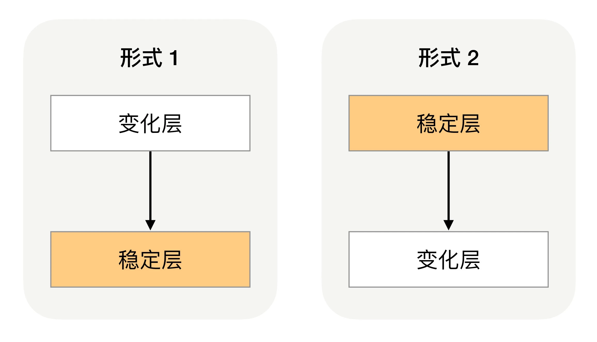
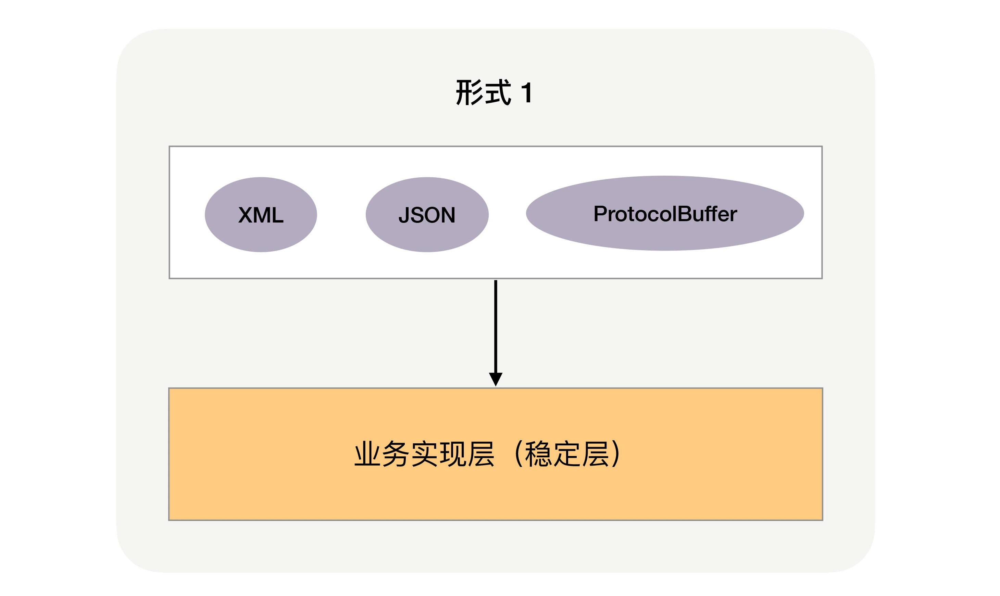
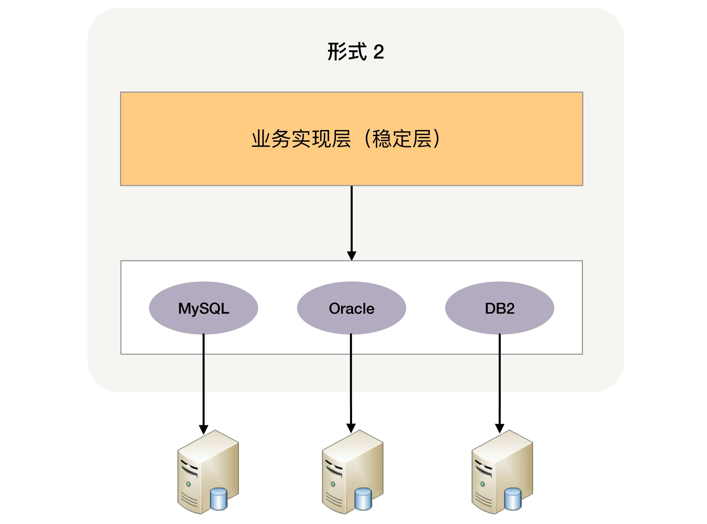
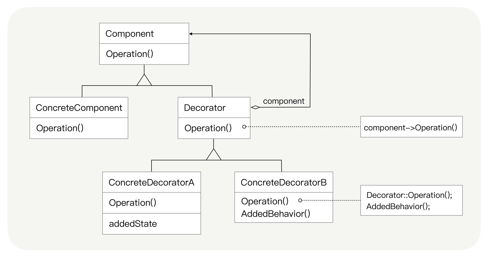

## 原文

复杂度来源前面已经讲了高性能和高可用，今天来聊聊**可扩展性**。

可扩展性指系统为了应对将来需求变化而提供的一种扩展能力，当有新的需求出现时，系统不需要或者仅需要少量修改就可以支持，无须整个系统重构或者重建。

由于软件系统固有的多变性，新的需求总会不断提出来，因此可扩展性显得尤其重要。在软件开发领域，面向对象思想的提出，就是为了解决可扩展性带来的问题；后来的设计模式，更是将可扩展性做到了极致。得益于设计模式的巨大影响力，几乎所有的技术人员对于可扩展性都特别重视。

设计具备良好可扩展性的系统，有两个基本条件：**正确预测变化、完美封装变化**。但要达成这两个条件，本身也是一件复杂的事情，我来具体分析一下。

### 预测变化

软件系统与硬件或者建筑相比，有一个很大的差异：软件系统在发布后还可以不断地修改和演进，这就意味着**不断有新的需求需要实现**。如果新需求能够不改代码甚至少改代码就可以实现，那当然是皆大欢喜的，否则来一个需求就要求系统大改一次，成本会非常高，程序员心里也不爽（改来改去），产品经理也不爽（做得那么慢），老板也不爽（那么多人就只能干这么点事）。因此作为架构师，我们总是试图去预测所有的变化，然后设计完美的方案来应对，当下一次需求真正来临时，架构师可以自豪地说：这个我当时已经预测到了，架构已经完美地支持，只需要一两天工作量就可以了！

然而理想是美好的，现实却是复杂的。有一句谚语，“唯一不变的是变化”，如果按照这个标准去衡量，架构师每个设计方案都要考虑可扩展性。例如，架构师准备设计一个简单的后台管理系统，当架构师考虑用 MySQL 存储数据时，是否要考虑后续需要用 Oracle 来存储？当架构师设计用 HTTP 做接口协议时，是否要考虑要不要支持 ProtocolBuffer？甚至更离谱一点，架构师是否要考虑 VR 技术对架构的影响从而提前做好可扩展性？如果每个点都考虑可扩展性，架构师会不堪重负，架构设计也会异常庞大且最终无法落地。但架构师也不能完全不做预测，否则可能系统刚上线，马上来新的需求就需要重构，这同样意味着前期很多投入的工作量也白费了。

同时，“预测”这个词，本身就暗示了不可能每次预测都是准确的，如果预测的事情出错，我们期望中的需求迟迟不来，甚至被明确否定，那么基于预测做的架构设计就没什么作用，投入的工作量也就白费了。

综合分析，预测变化的复杂性在于：

+ 不能每个设计点都考虑可扩展性。
+ 不能完全不考虑可扩展性。
+ 所有的预测都存在出错的可能性。

对于架构师来说，如何把握预测的程度和提升预测结果的准确性，是一件很复杂的事情，而且没有通用的标准可以简单套上去，更多是靠自己的经验、直觉，所以架构设计评审的时候经常会出现两个设计师对某个判断争得面红耳赤的情况，原因就在于没有明确标准，不同的人理解和判断有偏差，而最终又只能选择一个判断。

### 应对变化

假设架构师经验非常丰富，目光非常敏锐，看问题非常准，所有的变化都能准确预测，是否意味着可扩展性就很容易实现了呢？也没那么理想！因为预测变化是一回事，采取什么方案来应对变化，又是另外一个复杂的事情。即使预测很准确，如果方案不合适，则系统扩展一样很麻烦。

第一种应对变化的常见方案是**将“变化”封装在一个“变化层”，将不变的部分封装在一个独立的“稳定层”**。

无论是变化层依赖稳定层，还是稳定层依赖变化层都是可以的，需要根据具体业务情况来设计。例如，如果系统需要支持 XML、JSON、ProtocolBuffer 三种接入方式，那么最终的架构就是上面图中的“形式 1”架构，也就是下面这样。

如果系统需要支持 MySQL、Oracle、DB2 数据库存储，那么最终的架构就变成了“形式 2”的架构了，你可以看下面这张图。

无论采取哪种形式，通过剥离变化层和稳定层的方式应对变化，都会带来两个主要的复杂性相关的问题。
1. 系统需要拆分出变化层和稳定层

对于哪些属于变化层，哪些属于稳定层，很多时候并不是像前面的示例（不同接口协议或者不同数据库）那样明确，不同的人有不同的理解，导致架构设计评审的时候可能吵翻天。

2. 需要设计变化层和稳定层之间的接口

接口设计同样至关重要，对于稳定层来说，接口肯定是越稳定越好；但对于变化层来说，在有差异的多个实现方式中找出共同点，并且还要保证当加入新的功能时原有的接口设计不需要太大修改，这是一件很复杂的事情。例如，MySQL 的 REPLACE INTO 和 Oracle 的 MERGE INTO 语法和功能有一些差异，那存储层如何向稳定层提供数据访问接口呢？是采取 MySQL 的方式，还是采取 Oracle 的方式，还是自适应判断？如果再考虑 DB2 的情况呢？相信你看到这里就已经能够大致体会到接口设计的复杂性了。

第二种常见的应对变化的方案是**提炼出一个“抽象层”和一个“实现层”**。抽象层是稳定的，实现层可以根据具体业务需要定制开发，当加入新的功能时，只需要增加新的实现，无须修改抽象层。这种方案典型的实践就是设计模式和规则引擎。考虑到绝大部分技术人员对设计模式都非常熟悉，我以设计模式为例来说明这种方案的复杂性。

以设计模式的“装饰者”模式来分析，下面是装饰者模式的类关系图。

图中的 Component 和 Decorator 就是抽象出来的规则，这个规则包括几部分：

1. Component 和 Decorator 类。
2. Decorator 类继承 Component 类。
3. Decorator 类聚合了 Component 类。

这个规则一旦抽象出来后就固定了，不能轻易修改。例如，把规则 3 去掉，就无法实现装饰者模式的目的了。

装饰者模式相比传统的继承来实现功能，确实灵活很多。例如，《设计模式》中装饰者模式的样例“TextView”类的实现，用了装饰者之后，能够灵活地给 TextView 增加额外更多功能，比如可以增加边框、滚动条、背景图片等，这些功能上的组合不影响规则，只需要按照规则实现即可。但装饰者模式相对普通的类实现模式，明显要复杂多了。本来一个函数或者一个类就能搞定的事情，现在要拆分成多个类，而且多个类之间必须按照装饰者模式来设计和调用。

规则引擎和设计模式类似，都是通过灵活的设计来达到可扩展的目的，但“灵活的设计”本身就是一件复杂的事情，不说别的，光是把 23 种设计模式全部理解和备注，都是一件很困难的事情。

### 小结

今天我从预测变化和应对变化这两个设计可扩展性系统的条件，以及它们实现起来本身的复杂性，为你讲了复杂度来源之一的可扩展性，希望对你有所帮助。

这就是今天的全部内容，留一道思考题给你吧。你在具体代码中使用过哪些可扩展的技术？最终的效果如何？

## 读者观点

**公号-技术夜未眠:**
今日心得

1 What：什么是架构的可扩展性？

业务需求、运行环境方面的变化都会导致软件系统发生变化，而这种软件系统对上述变化的适应能力就是可扩展性。

可扩展性可以理解为是一种从功能需求方面考虑的软件属性，属性就会存在好坏之分。

按照可扩展性的定义，一个具备良好可扩展性的架构设计应当符合开闭原则：对扩展开放，对修改关闭。衡量一个软件系统具备良好可扩展性主要表现但不限于：（1）软件自身内部方面。在软件系统实现新增的业务功能时，对现有系统功能影响较少，即不需要对现有功能作任何改动或者很少改动。（2）软件外部方面。软件系统本身与其他存在协同关系的外部系统之间存在松耦合关系，软件系统的变化对其他软件系统无影响，其他软件系统和功能不需要进行改动。反之，则是一个可扩展性不好的软件系统。

2 Why：为什么要求架构具备良好的可扩展性？

伴随业务的发展、创新，运行环境的变化，对技术也就提出了更多、更高的要求。能够快速响应上述变化，并最大程度降低对现有系统的影响，是设计可扩展性好的架构的主要目的。

3 How：如何设计可扩展性好的架构？

面向对象思想、设计模式都是为了解决可扩展性的而出现的方法与技术。

设计具备良好可扩展性的系统，有两个思考角度：（1）从业务维度。对业务深入理解，对可预计的业务变化进行预测。（2）从技术维度。利用扩展性好的技术，实现对变化的封装。

(1)在业务维度。对业务深入理解，对业务的发展方向进行预判，也就是不能完全不考虑可扩展性；但是，变化无处不在，在业务看得远一点的同时，需要注意:警惕过度设计；不能每个设计点都考虑可扩展性；所有的预测都存在不正确的可能性。

(2)在技术维度。预测变化是一回事，采取什么方案来应对变化，又是另外一个复杂的事情。即使预测很准确，如果方案不合适，则系统扩展一样很麻烦。第一种应对变化的常见方案是将“变化”封装在一个“变化层”，将不变的部分封装在一个独立的“稳定层”。第二种常见的应对变化的方案是提炼出一个“抽象层”和一个“实现层”。

4.在实际工作场景中的解决方案
在实际软件系统架构设计中，常通过以下技术手段实现良好的可扩展性:（1）使用分布式服务(框架)构建可复用的业务平台。（2）使用分布式消息队列降低业务模块间的耦合性。

(1)分布式服务框架
利用分布式服务框架(如Dubbo)可以将业务逻辑实现和可复用组件服务分离开，通过接口降低子系统或模块间的耦合性。新增功能时，可以通过调用可复用的组件实现自身的业务逻辑，而对现有系统没有任何影响。可复用组件升级变更的时候，可以提供多版本服务对应用实现透明升级，对现有应用不会造成影响。

(2) 分布式消息队列
基于生产者-消费者编程模式，利用分布式消息队列(如RabbitMQ)将用户请求、业务请求作为消息发布者将事件构造成消息发布到消息队列，消息的订阅者作为消费者从消息队列中获取消息进行处理。通过这种方式将消息生产和消息处理分离开来，可以透明地增加新的消息生产者任务或者新的消息消费者任务。

**憶海拾貝:**
设计模式的核心就是，封装变化，隔离可变性

> 作者回复: 这是设计模式的核心思想，能理解到这点比背住23个模式更重要

**约书亚:**
我平时工作中更多提醒自己压抑一下想预测各种需求变化的欲望。因为之前总是过度设计。压抑并不是说不去考虑各种变化，而恰恰需要把可能性大的变化点一一罗列出来，分维度打分，维度包括 可能性大小？长期还是短期会变化？如果发生变化，目前的组织和系统要花多大成本适应变化。这些变化正是李老师之前说过的各种复杂度上的变化，比如用户量激增带来的性能要求。此外还包括一个业务功能逻辑上的变化。
在经过上面分析后往往会给出“上中下”策的设计方案，下策一般考虑的变化少，短视，但迅速，修改小，立竿见影。上策一般看重远期，但成本高很高，也很可能预测不中。
最后还要分析，如果决定采用下中策，如果预测的变化发生了，系统修改为中上策的代价有多大，有些代价几乎是无穷大的，比如必须中断服务进行升级。如果代价小，那可以放心采用下策或中策。如果答案是否，可上策当前的代价又真的不可接受，那又要返回头重新分析了
实践发现这个方法挺好用，尤其当有人来咨询架构方案时，往往对给出的结果比较满意

> 作者回复: 挺实用的方法，架构设计原则部分会讲到

**Jaime:**
曾经在游戏中使用过工厂模式和状态模式，但交个另外一个人维护了一个月，我回头去看，代码已经没办法入眼😅😅😅。虽然说设计模式确实是程序员的基本功，但其实很多程序员也不是很明白设计模式的。对于现在来说，我比较喜欢的做法就是先分层，层与层之间用消息解耦，在层内部的实现我会分模块出来，遵守单一职责原则。同时会积极跟业务部门沟通，预测一下下一步的方向。虽然不是每次都准确，但也大概做到心中有数，对于现在的系统也有个预估。这几年的编程经验给了我一些启发，一定不要过分设计，首先要能正确工作的软件是最重要的。

> 作者回复: 符合实际情况，分层最有用，代码中用设计模式，如果后面接手的人不懂或者理解不到位，最后改的代码简直没法理解，还不如面向过程😂

**Mark Yao:**
说说我们的消息系统，原始需求是用户操作业务后给用户手机短信提醒，设计初衷考虑到可能涉及到多家第三方短信服务商。我们统一定义发送短信接口，定义实时和定时发送方式，在内容形式定义模版接口接受不通形式自定义模版的内容，后来把短信定义为消息中的一种，如微信、短信、站内消息、app push 都为消息，又抽象出来消息接口，消息开发中使用多种设计模式。最后发现就就一直使用短信服务。我困惑地方，扩展性需要在什么时候做，做到什么程度呢？
> 作者回复: 我的经验供参考：设计的时候考虑可扩展性，但如果评估后发现可扩展性设计的代价太大，那就暂时不做，等到真的有需求时再重构。
过早考虑可扩展性，很多通用性和抽象都是推测的，等到真的要落地了，很可能发现事实并非如此，这就是预测是错误的。
回到你的案例，一般来说，短信本身会考虑可扩展性，例如联通的短信接口和电信的不同，这种可扩展性是要一开始就设计的，但短信和微信，看起来都是消息，实际上差异非常大，可扩展性设计想兼容这两种方式，方案比较复杂，可能看起来有点不伦不类

**明翼:**
设计模式里面的依赖倒置原则，上层不依赖下层，下层也不依赖上层，两者都依赖于抽象，抽象是稳定的，上层和下层都是可扩展的，相当于文章说的一个稳定层抽象，两个变化层…
> 作者回复: 纠正一下：SOLID原则不是设计模式里面的，而是对象和接口的设计原则。
依赖倒置的难点就在于稳定层的设计，实践中稳定层也难以保证稳定

**孙振超:**
之前看过一篇介绍架构的博文，里面提到一个观点：衡量架构的好坏是变更的成本。扩展性的好坏很依赖于设计人员对问题的抽象能力，如同文中所描述的把系统分为稳定层和抽象层两部分，就是对问题进行了抽象。具体而言，在设计上经常采用的方法是模板+接口，将具体的业务逻辑抽象为固定的几个步骤，每一个步骤是一个接口，而后根据不同的对应的参数动态选择不同的实现，这样当已有的业务发生变更时，只需要调整相应的逻辑即可，做好关注点分离，面对新增的业务逻辑和形态，添加对应的实现即可，无需修改已有的内容。
另外就是利用动态修改能力（比如java中无需重启服务修改某一个属性的值）来应对业务变动，提升扩展性

> 作者回复: 将业务逻辑抽象为固定的步骤，适合业务已经比较成熟了，例如nginx将http的处理步骤抽象为大概10个阶段，如果是创新业务，这样做比较难

**I:**
代码中实现的扩展，只采用过插件模式。但插件模式似乎应对场景比较单一，大神可以谈谈代码中的其他实现方式吗？

> 作者回复: 代码中的扩展性，一般都是用面向对象，设计模式，面向过程的语言就封装为模块，用插件模式

**不再犹豫:**
代码层面来说我觉得是快速实现，持续重构。建立在对业务充分理解的基础上，按照依赖抽象的原则，提取出因业务变化而导致代码逻辑变化部分。
> 作者回复: 是的，应用设计模式，设计原则就可以了

## 我的观点