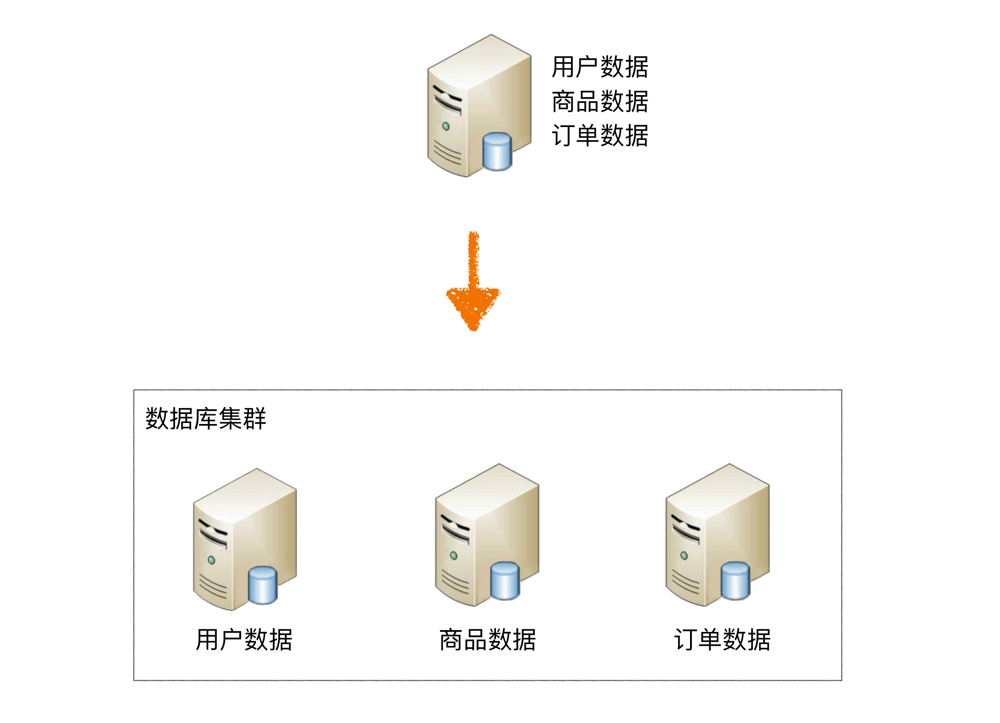
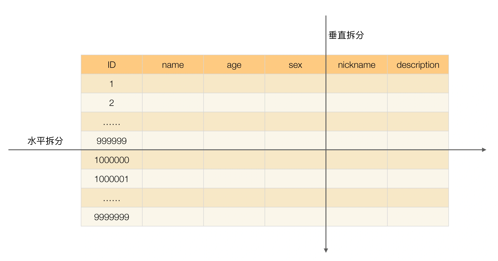

## 原文

上期我讲了“读写分离”，读写分离分散了数据库读写操作的压力，但没有分散存储压力，当数据量达到千万甚至上亿条的时候，单台数据库服务器的存储能力会成为系统的瓶颈，主要体现在这几个方面：

+ 数据量太大，读写的性能会下降，即使有索引，索引也会变得很大，性能同样会下降。
+ 数据文件会变得很大，数据库备份和恢复需要耗费很长时间。
+ 数据文件越大，极端情况下丢失数据的风险越高（例如，机房火灾导致数据库主备机都发生故障）。

基于上述原因，单个数据库服务器存储的数据量不能太大，需要控制在一定的范围内。为了满足业务数据存储的需求，就需要将存储分散到多台数据库服务器上。

今天我来介绍常见的分散存储的方法“**分库分表**”，其中包括“分库”和“分表”两大类。

### 业务分库

业务分库指的是按照业务模块将数据分散到不同的数据库服务器。例如，一个简单的电商网站，包括用户、商品、订单三个业务模块，我们可以将用户数据、商品数据、订单数据分开放到三台不同的数据库服务器上，而不是将所有数据都放在一台数据库服务器上。

虽然业务分库能够分散存储和访问压力，但同时也带来了新的问题，接下来我进行详细分析。

1. join 操作问题

业务分库后，原本在同一个数据库中的表分散到不同数据库中，导致无法使用 SQL 的 join 查询。

例如：“查询购买了化妆品的用户中女性用户的列表”这个功能，虽然订单数据中有用户的 ID 信息，但是用户的性别数据在用户数据库中，如果在同一个库中，简单的 join 查询就能完成；但现在数据分散在两个不同的数据库中，无法做 join 查询，只能采取先从订单数据库中查询购买了化妆品的用户 ID 列表，然后再到用户数据库中查询这批用户 ID 中的女性用户列表，这样实现就比简单的 join 查询要复杂一些。

2. 事务问题

原本在同一个数据库中不同的表可以在同一个事务中修改，业务分库后，表分散到不同的数据库中，无法通过事务统一修改。虽然数据库厂商提供了一些分布式事务的解决方案（例如，MySQL 的 XA），但性能实在太低，与高性能存储的目标是相违背的。

例如，用户下订单的时候需要扣商品库存，如果订单数据和商品数据在同一个数据库中，我们可以使用事务来保证扣减商品库存和生成订单的操作要么都成功要么都失败，但分库后就无法使用数据库事务了，需要业务程序自己来模拟实现事务的功能。例如，先扣商品库存，扣成功后生成订单，如果因为订单数据库异常导致生成订单失败，业务程序又需要将商品库存加上；而如果因为业务程序自己异常导致生成订单失败，则商品库存就无法恢复了，需要人工通过日志等方式来手工修复库存异常。

3. 成本问题

业务分库同时也带来了成本的代价，本来 1 台服务器搞定的事情，现在要 3 台，如果考虑备份，那就是 2 台变成了 6 台。

基于上述原因，对于小公司初创业务，并不建议一开始就这样拆分，主要有几个原因：

+ 初创业务存在很大的不确定性，业务不一定能发展起来，业务开始的时候并没有真正的存储和访问压力，业务分库并不能为业务带来价值。
+ 业务分库后，表之间的 join 查询、数据库事务无法简单实现了。
+ 业务分库后，因为不同的数据要读写不同的数据库，代码中需要增加根据数据类型映射到不同数据库的逻辑，增加了工作量。而业务初创期间最重要的是快速实现、快速验证，业务分库会拖慢业务节奏。

有的架构师可能会想：如果业务真的发展很快，岂不是很快就又要进行业务分库了？那为何不一开始就设计好呢？

其实这个问题很好回答，按照我前面提到的“架构设计三原则”，简单分析一下。

首先，这里的“如果”事实上发生的概率比较低，做 10 个业务有 1 个业务能活下去就很不错了，更何况快速发展，和中彩票的概率差不多。如果我们每个业务上来就按照淘宝、微信的规模去做架构设计，不但会累死自己，还会害死业务。

其次，如果业务真的发展很快，后面进行业务分库也不迟。因为业务发展好，相应的资源投入就会加大，可以投入更多的人和更多的钱，那业务分库带来的代码和业务复杂的问题就可以通过增加人来解决，成本问题也可以通过增加资金来解决。

第三，单台数据库服务器的性能其实也没有想象的那么弱，一般来说，单台数据库服务器能够支撑 10 万用户量量级的业务，初创业务从 0 发展到 10 万级用户，并不是想象得那么快。

而对于业界成熟的大公司来说，由于已经有了业务分库的成熟解决方案，并且即使是尝试性的新业务，用户规模也是海量的，**这与前面提到的初创业务的小公司有本质区别**，因此最好在业务开始设计时就考虑业务分库。例如，在淘宝上做一个新的业务，由于已经有成熟的数据库解决方案，用户量也很大，需要在一开始就设计业务分库甚至接下来介绍的分表方案。

### 分表

将不同业务数据分散存储到不同的数据库服务器，能够支撑百万甚至千万用户规模的业务，但如果业务继续发展，同一业务的单表数据也会达到单台数据库服务器的处理瓶颈。例如，淘宝的几亿用户数据，如果全部存放在一台数据库服务器的一张表中，肯定是无法满足性能要求的，此时就需要对单表数据进行拆分。

单表数据拆分有两种方式：**垂直分表**和**水平分表**。示意图如下：

为了形象地理解垂直拆分和水平拆分的区别，可以想象你手里拿着一把刀，面对一个蛋糕切一刀：

+ 从上往下切就是垂直切分，因为刀的运行轨迹与蛋糕是垂直的，这样可以把蛋糕切成高度相等（面积可以相等也可以不相等）的两部分，对应到表的切分就是表记录数相同但包含不同的列。例如，示意图中的垂直切分，会把表切分为两个表，一个表包含 ID、name、age、sex 列，另外一个表包含 ID、nickname、description 列。
+ 从左往右切就是水平切分，因为刀的运行轨迹与蛋糕是平行的，这样可以把蛋糕切成面积相等（高度可以相等也可以不相等）的两部分，对应到表的切分就是表的列相同但包含不同的行数据。例如，示意图中的水平切分，会把表分为两个表，两个表都包含 ID、name、age、sex、nickname、description 列，但是一个表包含的是 ID 从 1 到 999999 的行数据，另一个表包含的是 ID 从 1000000 到 9999999 的行数据。

上面这个示例比较简单，只考虑了一次切分的情况，实际架构设计过程中并不局限切分的次数，可以切两次，也可以切很多次，就像切蛋糕一样，可以切很多刀。

单表进行切分后，是否要将切分后的多个表分散在不同的数据库服务器中，可以根据实际的切分效果来确定，并不强制要求单表切分为多表后一定要分散到不同数据库中。原因在于单表切分为多表后，新的表即使在同一个数据库服务器中，也可能带来可观的性能提升，如果性能能够满足业务要求，是可以不拆分到多台数据库服务器的，毕竟我们在上面业务分库的内容看到业务分库也会引入很多复杂性的问题；如果单表拆分为多表后，单台服务器依然无法满足性能要求，那就不得不再次进行业务分库的设计了。

分表能够有效地分散存储压力和带来性能提升，但和分库一样，也会引入各种复杂性。

1. 垂直分表

垂直分表适合将表中某些不常用且占了大量空间的列拆分出去。例如，前面示意图中的 nickname 和 description 字段，假设我们是一个婚恋网站，用户在筛选其他用户的时候，主要是用 age 和 sex 两个字段进行查询，而 nickname 和 description 两个字段主要用于展示，一般不会在业务查询中用到。description 本身又比较长，因此我们可以将这两个字段独立到另外一张表中，这样在查询 age 和 sex 时，就能带来一定的性能提升。

垂直分表引入的复杂性主要体现在表操作的数量要增加。例如，原来只要一次查询就可以获取 name、age、sex、nickname、description，现在需要两次查询，一次查询获取 name、age、sex，另外一次查询获取 nickname、description。

不过相比接下来要讲的水平分表，这个复杂性就是小巫见大巫了。

2. 水平分表

水平分表适合表行数特别大的表，有的公司要求单表行数超过 5000 万就必须进行分表，这个数字可以作为参考，但并不是绝对标准，关键还是要看表的访问性能。对于一些比较复杂的表，可能超过 1000 万就要分表了；而对于一些简单的表，即使存储数据超过 1 亿行，也可以不分表。但不管怎样，当看到表的数据量达到千万级别时，作为架构师就要警觉起来，因为这很可能是架构的性能瓶颈或者隐患。

水平分表相比垂直分表，会引入更多的复杂性，主要表现在下面几个方面：

+ 路由

水平分表后，某条数据具体属于哪个切分后的子表，需要增加路由算法进行计算，这个算法会引入一定的复杂性。

常见的路由算法有：

**范围路由**：选取有序的数据列（例如，整形、时间戳等）作为路由的条件，不同分段分散到不同的数据库表中。以最常见的用户 ID 为例，路由算法可以按照 1000000 的范围大小进行分段，1 ~ 999999 放到数据库 1 的表中，1000000 ~ 1999999 放到数据库 2 的表中，以此类推。

范围路由设计的复杂点主要体现在分段大小的选取上，分段太小会导致切分后子表数量过多，增加维护复杂度；分段太大可能会导致单表依然存在性能问题，一般建议分段大小在 100 万至 2000 万之间，具体需要根据业务选取合适的分段大小。

范围路由的优点是可以随着数据的增加平滑地扩充新的表。例如，现在的用户是 100 万，如果增加到 1000 万，只需要增加新的表就可以了，原有的数据不需要动。

范围路由的一个比较隐含的缺点是分布不均匀，假如按照 1000 万来进行分表，有可能某个分段实际存储的数据量只有 1000 条，而另外一个分段实际存储的数据量有 900 万条。

**Hash 路由**：选取某个列（或者某几个列组合也可以）的值进行 Hash 运算，然后根据 Hash 结果分散到不同的数据库表中。同样以用户 ID 为例，假如我们一开始就规划了 10 个数据库表，路由算法可以简单地用 user_id % 10 的值来表示数据所属的数据库表编号，ID 为 985 的用户放到编号为 5 的子表中，ID 为 10086 的用户放到编号为 6 的字表中。

Hash 路由设计的复杂点主要体现在初始表数量的选取上，表数量太多维护比较麻烦，表数量太少又可能导致单表性能存在问题。而用了 Hash 路由后，增加子表数量是非常麻烦的，所有数据都要重分布。

Hash 路由的优缺点和范围路由基本相反，Hash 路由的优点是表分布比较均匀，缺点是扩充新的表很麻烦，所有数据都要重分布。

**配置路由**：配置路由就是路由表，用一张独立的表来记录路由信息。同样以用户 ID 为例，我们新增一张 user_router 表，这个表包含 user_id 和 table_id 两列，根据 user_id 就可以查询对应的 table_id。

配置路由设计简单，使用起来非常灵活，尤其是在扩充表的时候，只需要迁移指定的数据，然后修改路由表就可以了。

配置路由的缺点就是必须多查询一次，会影响整体性能；而且路由表本身如果太大（例如，几亿条数据），性能同样可能成为瓶颈，如果我们再次将路由表分库分表，则又面临一个死循环式的路由算法选择问题。

+ join 

操作水平分表后，数据分散在多个表中，如果需要与其他表进行 join 查询，需要在业务代码或者数据库中间件中进行多次 join 查询，然后将结果合并。

+ count() 

操作水平分表后，虽然物理上数据分散到多个表中，但某些业务逻辑上还是会将这些表当作一个表来处理。例如，获取记录总数用于分页或者展示，水平分表前用一个 count() 就能完成的操作，在分表后就没那么简单了。常见的处理方式有下面两种：

**count() 相加**：具体做法是在业务代码或者数据库中间件中对每个表进行 count() 操作，然后将结果相加。这种方式实现简单，缺点就是性能比较低。例如，水平分表后切分为 20 张表，则要进行 20 次 count(*) 操作，如果串行的话，可能需要几秒钟才能得到结果。

**记录数表**：具体做法是新建一张表，假如表名为“记录数表”，包含 table_name、row_count 两个字段，每次插入或者删除子表数据成功后，都更新“记录数表”。

这种方式获取表记录数的性能要大大优于 count() 相加的方式，因为只需要一次简单查询就可以获取数据。缺点是复杂度增加不少，对子表的操作要同步操作“记录数表”，如果有一个业务逻辑遗漏了，数据就会不一致；且针对“记录数表”的操作和针对子表的操作无法放在同一事务中进行处理，异常的情况下会出现操作子表成功了而操作记录数表失败，同样会导致数据不一致。

此外，记录数表的方式也增加了数据库的写压力，因为每次针对子表的 insert 和 delete 操作都要 update 记录数表，所以对于一些不要求记录数实时保持精确的业务，也可以通过后台定时更新记录数表。定时更新实际上就是“count() 相加”和“记录数表”的结合，即定时通过 count() 相加计算表的记录数，然后更新记录数表中的数据。

+ order by 操作

水平分表后，数据分散到多个子表中，排序操作无法在数据库中完成，只能由业务代码或者数据库中间件分别查询每个子表中的数据，然后汇总进行排序。

### 实现方法

和数据库读写分离类似，分库分表具体的实现方式也是“程序代码封装”和“中间件封装”，但实现会更复杂。读写分离实现时只要识别 SQL 操作是读操作还是写操作，通过简单的判断 SELECT、UPDATE、INSERT、DELETE 几个关键字就可以做到，而分库分表的实现除了要判断操作类型外，还要判断 SQL 中具体需要操作的表、操作函数（例如 count 函数)、order by、group by 操作等，然后再根据不同的操作进行不同的处理。例如 order by 操作，需要先从多个库查询到各个库的数据，然后再重新 order by 才能得到最终的结果。

### 小结

今天我为你讲了高性能数据库集群的分库分表架构，包括业务分库产生的问题和分表的两种方式及其带来的复杂度，希望对你有所帮助。

这就是今天的全部内容，留一道思考题给你吧，你认为什么时候引入分库分表是合适的？是数据库性能不够的时候就开始分库分表么？

## 读者观点

**明日之春：**
应该是这些操作依次尝试
1.做硬件优化，例如从机械硬盘改成使用固态硬盘，当然固态硬盘不适合服务器使用，只是举个例子
2.先做数据库服务器的调优操作，例如增加索引，oracle有很多的参数调整;
3.引入缓存技术，例如Redis，减少数据库压力
4.程序与数据库表优化，重构，例如根据业务逻辑对程序逻辑做优化，减少不必要的查询;
5.在这些操作都不能大幅度优化性能的情况下，不能满足将来的发展，再考虑分库分表，也要有预估性
> 作者回复: 赞，写的很完善

**Kongk0ng:**
如果使用hash进行分表的话，为什么大多方案推荐2的n次方作为表的总数，除了收缩容易还有什么好处吗？谢谢
> 作者回复: 这个是hash函数实现的一个技巧，当计算hash值的时候，普通做法是取余操作，例如h%len，但如果len是2的N次方，通过位操作性能更高，计算方式为h & (len-1)

**帅:**
老师，针对mysql，发现如果字段有blob的字段，select 不写这个字段，和写这个字段，效率差异很大啊，这个是什么原因？一直没弄明白😊 ，谢谢
> 作者回复: blob的字段是和行数据分开存储的，而且磁盘上并不是连续的，因此select blob字段会让磁盘进入随机IO模式

**公号-技术夜未眠:**
分库分表，可以理解为是一种空间换时间的思路，同时分流了存储压力与读写压力。

数据库性能不够时，首先应该想到是否可以通过改善硬件条件等垂直扩容手段；其次可引入读写分离、缓存/NoSQL、全文检索等手段；然后，单库单表的访问仍然存在性能瓶颈，可考虑分库分表，并且分库分表可以按照业务进行垂直拆分，接着进行水平拆分。

我的问题是:当线上已经进行了分库分表的系统，需要进一步水平扩容时，有什么好的设计方案？
> 作者回复: 没有太好的方案，要么一开始的分表方案就是按照id范围来设计的，要么就需要数据迁移

**Snway:**
我们是在设计初就考虑进去了，预估单表数据容量，再考虑未来三年的数据增长，不过现在反观这种做法，感觉有点过度设计，如当初一张用户表，分了127张，2个库，然而实际数据容量根本没这么多，顶多千万级别，不仅带来存储资源浪费，也给编码带来不少复杂度！所以我还是觉得得遵循演化原则，业务真正发展起来再考虑分库分表
> 作者回复: 我们也这样做过，后来受不了了又缩表😂😂😂

**鲁伊李:**
分库分表的痛点大家都知道，可否介绍下解决方案…
> 作者回复: 没有很好的，要么中间件要么代码中间层，业务代码处理总是很麻烦的

**kylexy_0817:**
其实在同一个库里做数据拆分，无需分表吧？就例如MySQL，只需要对表做分区就可以了。分表的目的主要是为后面把表分到不同的数据库实例作准备？
还有个疑问，文中提到，用户表的description等字段内容不是经常查到，所以做垂直划分可以提高查询性能，意思是，如果表中有内容较长的字段，查询的时候不查出来（不使用select *），也会有性能问题？
最后，我觉得当单实例的访问量，已达到机器的60%承载能力，就要考虑分库，而具体如何拆分，则要分析访问量主要集中在哪些表。至于分表，主要依据还是单表的数据量和查询性能。
> 作者回复: 关系数据库是行存储，即使不用那一列，也会从存储读取到内存

**耶愿:**
您好！请教一个问题，目前线上业务遇到一个问题，就是订单表需要在单库里分100张表，使用uid%100分的表，前端用户查数据没有问题，后台需要查天、周、月、年的统计信息，这个应该怎么实现？而且要求每行统计记录点击后可以看到该汇总信息下所有的订单记录，这个该怎么做？
> 作者回复: 后台统计库不拆分，冗余一份线上数据，既可以应对复杂的统计需求，也不担心影响线上业务

**大漠之鹰:**
没查询的字段也会加载到内存，不可能吧
> 作者回复: 数据库按页加载，不是按字段加载

**食指可爱多:**
想请教老师一个设计问题，以电商平台交易系统为例，订单数据量非常大的时候也可以考虑水平分库分表。
我的思考是针对消费者端订单表按用户ID哈希规则分表，这样所有对用户订单的查询条件全都带上用户ID，达到了数据分片的效果。
但这时商家端需要对订单做管理，就很尴尬了。于是我想到，可以将订单数据做同步到另一个数据源，表结构一致只是按照商家ID进行哈希规则分表，所有商家端查询走此数据源，条件全部带上商家ID，也可以做到数据分片的效果。
接下来问题又来了，系统还有一个平台的视角，这时貌似不好沿着这个思路继续了，恳请老师提点提点。
> 作者回复: 淘宝的单元化改造就面临你说的问题，最后他们选择了买家纬度拆分，卖家纬度不拆分，详细可以搜网上的公开资料。

**Geek_88604f:**
按照ID来分库的话会遇到访问热点问题，请问李老师这种情况怎么解决？
> 作者回复: 读热点加缓存，写热点加缓冲，例如用消息队列，写热点也可以合并写

**文竹:**
首先并不是数据库性能不够的时候就分库分表，提升数据库性能方式很多，若有其他能在单数据库操作的方式则毫不犹豫使用，因为使用分表有固有的复杂性（join操作，事务，order by等）。

分库使用时机：
1、业务不复杂，但整体数据量已影响了数据库的性能。
2、业务复杂，需要分模块由不同开发团队负责开发，这个时候使用分库可以减少团队间交流。

分表时机：
1、单个数据表数据量太大，拖慢了SQL操作性能。
> 作者回复: 分析正确

**re冷星:**
一直有一个问题，这里的单台服务器指的是多大的服务器。毕竟单核2G内存和8核56G内存差很多啊。
> 作者回复: 企业用的线上物理服务器至少32核16G

**张汉桂-东莞:**
老师你好，我认为这篇文章遗漏了一个知识点，就是文件组的知识点没有包含进来。我用过sqlserver和oracle都具有文件分组的功能。在create table语句中指定分组可以设置id多少到多少的写入到哪个文件。分组条件还是很灵活的。如有冒犯，请多包涵。
> 作者回复: 谢谢，这部分在商业数据库用的比较多，开源数据库一般不用，用分库分表，因为没有那么牛逼的硬件

**不吃番茄的西红柿:**
华仔，如果这时候分了表之后如果用户a的比如订单数据出现在 a和b表中，那么这时候就会跨裤 这时候性能问题怎么处理呢
> 作者回复: 跨库不一定有性能问题呀，如果有，那就尽量不要跨库，改成按用户id分库，而不是按订单id分库；如果两种方式都必须，可以考虑数据冗余，即设计两个订单表，一个以用户id分库，一个以订单id分库

**ron.c:**
有个疑问，为什么不用MySQL的分区功能，是有什么缺陷吗？
> 作者回复: 很多限制，性能也不行，详细上网查查

**func:**
华仔老师，用配置路由分表的话，配置路由表生成静态配置文件或者压入缓存是不是一个好的策略？
> 作者回复: 是的，而且必须这么做，因为路由表的访问量非常大，每次数据操作都要访问路由表，必须缓存，最好缓存到内存

**走神儿:**
老师好，我在长期代码编写中面对分库分表问题实现了一个工具，也可以说是中间件，在加表或加库的时候在业务查询中异步迁移数据，这样做的缺点是无法保证异步迁移成功，所以我做了每次查询都要去原始位置查询，但这样多一次查询，目前在用多线程来优化中间件，尽量做到新旧一起查，查到谁用谁。但这样面对高并发数据访问的时候可能导致脏读，是否有较好的解决办法
> 作者回复: 没有太好的方法，加表操作和加库操作最好在业务低峰期做，我们都是这样的

**小喵喵:**
按照ID范围来分表，比如一千万条数据一张表，为什么数据会不均匀呢？
> 作者回复: 看ID怎么生成的，递增ID容易被人遍历

## 我的观点

