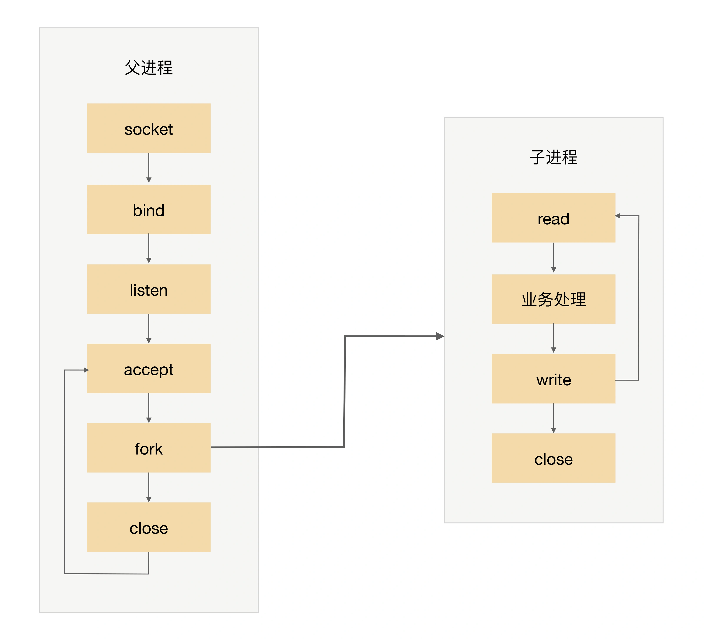
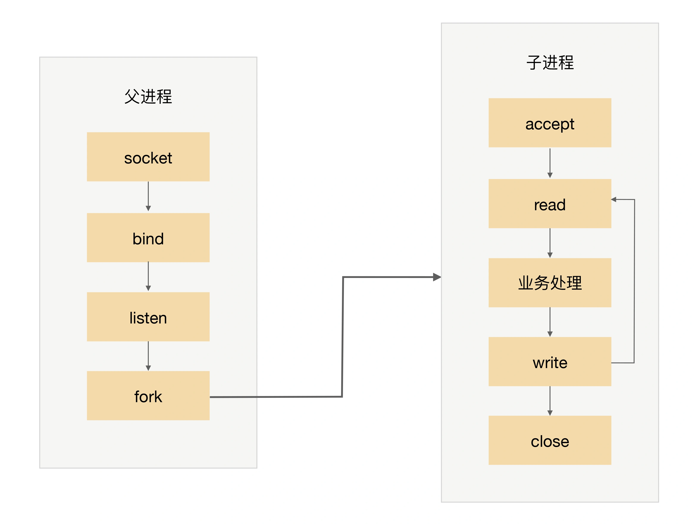
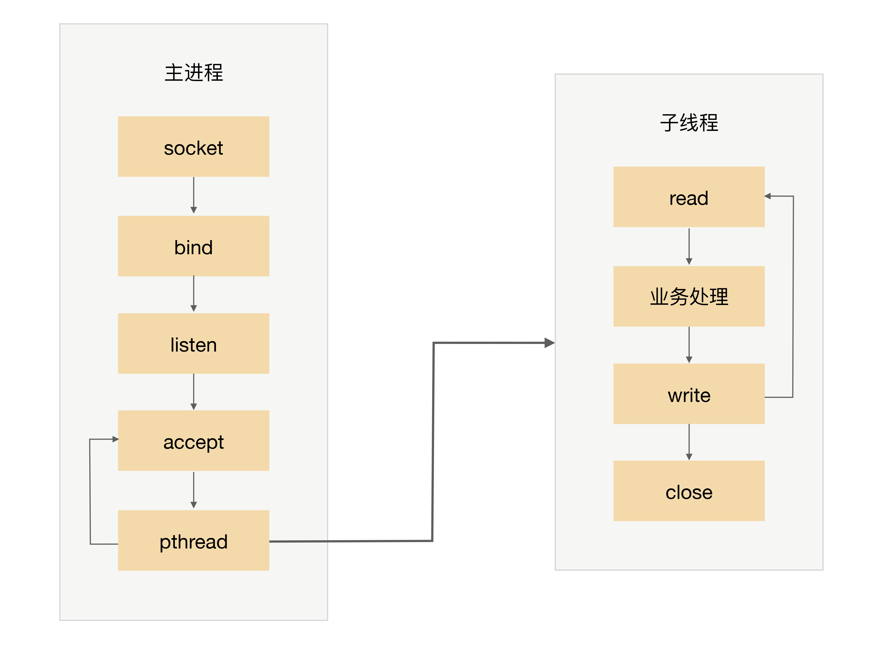
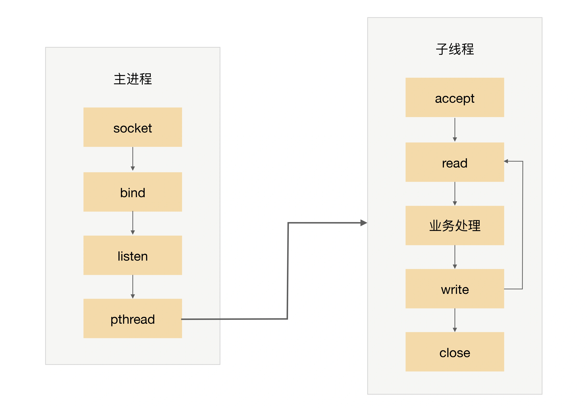

## 原文

高性能是每个程序员的追求，无论我们是做一个系统还是写一行代码，都希望能够达到高性能的效果，而高性能又是最复杂的一环，磁盘、操作系统、CPU、内存、缓存、网络、编程语言、架构等，每个都有可能影响系统达到高性能，一行不恰当的 debug 日志，就可能将服务器的性能从 TPS 30000 降低到 8000；一个 tcp_nodelay 参数，就可能将响应时间从 2 毫秒延长到 40 毫秒。因此，要做到高性能计算是一件很复杂很有挑战的事情，软件系统开发过程中的不同阶段都关系着高性能最终是否能够实现。

站在架构师的角度，当然需要特别关注高性能架构的设计。高性能架构设计主要集中在两方面：

尽量提升单服务器的性能，将单服务器的性能发挥到极致。如果单服务器无法支撑性能，设计服务器集群方案。

除了以上两点，最终系统能否实现高性能，还和具体的实现及编码相关。但架构设计是高性能的基础，如果架构设计没有做到高性能，则后面的具体实现和编码能提升的空间是有限的。形象地说，架构设计决定了系统性能的上限，实现细节决定了系统性能的下限。

单服务器高性能的关键之一就是**服务器采取的并发模型**，并发模型有如下两个关键设计点：

+ 服务器如何管理连接。
+ 服务器如何处理请求。

以上两个设计点最终都和操作系统的 I/O 模型及进程模型相关。

+ I/O 模型：阻塞、非阻塞、同步、异步。
+ 进程模型：单进程、多进程、多线程。

在下面详细介绍并发模型时会用到上面这些基础的知识点，所以我建议你先检测一下对这些基础知识的掌握情况，更多内容你可以参考《UNIX 网络编程》三卷本。今天，我们先来看看**单服务器高性能模式：PPC 与 TPC**。

### PPC

PPC 是 Process Per Connection 的缩写，其含义是指每次有新的连接就新建一个进程去专门处理这个连接的请求，这是传统的 UNIX 网络服务器所采用的模型。基本的流程图是：

+ 父进程接受连接（图中 accept）。
+ 父进程“fork”子进程（图中 fork）。
+ 子进程处理连接的读写请求（图中子进程 read、业务处理、write）。
+ 子进程关闭连接（图中子进程中的 close）。

注意，图中有一个小细节，父进程“fork”子进程后，直接调用了 close，看起来好像是关闭了连接，其实只是将连接的文件描述符引用计数减一，真正的关闭连接是等子进程也调用 close 后，连接对应的文件描述符引用计数变为 0 后，操作系统才会真正关闭连接，更多细节请参考《UNIX 网络编程：卷一》。

PPC 模式实现简单，比较适合服务器的连接数没那么多的情况，例如数据库服务器。对于普通的业务服务器，在互联网兴起之前，由于服务器的访问量和并发量并没有那么大，这种模式其实运作得也挺好，世界上第一个 web 服务器 CERN httpd 就采用了这种模式（具体你可以参考https://en.wikipedia.org/wiki/CERN_httpd）。互联网兴起后，服务器的并发和访问量从几十剧增到成千上万，这种模式的弊端就凸显出来了，主要体现在这几个方面：

+ fork 代价高：站在操作系统的角度，创建一个进程的代价是很高的，需要分配很多内核资源，需要将内存映像从父进程复制到子进程。即使现在的操作系统在复制内存映像时用到了 Copy on Write（写时复制）技术，总体来说创建进程的代价还是很大的。
+ 父子进程通信复杂：父进程“fork”子进程时，文件描述符可以通过内存映像复制从父进程传到子进程，但“fork”完成后，父子进程通信就比较麻烦了，需要采用 IPC（Interprocess Communication）之类的进程通信方案。例如，子进程需要在 close 之前告诉父进程自己处理了多少个请求以支撑父进程进行全局的统计，那么子进程和父进程必须采用 IPC 方案来传递信息。
+ 支持的并发连接数量有限：如果每个连接存活时间比较长，而且新的连接又源源不断的进来，则进程数量会越来越多，操作系统进程调度和切换的频率也越来越高，系统的压力也会越来越大。因此，一般情况下，PPC 方案能处理的并发连接数量最大也就几百。

### prefork

PPC 模式中，当连接进来时才 fork 新进程来处理连接请求，由于 fork 进程代价高，用户访问时可能感觉比较慢，prefork 模式的出现就是为了解决这个问题。

顾名思义，prefork 就是提前创建进程（pre-fork）。系统在启动的时候就预先创建好进程，然后才开始接受用户的请求，当有新的连接进来的时候，就可以省去 fork 进程的操作，让用户访问更快、体验更好。prefork 的基本示意图是：

prefork 的实现关键就是多个子进程都 accept 同一个 socket，当有新的连接进入时，操作系统保证只有一个进程能最后 accept 成功。但这里也存在一个小小的问题：“惊群”现象，就是指虽然只有一个子进程能 accept 成功，但所有阻塞在 accept 上的子进程都会被唤醒，这样就导致了不必要的进程调度和上下文切换了。幸运的是，操作系统可以解决这个问题，例如 Linux 2.6 版本后内核已经解决了 accept 惊群问题。

prefork 模式和 PPC 一样，还是存在父子进程通信复杂、支持的并发连接数量有限的问题，因此目前实际应用也不多。Apache 服务器提供了 MPM prefork 模式，推荐在需要可靠性或者与旧软件兼容的站点时采用这种模式，默认情况下最大支持 256 个并发连接。

### TPC

TPC 是 Thread Per Connection 的缩写，其含义是指每次有新的连接就新建一个线程去专门处理这个连接的请求。与进程相比，线程更轻量级，创建线程的消耗比进程要少得多；同时多线程是共享进程内存空间的，线程通信相比进程通信更简单。因此，TPC 实际上是解决或者弱化了 PPC fork 代价高的问题和父子进程通信复杂的问题。

TPC 的基本流程是：

+ 父进程接受连接（图中 accept）。
+ 父进程创建子线程（图中 pthread）。
+ 子线程处理连接的读写请求（图中子线程 read、业务处理、write）。
+ 子线程关闭连接（图中子线程中的 close）。

注意，和 PPC 相比，主进程不用“close”连接了。原因是在于子线程是共享主进程的进程空间的，连接的文件描述符并没有被复制，因此只需要一次 close 即可。

TPC 虽然解决了 fork 代价高和进程通信复杂的问题，但是也引入了新的问题，具体表现在：

+ 创建线程虽然比创建进程代价低，但并不是没有代价，高并发时（例如每秒上万连接）还是有性能问题。
+ 无须进程间通信，但是线程间的互斥和共享又引入了复杂度，可能一不小心就导致了死锁问题。
+ 多线程会出现互相影响的情况，某个线程出现异常时，可能导致整个进程退出（例如内存越界）

除了引入了新的问题，TPC 还是存在 CPU 线程调度和切换代价的问题。因此，TPC 方案本质上和 PPC 方案基本类似，在并发几百连接的场景下，反而更多地是采用 PPC 的方案，因为 PPC 方案不会有死锁的风险，也不会多进程互相影响，稳定性更高。

### prethread

TPC 模式中，当连接进来时才创建新的线程来处理连接请求，虽然创建线程比创建进程要更加轻量级，但还是有一定的代价，而 prethread 模式就是为了解决这个问题。

和 prefork 类似，prethread 模式会预先创建线程，然后才开始接受用户的请求，当有新的连接进来的时候，就可以省去创建线程的操作，让用户感觉更快、体验更好。

由于多线程之间数据共享和通信比较方便，因此实际上 prethread 的实现方式相比 prefork 要灵活一些，常见的实现方式有下面几种：

+ 主进程 accept，然后将连接交给某个线程处理。
+ 子线程都尝试去 accept，最终只有一个线程 accept 成功，方案的基本示意图如下：

Apache 服务器的 MPM worker 模式本质上就是一种 prethread 方案，但稍微做了改进。Apache 服务器会首先创建多个进程，每个进程里面再创建多个线程，这样做主要是为了考虑稳定性，即：即使某个子进程里面的某个线程异常导致整个子进程退出，还会有其他子进程继续提供服务，不会导致整个服务器全部挂掉。

prethread 理论上可以比 prefork 支持更多的并发连接，Apache 服务器 MPM worker 模式默认支持 16 × 25 = 400 个并发处理线程。

### 小结

今天我为你讲了传统的单服务器高性能模式 PPC 与 TPC，希望对你有所帮助。

这就是今天的全部内容，留一道思考题给你吧，什么样的系统比较适合本期所讲的高性能模式？原因是什么？

## 读者观点

**鹅米豆发**
不同并发模式的选择，还要考察三个指标，分别是响应时间（RT），并发数（Concurrency），吞吐量（TPS）。三者关系，吞吐量=并发数/平均响应时间。不同类型的系统，对这三个指标的要求不一样。
       三高系统，比如秒杀、即时通信，不能使用。
       三低系统，比如ToB系统，运营类、管理类系统，一般可以使用。
       高吞吐系统，如果是内存计算为主的，一般可以使用，如果是网络IO为主的，一般不能使用。
>作者回复: 赞，分析到位

**Regular:**
我怎么觉得，凡是高并发请求的系统都适合本节讲的高性能模式？！
>作者回复: 高并发需要根据两个条件划分：连接数量，请求数量。
1. 海量连接（成千上万）海量请求：例如抢购，双十一等
2. 常量连接（几十上百）海量请求：例如中间件
3. 海量连接常量请求：例如门户网站
4. 常量连接常量请求：例如内部运营系统，管理系统
你再尝试分析一下看看😃

**W_T:**
老师在文章和留言里已经透露答案了。
首先，PPC和TPC能够支持的最大连接数差不多，都是几百个，所以我觉得他们适用的场景也是差不多的。
接着再从连接数和请求数来划分，这两种方式明显不支持高连接数的场景，所以答案就是：
1. 常量连接海量请求。比如数据库，redis，kafka等等
2. 常量连接常量请求。比如企业内部网址
> 作者回复: 回答正确😃😃

**正是那朵玫瑰:**
根据华仔回复留言的提示，分析下
1. 海量连接（成千上万）海量请求：例如抢购，双十一等
这样的系统，我觉得这讲所说的模式都不适应，面对海量的连接至少要使用IO复用模型或者异步IO模型，针对海量的请求，无论使用多进程处理还是多线程，单机都是无法支撑的，应该集群了吧。
2. 常量连接（几十上百）海量请求：例如中间件
常量连接，我觉得这讲的模式应该可以适用，如使用TPC的preyhtead模型，启动几十上百的线程去处理连接，应该问题不大吧，但是老师举的列子是中间件是这类系统，我就有点疑问了，是不是中间件系统都可以是阻塞IO模型来实现，比如activemq既支持BIO也支持NIO，但是NIO只是解决了能处理更多的连接，而真正每个请求的处理快慢还得看后面的业务的处理；而阿里的rocketmq也是使用netty这样的NIO框架实现的。但在面对常量连接的场景下，NIO并没有优势啊。
3. 海量连接常量请求：例如门户网站
这种系统我觉得非常适合使用netty这样的NIO框架来实现，IO复用模型可以处理海量的连接，而每个连接的请求数据量会很小，处理会很长快，如华仔说的门户网站，只要简单返回页面即可。
4. 常量连接常量请求：例如内部运营系统，管理系统
这种系统，本讲的模式就很适合了。

水平有限，望华仔指点下。
> 作者回复: 写的很好，你的疑问补充如下：
1. 常量连接模式下NIO除了复杂一点外，也没有缺点，因此也可以用。
2. 海量连接情况下，单机也要支持很多连接，不然集群成本太高

**peison:**
请教一个比较小白的问题…为什么说门户网站是海量连接常量请求的情况？海量连接下为什么会常量请求，一直想不通
> 作者回复: 海量连接：连接的用户很多
常量请求：每个用户请求数量不多，大部分都是看完一篇文章再去点击另外的文章

**孙晓明:**
李老师，看完文章后查了一下bio和nio，还有一种aio，看的不是太明白，能麻烦您解答一下，并且它与nio的差别在哪里？
> 作者回复: bio：阻塞io，PPC和TPC属于这种
NIO：多路复用io，reactor就是基于这种技术
aio：异步io，Proactor就是基于这种技术

**小文同学:**
PPC和TPC对那些吞吐量比较大，长连接且连接数不多的系统应该比较适用。两种模式的特点都比较重，每个连接都能占有较多计算资源，一些内部系统，如日志系统用于实时监控的估计可以采用。这类型的系统一般连接数不多，吞吐量比较大，不求服务数量，求服务质量。不知道这样的假设符不符合？
> 作者回复: 回答正确

**胖胖的程序猿:**
1. 海量连接（成千上万）海量请求：例如抢购，双十一等
2. 常量连接（几十上百）海量请求：例如中间件
3. 海量连接常量请求：例如门户网站
4. 常量连接常量请求：例如内部运营系统，管理系统

这个不理解，连接和请求有什么区别
> 作者回复: 一个连接就是TCP连接，一个连接每秒可以发一个请求，也可以发几千个请求

**无聊夫斯基:**
我无法想到ppc比tpc更适合的场景
> 作者回复: tpc异常时整个服务器就挂了，而ppc不会，所以ppc适合数据库，中间件这类

**james:**
互联网高并发的系统全部适应啊，现在C10K已经不是问题了，有些可优化度较高的系统（例如读多写少的系统）C100k的性能都很常见了
> 作者回复: 互联网用ppc和tpc的不多呢，尤其是海量连接的场景

**孙振超:**
本章中提到的几个概念，比如阻塞、非阻塞、同步、异步以及主要的两种方式ppc和tpc，以前都是记住了，今天通过这篇文章是理解了而不再是记住了。
ppc和tpc都是有一个进程来处理链接，收到一个请求就新创建一个进程或线程来处理，在处理完成之前调用方是处于阻塞状态，这种机制决定了单机容量不会太大。
但在文章中提到数据库一般是ppc模式，但数据库通常是链接数少请求量大的场景，为什么会采用这种模式呢？reactor模式为什么不适合数据库？还望老师解惑，多谢！
> 作者回复: 数据库链接数少请求量大，所以单线程或者单进程io轮询性能也高，因为一直都有数据处理，不会浪费时间阻塞等待，但数据库的引擎可以是多线程或者多进程，也就是说一条链接的请求交给引擎后，引擎可以是多线程来处理。
reactor适应于连接数很大但活动连接并没有那么多的场景，例如互联网web服务器，reactor功能上也可以用于数据库，只是关系数据库都是历史悠久，久经考验，没有必要把原来的模式改为reactor

**Hanson:**
如果针对自内部系统，是否使用长链接性能损耗较低，毕竟频繁建链拆链性能损耗还是不小的，尤其是TLS的情况下
> 作者回复: 内部系统长连接多，例如各种中间件，数据库

**海军上校:**
如何系统的学习liunx～ 包括网络～文件系统～内存管理～进程管理～然后串起来形成面呢😂
> 作者回复: 系统学习最好的方式就是看书，推荐《Unix环境高级编程》《Linux系统编程》

**云学:**
希望再多写几篇讲解单机性能优化，比如线程模型，数据库，网络等，猜测下一篇讲IO复用了吧
> 作者回复: 具体的技术细节点好多，专栏聚焦架构。
一些常见的细节点如下：
java：推荐看disruptor的设计论文，包括false sharing, 并发无锁，ring buffer等；
网络：tcp_nodelay，NIO；
内存：内存池，对象池，数据结构
存储：磁盘尾部追加，LSM；

**星火燎原:**
像您说的这种多进程多线程模式好似更加稳定，但是tomcat为什么采用单进程多线程模型呢？
> 作者回复: tomcat是java语言开发的，java用线程是最好的

**互联网老辛:**
单台数据库服务器可以支撑多少并发？单台nginx 可以支撑多少呢
> 作者回复: nginx反向代理可以达到3万以上，具体需要根据业务和场景测试

**feifei:**
PPC和TPC,这2种模式，无论进程还是线程都受cpu的限制，进程和线程的切换都是有代价的，所以像小型的系统合适，所以很多传统行业选择的是这2种
> 作者回复: 是的，连接数不多

**琴扬枫:**
老师好，请教个问题，文中提到的几百连接是在什么样的软硬件环境参数下面呢？谢谢
> 作者回复: 常见的服务器配置就可以，16核16g以上

**落叶飞逝的恋:**
几百连接的这种性能只适合内部管理系统之类。
> 作者回复: 中间件也可以，例如数据库，缓存系统等

## 我的观点