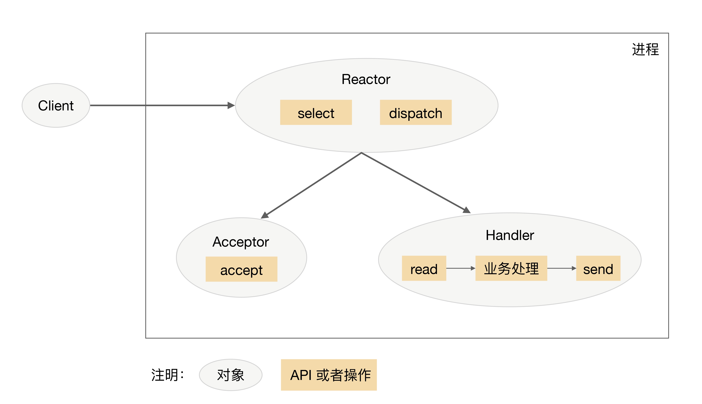
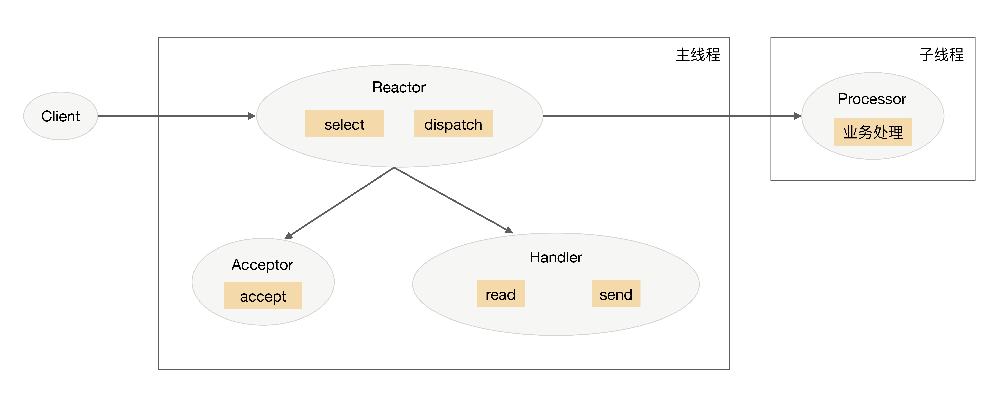
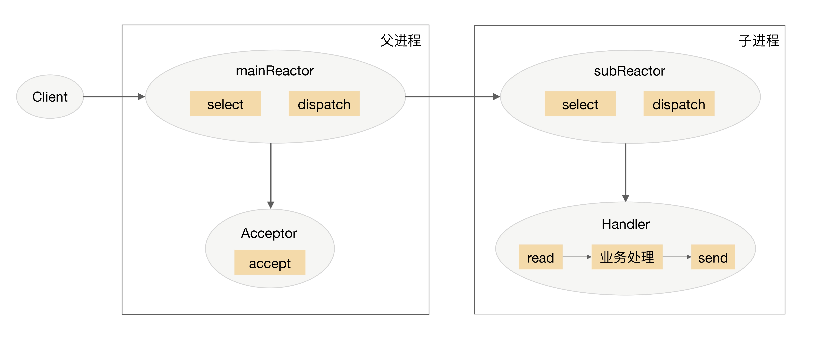
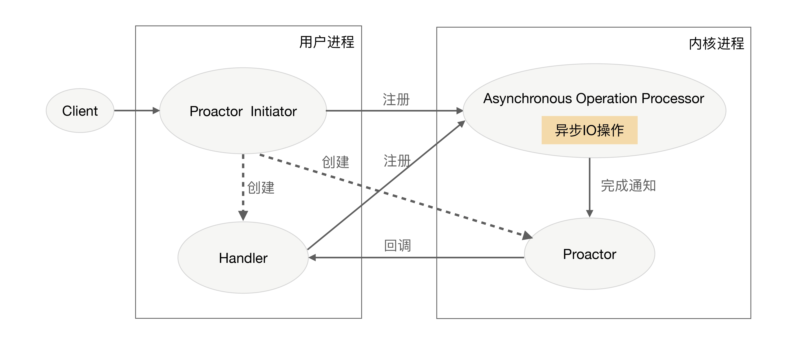

## 原文

专栏上一期我介绍了单服务器高性能的 PPC 和 TPC 模式，它们的优点是实现简单，缺点是都无法支撑高并发的场景，尤其是互联网发展到现在，各种海量用户业务的出现，PPC 和 TPC 完全无能为力。今天我将介绍可以应对高并发场景的**单服务器高性能架构模式：Reactor 和 Proactor**。

### Reactor

PPC 模式最主要的问题就是每个连接都要创建进程（为了描述简洁，这里只以 PPC 和进程为例，实际上换成 TPC 和线程，原理是一样的），连接结束后进程就销毁了，这样做其实是很大的浪费。为了解决这个问题，一个自然而然的想法就是资源复用，即不再单独为每个连接创建进程，而是创建一个进程池，将连接分配给进程，一个进程可以处理多个连接的业务。

引入资源池的处理方式后，会引出一个新的问题：进程如何才能高效地处理多个连接的业务？当一个连接一个进程时，进程可以采用“read -> 业务处理 -> write”的处理流程，如果当前连接没有数据可以读，则进程就阻塞在 read 操作上。这种阻塞的方式在一个连接一个进程的场景下没有问题，但如果一个进程处理多个连接，进程阻塞在某个连接的 read 操作上，此时即使其他连接有数据可读，进程也无法去处理，很显然这样是无法做到高性能的。

解决这个问题的最简单的方式是将 read 操作改为非阻塞，然后进程不断地轮询多个连接。这种方式能够解决阻塞的问题，但解决的方式并不优雅。首先，轮询是要消耗 CPU 的；其次，如果一个进程处理几千上万的连接，则轮询的效率是很低的。

为了能够更好地解决上述问题，很容易可以想到，只有当连接上有数据的时候进程才去处理，这就是 I/O 多路复用技术的来源。

I/O 多路复用技术归纳起来有两个关键实现点：

+ 当多条连接共用一个阻塞对象后，进程只需要在一个阻塞对象上等待，而无须再轮询所有连接，常见的实现方式有 select、epoll、kqueue 等。
+ 当某条连接有新的数据可以处理时，操作系统会通知进程，进程从阻塞状态返回，开始进行业务处理。

I/O 多路复用结合线程池，完美地解决了 PPC 和 TPC 的问题，而且“大神们”给它取了一个很牛的名字：Reactor，中文是“反应堆”。联想到“核反应堆”，听起来就很吓人，实际上这里的“反应”不是聚变、裂变反应的意思，而是“**事件反应**”的意思，可以通俗地理解为“**来了一个事件我就有相应的反应**”，这里的“我”就是 Reactor，具体的反应就是我们写的代码，Reactor 会根据事件类型来调用相应的代码进行处理。Reactor 模式也叫 Dispatcher 模式（在很多开源的系统里面会看到这个名称的类，其实就是实现 Reactor 模式的），更加贴近模式本身的含义，即 I/O 多路复用统一监听事件，收到事件后分配（Dispatch）给某个进程。

Reactor 模式的核心组成部分包括 Reactor 和处理资源池（进程池或线程池），其中 Reactor 负责监听和分配事件，处理资源池负责处理事件。初看 Reactor 的实现是比较简单的，但实际上结合不同的业务场景，Reactor 模式的具体实现方案灵活多变，主要体现在：

+ Reactor 的数量可以变化：可以是一个 Reactor，也可以是多个 Reactor。
+ 资源池的数量可以变化：以进程为例，可以是单个进程，也可以是多个进程（线程类似）。

将上面两个因素排列组合一下，理论上可以有 4 种选择，但由于“多 Reactor 单进程”实现方案相比“单 Reactor 单进程”方案，既复杂又没有性能优势，因此“多 Reactor 单进程”方案仅仅是一个理论上的方案，实际没有应用。

最终 Reactor 模式有这三种典型的实现方案：

+ 单 Reactor 单进程 / 线程。
+ 单 Reactor 多线程。
+ 多 Reactor 多进程 / 线程。

以上方案具体选择进程还是线程，更多地是和编程语言及平台相关。例如，Java 语言一般使用线程（例如，Netty），C 语言使用进程和线程都可以。例如，Nginx 使用进程，Memcache 使用线程。

1. 单 Reactor 单进程 / 线程

单 Reactor 单进程 / 线程的方案示意图如下（以进程为例）：

注意，select、accept、read、send 是标准的网络编程 API，dispatch 和“业务处理”是需要完成的操作，其他方案示意图类似。

详细说明一下这个方案：

+ Reactor 对象通过 select 监控连接事件，收到事件后通过 dispatch 进行分发。
+ 如果是连接建立的事件，则由 Acceptor 处理，Acceptor 通过 accept 接受连接，并创建一个 Handler 来处理连接后续的各种事件。
+ 如果不是连接建立事件，则 Reactor 会调用连接对应的 Handler（第 2 步中创建的 Handler）来进行响应。
+ Handler 会完成 read-> 业务处理 ->send 的完整业务流程。

单 Reactor 单进程的模式优点就是很简单，没有进程间通信，没有进程竞争，全部都在同一个进程内完成。但其缺点也是非常明显，具体表现有：

+ 只有一个进程，无法发挥多核 CPU 的性能；只能采取部署多个系统来利用多核 CPU，但这样会带来运维复杂度，本来只要维护一个系统，用这种方式需要在一台机器上维护多套系统。
+ Handler 在处理某个连接上的业务时，整个进程无法处理其他连接的事件，很容易导致性能瓶颈。

因此，单 Reactor 单进程的方案在实践中应用场景不多，**只适用于业务处理非常快速的场景**，目前比较著名的开源软件中使用单 Reactor 单进程的是 Redis。

需要注意的是，C 语言编写系统的一般使用单 Reactor 单进程，因为没有必要在进程中再创建线程；而 Java 语言编写的一般使用单 Reactor 单线程，因为 Java 虚拟机是一个进程，虚拟机中有很多线程，业务线程只是其中的一个线程而已。

2. 单 Reactor 多线程

为了克服单 Reactor 单进程 / 线程方案的缺点，引入多进程 / 多线程是显而易见的，这就产生了第 2 个方案：单 Reactor 多线程。

单 Reactor 多线程方案示意图是：

我来介绍一下这个方案：

+ 主线程中，Reactor 对象通过 select 监控连接事件，收到事件后通过 dispatch 进行分发。
+ 如果是连接建立的事件，则由 Acceptor 处理，Acceptor 通过 accept 接受连接，并创建一个 Handler 来处理连接后续的各种事件。
+ 如果不是连接建立事件，则 Reactor 会调用连接对应的 Handler（第 2 步中创建的 Handler）来进行响应。
+ Handler 只负责响应事件，不进行业务处理；Handler 通过 read 读取到数据后，会发给 Processor 进行业务处理。Processor 会在独立的子线程中完成真正的业务处理，然后将响应结果发给主进程的 Handler 处理；
+ Handler 收到响应后通过 send 将响应结果返回给 client。

单 Reator 多线程方案能够充分利用多核多 CPU 的处理能力，但同时也存在下面的问题：

+ 多线程数据共享和访问比较复杂。例如，子线程完成业务处理后，要把结果传递给主线程的 Reactor 进行发送，这里涉及共享数据的互斥和保护机制。以 Java 的 NIO 为例，Selector 是线程安全的，但是通过 Selector.selectKeys() 返回的键的集合是非线程安全的，对 selected keys 的处理必须单线程处理或者采取同步措施进行保护。
+ Reactor 承担所有事件的监听和响应，只在主线程中运行，瞬间高并发时会成为性能瓶颈。

你可能会发现，我只列出了“单 Reactor 多线程”方案，没有列出“单 Reactor 多进程”方案，这是什么原因呢？主要原因在于如果采用多进程，子进程完成业务处理后，将结果返回给父进程，并通知父进程发送给哪个 client，这是很麻烦的事情。因为父进程只是通过 Reactor 监听各个连接上的事件然后进行分配，子进程与父进程通信时并不是一个连接。如果要将父进程和子进程之间的通信模拟为一个连接，并加入 Reactor 进行监听，则是比较复杂的。而采用多线程时，因为多线程是共享数据的，因此线程间通信是非常方便的。虽然要额外考虑线程间共享数据时的同步问题，但这个复杂度比进程间通信的复杂度要低很多。

3. 多 Reactor 多进程 / 线程

为了解决单 Reactor 多线程的问题，最直观的方法就是将单 Reactor 改为多 Reactor，这就产生了第 3 个方案：多 Reactor 多进程 / 线程。

多 Reactor 多进程 / 线程方案示意图是（以进程为例）：

方案详细说明如下：

+ 父进程中 mainReactor 对象通过 select 监控连接建立事件，收到事件后通过 Acceptor 接收，将新的连接分配给某个子进程。
+ 子进程的 subReactor 将 mainReactor 分配的连接加入连接队列进行监听，并创建一个 Handler 用于处理连接的各种事件。
+ 当有新的事件发生时，subReactor 会调用连接对应的 Handler（即第 2 步中创建的 Handler）来进行响应。
+ Handler 完成 read→业务处理→send 的完整业务流程。

多 Reactor 多进程 / 线程的方案看起来比单 Reactor 多线程要复杂，但实际实现时反而更加简单，主要原因是：

+ 父进程和子进程的职责非常明确，父进程只负责接收新连接，子进程负责完成后续的业务处理。
+ 父进程和子进程的交互很简单，父进程只需要把新连接传给子进程，子进程无须返回数据。
+ 子进程之间是互相独立的，无须同步共享之类的处理（这里仅限于网络模型相关的 select、read、send 等无须同步共享，“业务处理”还是有可能需要同步共享的）。

目前著名的开源系统 Nginx 采用的是多 Reactor 多进程，采用多 Reactor 多线程的实现有 Memcache 和 Netty。

我多说一句，**Nginx 采用的是多 Reactor 多进程的模式，但方案与标准的多 Reactor 多进程有差异**。具体差异表现为主进程中仅仅创建了监听端口，并没有创建 mainReactor 来“accept”连接，而是由子进程的 Reactor 来“accept”连接，通过锁来控制一次只有一个子进程进行“accept”，子进程“accept”新连接后就放到自己的 Reactor 进行处理，不会再分配给其他子进程，更多细节请查阅相关资料或阅读 Nginx 源码。

### Proactor

Reactor 是非阻塞同步网络模型，因为真正的 read 和 send 操作都需要用户进程同步操作。这里的“同步”指用户进程在执行 read 和 send 这类 I/O 操作的时候是同步的，如果把 I/O 操作改为异步就能够进一步提升性能，这就是异步网络模型 Proactor。

Proactor 中文翻译为“前摄器”比较难理解，与其类似的单词是 proactive，含义为“主动的”，因此我们照猫画虎翻译为“主动器”反而更好理解。Reactor 可以理解为“来了事件我通知你，你来处理”，而 Proactor 可以理解为“**来了事件我来处理，处理完了我通知你**”。这里的“我”就是操作系统内核，“事件”就是有新连接、有数据可读、有数据可写的这些 I/O 事件，“你”就是我们的程序代码。

Proactor 模型示意图是：

详细介绍一下 Proactor 方案：

+ Proactor Initiator 负责创建 Proactor 和 Handler，并将 Proactor 和 Handler 都通过 Asynchronous Operation Processor 注册到内核。
+ Asynchronous Operation Processor 负责处理注册请求，并完成 I/O 操作。
+ Asynchronous Operation Processor 完成 I/O 操作后通知 Proactor。
+ Proactor 根据不同的事件类型回调不同的 Handler 进行业务处理。
+ Handler 完成业务处理，Handler 也可以注册新的 Handler 到内核进程。

理论上 Proactor 比 Reactor 效率要高一些，异步 I/O 能够充分利用 DMA 特性，让 I/O 操作与计算重叠，但要实现真正的异步 I/O，操作系统需要做大量的工作。目前 Windows 下通过 IOCP 实现了真正的异步 I/O，而在 Linux 系统下的 AIO 并不完善，因此在 Linux 下实现高并发网络编程时都是以 Reactor 模式为主。所以即使 Boost.Asio 号称实现了 Proactor 模型，其实它在 Windows 下采用 IOCP，而在 Linux 下是用 Reactor 模式（采用 epoll）模拟出来的异步模型。

### 小结

今天我为你讲了单服务器支持高并发的高性能架构模式 Reactor 和 Proactor，希望对你有所帮助。

这就是今天的全部内容，留一道思考题给你吧，针对“前浪微博”消息队列架构的案例，你觉得采用何种并发模式是比较合适的，为什么？

## 读者观点

**林：**
IO操作分两个阶段
1、等待数据准备好(读到内核缓存)
2、将数据从内核读到用户空间(进程空间)
一般来说1花费的时间远远大于2。
1上阻塞2上也阻塞的是同步阻塞IO
1上非阻塞2阻塞的是同步非阻塞IO，这讲说的Reactor就是这种模型
1上非阻塞2上非阻塞是异步非阻塞IO，这讲说的Proactor模型就是这种模型
> 作者回复: 解释很清楚👍👍

**林:**
Reactor与Proactor能不能这样打个比方：

1、假如我们去饭店点餐，饭店人很多，如果我们付了钱后站在收银台等着饭端上来我们才离开，这就成了同步阻塞了。

2、如果我们付了钱后给你一个号就可以离开，饭好了老板会叫号，你过来取。这就是Reactor模型。

3、如果我们付了钱后给我一个号就可以坐到坐位上该干啥干啥，饭好了老板会把饭端上来送给你。这就是Proactor模型了。
> 作者回复: 太形象了👍👍👍

**正是那朵玫瑰:**
感谢华仔，我也再实验了下netty4，其实handler的独立的线程池里面执行其实也没有问题，netty已经帮我们处理好了，当我们处理完业务，write数据的时候，会先放到一个队列里面，真正出站还是由io线程统一调度，这样就避免了netty3的问题！

> 作者回复: 非常感谢，我明白了你说的情况，我再次验证了一下，写了一个独立线程处理业务的，确实如你所说，netty4两者都支持，并且做了线程安全处理，最终发送都是在io线程里面。
如果我们用这种模式，可以自己控制业务线程，因为netty4已经帮我们封装了复杂度，看来我孤陋寡闻了😂
不过我建议还是别无条件用这种模式，我们之前遇到的情况就是短时间内io确实很快，并发高，但如果业务处理慢，会积压请求数据，如果客户端请求是同步的，单个请求全流程时间不会减少；如果客户端请求是异步的，如果积压的时候宕机会丢较多数据。
其实这种情况我理解单纯加大线程数就够了，例如5个io线程加20个业务线程能达到最优性能的话，我理解25个融合线程性能也差不多。
我们之前有一个案例，http服务器业务处理线程配置了512个，后来发现其实配置128是最好的(48核)，所以说并不是线程分开或者线程数量多性能就一定高。
再次感谢你的认真钻研，我也学到了一个技术细节👍

**正是那朵玫瑰:**
根据华仔之前对前浪微博消息中间件的分析，TPS定位在1380，QPS定位在13800，消息要高可靠（不能丢失消息），定位在常量连接海量请求的系统吧。基于此来分析下吧。

1、单Reactor单进程/线程
redis采用这种模式，原因是redis是基于内存的数据库，在处理业务会非常快，所以不会对IO读写进行过长时间的阻塞，但是如果redis开启同步持久化后，业务处理会变慢，阻塞了IO线程，也就无法处理更多的连接了，而我们的消息中间件需要消息的高可靠，必定要同步持久化，如果异步的话，就看异步持久化的时间间隔了，假设500ms持久化一次，那就有可能会丢失500ms的消息。当然华仔分析的无法利用多核cpu的特性也是一大缺点；虽然我们要求的TPS不算很高，但是QPS很高了，所以我觉得这种模式不合适
2、单Reactor多进程/线程
这种模式我觉得也不是和合适，虽然真正的业务处理在独立的线程了，IO线程并没有被阻塞，可以处理更多的连接和读写事件。我们的中间件可能不会面对海量的连接数，但是会面对大量的读请求，瓶颈是在处理读操作上，跟单Reactor单进程/线程差别不大；我倒觉得前一讲说的TPC prethread 模式是合适的，有独立的线程负责read-业务处理-send。
3、多Reactor多进程/线程
这种模式是最合适的了，不过华仔在讲解是read→业务处理→send，业务处理还是在IO线程上，如果业务处理的慢，还是会阻塞IO线程的，我觉得最好是业务处理放到独立的线程池里面去，这就变成了mainReactor负责监听连接，subReactor 负责IO读写，后面的业务线程池负责真正的业务处理，这样就既可以面对海量的连接，海量的请求也可以支撑。

不知理解的是否正确？
> 作者回复: 1. 分析正确，redis不太适合有的key的value特别大，这种情况会导致整个redis变慢，这种场景mc更好
2. prethread确实可以，mysql就是这种模式
3. 多reactor多线程再拆分业务线程，性能没有提升，复杂度提升不少，我还没见过这种方式。

**空档滑行:**
消息队列系统属于中间件系统，连接数相对固定，长链接为主，所以把accept分离出来的意义是不大的。消息中间件要保证数据持久性，所以入库操作应该是耗时最大的操作。综合起来我觉得单reactor，多线程/进程的方式比较合适。
> 作者回复: 分析正确

**LinMoo:**
请教两个问题 谢谢
之前学习NIO和AIO的时候是这么描述的：进程请求IO（无论是硬盘还是网络IO），先让内核读取数据到内核缓存，然后从内核缓存读取到进程。这里面就有2个IO等待时间，第一个是读取到内核缓存，第二个是读取到进程。前者花费的时间远远大于后者。在第一个时间中进程不做等待就是NIO，即非阻塞。第二个时间中进程也不需要等待就是AIO，即异步。
第一个问题：文章中说Reactor 是非阻塞同步网络模型，因为真正的 read 和 send 操作都需要用户进程同步操作。这里的read和send指的是我上面说的第二个时间吗？
第二个问题：因为我理解你的“来了事件我来处理，处理完了我通知你”。这里的我来处理就是包括第一和第二个时间吗？

感觉我之前被误解了，是我哪个地方理解不对吗？麻烦解答一下。
> 作者回复: 你两个问题的理解都正确

**沙亮亮:**
根据unix网络编程上说的，select和poll都是轮询方式，epoll是注册方式。为什么您说select也不是轮询方式
> 作者回复: 两个轮询不是一个意思，select和poll是收到通知后轮询socket列表看看哪个socket可以读，普通的socket轮询是指重复调用read操作

**文竹:**
服务基本上都是部署在Linux上的，所以仅能使用reactor。前浪微博的写QPS在千级别，读在万级别，一般单台稍微好点配置好点的机器都能承受这两个QPS，再加上这两个QPS因任务分配器被分摊到了多态机器，最终单台机器上的QPS并不高。所以使用单reactor多线程模式足矣。
> 作者回复: 分析正确👍

## 我的观点