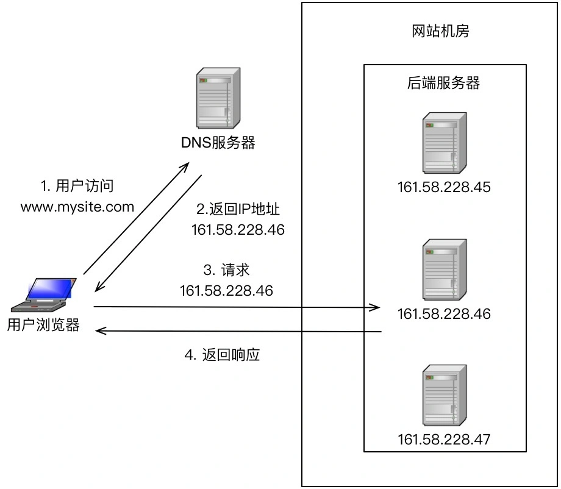
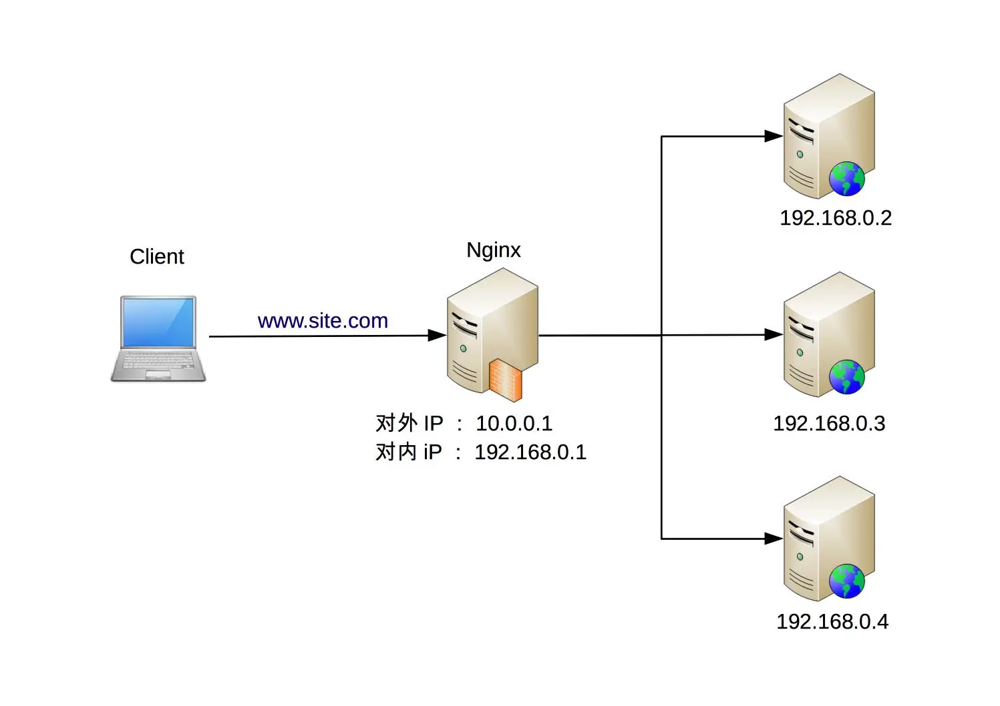
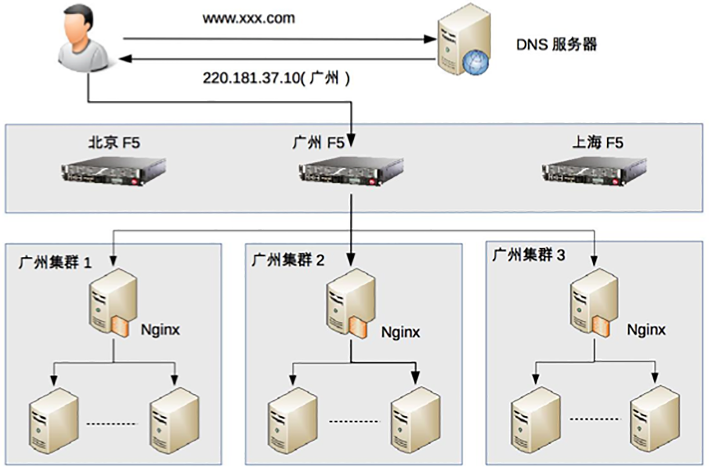

## 原文

单服务器无论如何优化，无论采用多好的硬件，总会有一个性能天花板，当单服务器的性能无法满足业务需求时，就需要设计高性能集群来提升系统整体的处理性能。

高性能集群的本质很简单，通过增加更多的服务器来提升系统整体的计算能力。由于计算本身存在一个特点：同样的输入数据和逻辑，无论在哪台服务器上执行，都应该得到相同的输出。因此高性能集群设计的复杂度主要体现在任务分配这部分，需要设计合理的任务分配策略，将计算任务分配到多台服务器上执行。

**高性能集群的复杂性主要体现在需要增加一个任务分配器，以及为任务选择一个合适的任务分配算法**。对于任务分配器，现在更流行的通用叫法是“负载均衡器”。但这个名称有一定的误导性，会让人潜意识里认为任务分配的目的是要保持各个计算单元的负载达到均衡状态。而实际上任务分配并不只是考虑计算单元的负载均衡，不同的任务分配算法目标是不一样的，有的基于负载考虑，有的基于性能（吞吐量、响应时间）考虑，有的基于业务考虑。考虑到“负载均衡”已经成为了事实上的标准术语，这里我也用“负载均衡”来代替“任务分配”，但请你时刻记住，**负载均衡不只是为了计算单元的负载达到均衡状态**。

今天我先来讲讲**负载均衡的分类及架构**，下一期会讲负载均衡的算法。

### 负载均衡分类

常见的负载均衡系统包括 3 种：DNS 负载均衡、硬件负载均衡和软件负载均衡。

#### DNS 负载均衡

DNS 是最简单也是最常见的负载均衡方式，一般用来实现地理级别的均衡。例如，北方的用户访问北京的机房，南方的用户访问深圳的机房。DNS 负载均衡的本质是 DNS 解析同一个域名可以返回不同的 IP 地址。例如，同样是 www.baidu.com，北方用户解析后获取的地址是 61.135.165.224（这是北京机房的 IP），南方用户解析后获取的地址是 14.215.177.38（这是深圳机房的 IP）。

下面是 DNS 负载均衡的简单示意图：

DNS 负载均衡实现简单、成本低，但也存在粒度太粗、负载均衡算法少等缺点。仔细分析一下优缺点，其优点有：

+ 简单、成本低：负载均衡工作交给 DNS 服务器处理，无须自己开发或者维护负载均衡设备。
+ 就近访问，提升访问速度：DNS 解析时可以根据请求来源 IP，解析成距离用户最近的服务器地址，可以加快访问速度，改善性能。

缺点有：

+ 更新不及时：DNS 缓存的时间比较长，修改 DNS 配置后，由于缓存的原因，还是有很多用户会继续访问修改前的 IP，这样的访问会失败，达不到负载均衡的目的，并且也影响用户正常使用业务。
+ 扩展性差：DNS 负载均衡的控制权在域名商那里，无法根据业务特点针对其做更多的定制化功能和扩展特性。
+ 分配策略比较简单：DNS 负载均衡支持的算法少；不能区分服务器的差异（不能根据系统与服务的状态来判断负载）；也无法感知后端服务器的状态。

针对 DNS 负载均衡的一些缺点，对于时延和故障敏感的业务，有一些公司自己实现了 HTTP-DNS 的功能，即使用 HTTP 协议实现一个私有的 DNS 系统。这样的方案和通用的 DNS 优缺点正好相反。

####  硬件负载均衡

硬件负载均衡是通过单独的硬件设备来实现负载均衡功能，这类设备和路由器、交换机类似，可以理解为一个用于负载均衡的基础网络设备。目前业界典型的硬件负载均衡设备有两款：F5 和 A10。这类设备性能强劲、功能强大，但价格都不便宜，一般只有“土豪”公司才会考虑使用此类设备。普通业务量级的公司一是负担不起，二是业务量没那么大，用这些设备也是浪费。

硬件负载均衡的优点是：

+ 功能强大：全面支持各层级的负载均衡，支持全面的负载均衡算法，支持全局负载均衡。
+ 性能强大：对比一下，软件负载均衡支持到 10 万级并发已经很厉害了，硬件负载均衡可以支持 100 万以上的并发。
+ 稳定性高：商用硬件负载均衡，经过了良好的严格测试，经过大规模使用，稳定性高。
+ 支持安全防护：硬件均衡设备除具备负载均衡功能外，还具备防火墙、防 DDoS 攻击等安全功能。

硬件负载均衡的缺点是：

+ 价格昂贵：最普通的一台 F5 就是一台“马 6”，好一点的就是“Q7”了。
+ 扩展能力差：硬件设备，可以根据业务进行配置，但无法进行扩展和定制。

#### 软件负载均衡

软件负载均衡通过负载均衡软件来实现负载均衡功能，常见的有 Nginx 和 LVS，其中 Nginx 是软件的 7 层负载均衡，LVS 是 Linux 内核的 4 层负载均衡。4 层和 7 层的区别就在于**协议**和**灵活性**，Nginx 支持 HTTP、E-mail 协议；而 LVS 是 4 层负载均衡，和协议无关，几乎所有应用都可以做，例如，聊天、数据库等。

软件和硬件的最主要区别就在于性能，硬件负载均衡性能远远高于软件负载均衡性能。Nginx 的性能是万级，一般的 Linux 服务器上装一个 Nginx 大概能到 5 万 / 秒；LVS 的性能是十万级，据说可达到 80 万 / 秒；而 F5 性能是百万级，从 200 万 / 秒到 800 万 / 秒都有（数据来源网络，仅供参考，如需采用请根据实际业务场景进行性能测试）。当然，软件负载均衡的最大优势是便宜，一台普通的 Linux 服务器批发价大概就是 1 万元左右，相比 F5 的价格，那就是自行车和宝马的区别了。

除了使用开源的系统进行负载均衡，如果业务比较特殊，也可能基于开源系统进行定制（例如，Nginx 插件），甚至进行自研。

下面是 Nginx 的负载均衡架构示意图：

软件负载均衡的优点：

+ 简单：无论是部署还是维护都比较简单。
+ 便宜：只要买个 Linux 服务器，装上软件即可。
+ 灵活：4 层和 7 层负载均衡可以根据业务进行选择；也可以根据业务进行比较方便的扩展，例如，可以通过 Nginx 的插件来实现业务的定制化功能。

其实下面的缺点都是和硬件负载均衡相比的，并不是说软件负载均衡没法用。

+ 性能一般：一个 Nginx 大约能支撑 5 万并发。
+ 功能没有硬件负载均衡那么强大。
+ 一般不具备防火墙和防 DDoS 攻击等安全功能。

### 负载均衡典型架构

前面我们介绍了 3 种常见的负载均衡机制：DNS 负载均衡、硬件负载均衡、软件负载均衡，每种方式都有一些优缺点，但并不意味着在实际应用中只能基于它们的优缺点进行非此即彼的选择，反而是基于它们的优缺点进行组合使用。具体来说，组合的**基本原则**为：DNS 负载均衡用于实现地理级别的负载均衡；硬件负载均衡用于实现集群级别的负载均衡；软件负载均衡用于实现机器级别的负载均衡。

我以一个假想的实例来说明一下这种组合方式，如下图所示。

整个系统的负载均衡分为三层。

+ 地理级别负载均衡：www.xxx.com 部署在北京、广州、上海三个机房，当用户访问时，DNS 会根据用户的地理位置来决定返回哪个机房的 IP，图中返回了广州机房的 IP 地址，这样用户就访问到广州机房了。
+ 集群级别负载均衡：广州机房的负载均衡用的是 F5 设备，F5 收到用户请求后，进行集群级别的负载均衡，将用户请求发给 3 个本地集群中的一个，我们假设 F5 将用户请求发给了“广州集群 2”。
+ 机器级别的负载均衡：广州集群 2 的负载均衡用的是 Nginx，Nginx 收到用户请求后，将用户请求发送给集群里面的某台服务器，服务器处理用户的业务请求并返回业务响应。

需要注意的是，上图只是一个示例，一般在大型业务场景下才会这样用，如果业务量没这么大，则没有必要严格照搬这套架构。例如，一个大学的论坛，完全可以不需要 DNS 负载均衡，也不需要 F5 设备，只需要用 Nginx 作为一个简单的负载均衡就足够了。

### 小结

今天我为你讲了负载均衡的常见分类以及典型架构，希望对你有所帮助。

这就是今天的全部内容，留一道思考题给你吧，假设你来设计一个日活跃用户 1000 万的论坛的负载均衡集群，你的方案是什么？设计理由是什么？

## 读者观点

**无聊夫斯基：**
我还是不是很理解TPS和QPS具体的区别
> 作者回复: T=transaction，代表写请求,Q=query，代表读请求

**鹅米豆发:**
日活千万的论坛，这个流量不低了。

1、首先，流量评估。
       1000万DAU，换算成秒级，平均约等于116。

考虑每个用户操作次数，假定10，换算成平均QPS=1160。

       考虑峰值是均值倍数，假定10，换算成峰值QPS=11600。

       考虑静态资源、图片资源、服务拆分等，流量放大效应，假定10，QPS*10=116000。

2、其次，容量规划。

       考虑高可用、异地多活，QPS*2=232000。

       考虑未来半年增长，QPS*1.5=348000。

3、最后，方案设计。

       三级导流。

       第一级，DNS，确定机房，以目前量级，可以不考虑。

       第二级，确定集群，扩展优先，则选Haproxy/LVS，稳定优先则选F5。

       第三级，Nginx+KeepAlived，确定实例。
> 作者回复: 思路不错👍👍

**ant:**
日活跃用户1000万应该就是国家级应用了，面向全国活跃或者全球用户，比如最大的Xxx网站github。这个时候钱应该都不是问题了。我觉得可以考虑异地多机房部署。这样导流之后每个机房的日活就少很多。其实我在想如果在每个机房不加入负载硬件用多个ngnix集群来实现，每个ngnix上会有我们自定义的路由算法。ngnix也架设多层，逐层导流，比如我们一个机房设计承受200万，那么我们可以架设3层ngnix，第一层基于自己的路由算法导流到第2层ngnix。第2层又导流到第3层。为了避免ngnix单点，每一层ngnix部署多。这样导流下流每台服务器所承认的访问不会很多。不知道这样的设计能不能达到要求，老师点评下
> 作者回复: 可以达到，但有点复杂，nginx做级联不太合适，因为顶层的nginx性能是瓶颈，多级导流一般用在处理能力有差异的系统上，例如一级用F5，二级用LVS，三级用nginx

**何国平:**
nginx也支持4层反向代理了
> 作者回复: 我宁愿用LVS，久经考验，性能强大😄

**老北:**
千万日活，论坛的时间相对比较集中，同时在线预计会达到一百万。
这时候会有一半的人在操作(查看帖子之类)，每个用户操作可能会调用2-3个接口。那并发数大约就是50w*2.5=125w?

这时候nginx的5w并发就不行了。需要多个dns到不同主机，再进行nginx,lvs之类转发。
另外像tomcat一般支持2000左右连接数。这样就需要600多台tomcat？
总感觉哪里算的不对😂
> 作者回复: 确实有点吓人，千万日活转换为百万同时在线这里有问题，一般把日活转换为pv，例如平均每个用户会访问100个页面，日访问量就是10亿，每秒就是大约1.2万的并发访问量，再按照峰值等于均值3倍来算，也就3.6万，远远没有125万那么夸张

**张玮(大圣):**
看了大家的各种计算，估容量，估机器，

想说的是：根据之前专栏讲到的单台高性能模式等知识，先把单台机器做到最优化，同时做好负载均衡层，然后进行压测，一步一步添加机器，均衡层 Nginx 够了，另外，要考虑成本啊，F5尽量不用，稳定性用双主克服下
> 作者回复: 最好算一下，当然有经验的架构师确实能够凭感觉预估

**good boby:**
向后延伸：负载均衡还包括以下处理
1、集群调度平台（PaaS）平台，例如k8s 、docker， 可以实现动态扩容和缩减，根据事实的并发量进行处理，当然前提是包括Nginx、lvs、haproxy前端负载均衡器不能挂掉。
2、分布式框架。
例如：Spring Cloud 的ribbion、feign也可以从应用层面实现负载均衡。
> 作者回复: 非常棒的补充，当时写书的时候，这些还不怎么很成熟，所以没有包含，技术与时俱进，我们的认知也要不断更新 ：）

**lawrence.peng:**
老师，看了前面的文章的话，经常能看到你说，linux服务器 nginx 5w/s ，lvs 80w/s 等等，并且知道这些机器是当前主流的配置 32C 48G,要求我们要把这个性能指标背熟，目地是很明显的，为了做容量规划。但现在很多创业公司，基本上都是上云的，云主机的配置基本都是4C 8G,问题来了，怎么去做这个应用的容量规划呢？或者这些指标哪里能查阅吗？
> 作者回复: 云主机的性能可以按照同配置的物理机80%的性能来估算

## 我的观点