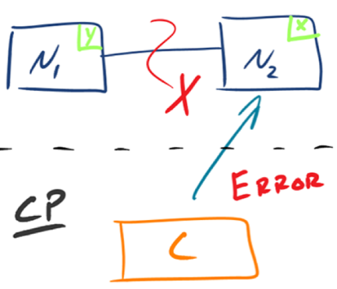
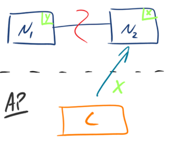

## 原文

CAP 定理（CAP theorem）又被称作布鲁尔定理（Brewer's theorem），是加州大学伯克利分校的计算机科学家埃里克·布鲁尔（Eric Brewer）在 2000 年的 ACM PODC 上提出的一个猜想。2002 年，麻省理工学院的赛斯·吉尔伯特（Seth Gilbert）和南希·林奇（Nancy Lynch）发表了布鲁尔猜想的证明，使之成为分布式计算领域公认的一个定理。**对于设计分布式系统的架构师来说，CAP 是必须掌握的理论。**

布鲁尔在提出 CAP 猜想的时候，并没有详细定义 Consistency、Availability、Partition Tolerance 三个单词的明确定义，因此如果初学者去查询 CAP 定义的时候会感到比较困惑，因为不同的资料对 CAP 的详细定义有一些细微的差别，例如：

> **Consistency**: where all nodes see the same data at the same time.
> **Availability**: which guarantees that every request receives a response about whether it succeeded or failed.
> **Partition tolerance**: where the system continues to operate even if any one part of the system is lost or fails.

(https://console.bluemix.net/docs/services/Cloudant/guides/cap_theorem.html#cap-)

> **Consistency**: Every read receives the most recent write or an error.> **Availability**: Every request receives a (non-error) response – without guarantee that it contains the most recent write.
> **Partition tolerance**: The system continues to operate despite an arbitrary number of messages being dropped (or delayed) by the network between nodes.

(https://en.wikipedia.org/wiki/CAP_theorem#cite_note-Brewer2012-6)

> **Consistency**: all nodes have access to the same data simultaneously.
> **Availability**: a promise that every request receives a response, at minimum whether the request succeeded or failed.
> **Partition tolerance**: the system will continue to work even if some arbitrary node goes offline or can’t communicate.

(https://www.teamsilverback.com/understanding-the-cap-theorem/)

为了更好地解释 CAP 理论，我挑选了 Robert Greiner（http://robertgreiner.com/about/）的文章作为参考基础。有趣的是，Robert Greiner 对 CAP 的理解也经历了一个过程，他写了两篇文章来阐述 CAP 理论，第一篇被标记为“outdated”（有一些中文翻译文章正好参考了第一篇），我将对比前后两篇解释的差异点，通过对比帮助你更加深入地理解 CAP 理论。

### CAP理论

第一版解释：

> Any distributed system cannot guaranty C, A, and P simultaneously.

（http://robertgreiner.com/2014/06/cap-theorem-explained/）

简单翻译为：对于一个分布式计算系统，不可能同时满足一致性（Consistence）、可用性（Availability）、分区容错性（Partition Tolerance）三个设计约束。

第二版解释：

> In a distributed system (a collection of interconnected nodes that share data.), you can only have two out of the following three guarantees across a write/read pair: Consistency, Availability, and Partition Tolerance - one of them must be sacrificed.

（http://robertgreiner.com/2014/08/cap-theorem-revisited/）

简单翻译为：在一个分布式系统（指互相连接并共享数据的节点的集合）中，当涉及读写操作时，只能保证一致性（Consistence）、可用性（Availability）、分区容错性（Partition Tolerance）三者中的两个，另外一个必须被牺牲。

对比两个版本的定义，有几个很关键的差异点：

+ 第二版定义了什么才是 CAP 理论探讨的分布式系统，强调了两点：interconnected 和 share data，为何要强调这两点呢？ 因为**分布式系统并不一定会互联和共享数据**。最简单的例如 Memcache 的集群，相互之间就没有连接和共享数据，因此 Memcache 集群这类分布式系统就不符合 CAP 理论探讨的对象；而 MySQL 集群就是互联和进行数据复制的，因此是 CAP 理论探讨的对象。
+ 第二版强调了 write/read pair，这点其实是和上一个差异点一脉相承的。也就是说，**CAP 关注的是对数据的读写操作，而不是分布式系统的所有功能**。例如，ZooKeeper 的选举机制就不是 CAP 探讨的对象。

相比来说，第二版的定义更加精确。

虽然第二版的定义和解释更加严谨，但内容相比第一版来说更加难记一些，所以现在大部分技术人员谈论 CAP 理论时，更多还是按照第一版的定义和解释来说的，因为第一版虽然不严谨，但非常简单和容易记住。

第二版除了基本概念，三个基本的设计约束也进行了重新阐述，我来详细分析一下。

1. 一致性（Consistency）

第一版解释：

> All nodes see the same data at the same time.

简单翻译为：所有节点在同一时刻都能看到相同的数据。

第二版解释：

> A read is guaranteed to return the most recent write for a given client.

简单翻译为：对某个指定的客户端来说，读操作保证能够返回最新的写操作结果。

第一版解释和第二版解释的主要差异点表现在：

+ 第一版从节点 node 的角度描述，第二版从客户端 client 的角度描述。

相比来说，第二版更加符合我们观察和评估系统的方式，即站在客户端的角度来观察系统的行为和特征。

+ 第一版的关键词是 see，第二版的关键词是 read。

第一版解释中的 see，其实并不确切，因为节点 node 是拥有数据，而不是看到数据，即使要描述也是用 have；第二版从客户端 client 的读写角度来描述一致性，定义更加精确。

+ 第一版强调同一时刻拥有相同数据（same time + same data），第二版并没有强调这点。

这就意味着实际上对于节点来说，可能同一时刻拥有不同数据（same time + different data），这和我们通常理解的一致性是有差异的，为何做这样的改动呢？其实在第一版的详细解释中已经提到了，具体内容如下：

> A system has consistency if a transaction starts with the system in a consistent state, and ends with the system in a consistent state. In this model, a system can (and does) shift into an inconsistent state during a transaction, but the entire transaction gets rolled back if there is an error during any stage in the process.

参考上述的解释，对于系统执行事务来说，**在事务执行过程中，系统其实处于一个不一致的状态，不同的节点的数据并不完全一致**，因此第一版的解释“All nodes see the same data at the same time”是不严谨的。而第二版强调 client 读操作能够获取最新的写结果就没有问题，因为事务在执行过程中，client 是无法读取到未提交的数据的，只有等到事务提交后，client 才能读取到事务写入的数据，而如果事务失败则会进行回滚，client 也不会读取到事务中间写入的数据。

2. 可用性（Availability）

第一版解释：

> Every request gets a response on success/failure.

简单翻译为：每个请求都能得到成功或者失败的响应。

第二版解释：

> A non-failing node will return a reasonable response within a reasonable amount of time (no error or timeout).

简单翻译为：非故障的节点在合理的时间内返回合理的响应（不是错误和超时的响应）。

第一版解释和第二版解释主要差异点表现在：

+ 第一版是 every request，第二版强调了 A non-failing node。

第一版的 every request 是不严谨的，因为只有非故障节点才能满足可用性要求，如果节点本身就故障了，发给节点的请求不一定能得到一个响应。

+ 第一版的 response 分为 success 和 failure，第二版用了两个 reasonable：reasonable response 和 reasonable time，而且特别强调了 no error or timeout。

第一版的 success/failure 的定义太泛了，几乎任何情况，无论是否符合 CAP 理论，我们都可以说请求成功和失败，因为超时也算失败、错误也算失败、异常也算失败、结果不正确也算失败；即使是成功的响应，也不一定是正确的。例如，本来应该返回 100，但实际上返回了 90，这就是成功的响应，但并没有得到正确的结果。相比之下，第二版的解释明确了不能超时、不能出错，结果是合理的，**注意没有说“正确”的结果**。例如，应该返回 100 但实际上返回了 90，肯定是不正确的结果，但可以是一个合理的结果。

3. 分区容忍性（Partition Tolerance）

第一版解释：

> System continues to work despite message loss or partial failure.

简单翻译为：出现消息丢失或者分区错误时系统能够继续运行。

第二版解释：

> The system will continue to function when network partitions occur.

简单翻译为：当出现网络分区后，系统能够继续“履行职责”。

第一版解释和第二版解释主要差异点表现在：

+ 第一版用的是 work，第二版用的是 function。

work 强调“运行”，只要系统不宕机，我们都可以说系统在 work，返回错误也是 work，拒绝服务也是 work；而 function 强调“发挥作用”“履行职责”，这点和可用性是一脉相承的。也就是说，只有返回 reasonable response 才是 function。相比之下，第二版解释更加明确。

+ 第一版描述分区用的是 message loss or partial failure，第二版直接用 network partitions。

对比两版解释，第一版是直接说原因，即 message loss 造成了分区，但 message loss 的定义有点狭隘，因为通常我们说的 message loss（丢包），只是网络故障中的一种；第二版直接说现象，即发生了**分区现象**，不管是什么原因，可能是丢包，也可能是连接中断，还可能是拥塞，只要导致了网络分区，就通通算在里面。

### CAP 应用

虽然 CAP 理论定义是三个要素中只能取两个，但放到分布式环境下来思考，我们会发现必须选择 P（分区容忍）要素，因为网络本身无法做到 100% 可靠，有可能出故障，所以分区是一个必然的现象。如果我们选择了 CA 而放弃了 P，那么当发生分区现象时，为了保证 C，系统需要禁止写入，当有写入请求时，系统返回 error（例如，当前系统不允许写入），这又和 A 冲突了，因为 A 要求返回 no error 和 no timeout。因此，分布式系统理论上不可能选择 CA 架构，只能选择 CP 或者 AP 架构。

1. CP - Consistency/Partition Tolerance

如下图所示，为了保证一致性，当发生分区现象后，N1 节点上的数据已经更新到 y，但由于 N1 和 N2 之间的复制通道中断，数据 y 无法同步到 N2，N2 节点上的数据还是 x。这时客户端 C 访问 N2 时，N2 需要返回 Error，提示客户端 C“系统现在发生了错误”，这种处理方式违背了可用性（Availability）的要求，因此 CAP 三者只能满足 CP。

2. AP - Availability/Partition Tolerance

如下图所示，为了保证可用性，当发生分区现象后，N1 节点上的数据已经更新到 y，但由于 N1 和 N2 之间的复制通道中断，数据 y 无法同步到 N2，N2 节点上的数据还是 x。这时客户端 C 访问 N2 时，N2 将当前自己拥有的数据 x 返回给客户端 C 了，而实际上当前最新的数据已经是 y 了，这就不满足一致性（Consistency）的要求了，因此 CAP 三者只能满足 AP。注意：这里 N2 节点返回 x，虽然不是一个“正确”的结果，但是一个“合理”的结果，因为 x 是旧的数据，并不是一个错乱的值，只是不是最新的数据而已。

### 小结

今天我为你讲了 CAP 理论，通过对比两个不同版本的 CAP 理论解释，详细地分析了 CAP 理论的准确定义，希望对你有所帮助。

这就是今天的全部内容，留一道思考题给你吧，基于 Paxos 算法构建的分布式系统，属于 CAP 架构中的哪一种？谈谈你的分析和理解。

## 读者观点

**鹅米豆发:**
Paxos算法本身能提供的是，可靠的最终一致性保证。如有足够的隔离性措施，中间状态的无法被客户端读取，则可以达到强一致性，这种属于CP架构。其它情况，就是AP架构。
       CAP定理存在不少坑点，理解起来很是令人费解。
       1、适用场景。分布式系统有很多类型，有异构的，比如节点之间是上下游依赖的关系，有同构的，比如分区/分片型的、副本型的（主从、多主）。CAP定理的适用场景是副本型的这种。
       2、一致性的概念，从强到弱，线性一致性、顺序一致性、因果一致性、单调一致性、最终一致性，CAP中的一致性应该是指顺序一致性。
       3、CAP中的一致性，与ACID中的一致性的区别。事务中的一致性，是指满足完整性约束条件，CAP中的一致性，是指读写一致性。
       4、CAP中的可用性，与我们常说的高可用的区别。比如HBase、MongoDB属于CP架构，Cassandra、CounchDB属于AP系统，能说后者比前者更高可用么？应该不是。CAP中的可用性，是指在某一次读操作中，即便发现不一致，也要返回响应，即在合理时间内返回合理响应。我们常说的高可用，是指部分实例挂了，能自动摘除，并由其它实例继续提供服务，关键是冗余。
       5、哪些情况属于网络分区。网络故障造成的分区，属于。节点应用出现问题导致超时，属于。节点宕机或硬件故障，不属于。

**鹅米豆发：**
前面对于一致性的描述有些问题。修正一下。
1、Paxos算法本身是满足线性一致性的。线性一致性，也是实际系统能够达到的最强一致性。
2、Paxos及其各种变体，在实际工程领域的实现，大多是做了一定程度的取舍，并不完全是线性一致性的。
3、比如，Zookeeper和Etcd，都是对于写操作（比如选举），满足线性一致性，对于读操作未必满足线性一致性。即可以选择线性一致性读取，也可以选择非线性一致性读取。这里的非线性一致性，就是顺序一致性。
4、cap中的一致性，是指线性一致性，而不是顺序一致性。
> 作者回复: 感谢，根据Raft的论文描述，工程上目前还没有完全实现paxos算法的系统

**luop:**
第二版解释从 non-failing node 的角度去看待「可用性」，个人存疑。

如果一个集群有 2 个 node，某个时刻 2 个 node 都 fail 了，那么此时该集群的「可用性」该如何定义？

个人觉得：「一致性」和「可用性」都应该站在 client 侧去审视；而「分区容忍性」则是集群 node 侧在遇到网络分区的问题时，选择如何去影响 client 侧感知到的「一致性」和「可用性」。
> 作者回复: 两个都挂整个集群肯定挂了，CAP关注的是分区时的可用性和一致性，不是说保证整个集群不挂，其实你最后的理解就是非常正确的👍👍

**tim:**
请问一下作者，在CP的选型中。 假如是查询一条并不存在的数据，文中还说得通。
但如果出现更新数据不及时，由于n1和n2 出现分区错误，那么n2如何知道自己不是最新的数据并返回error呢？？
假如就是简单的mysql主从， 从库并没有断连主库，只是数据在请求来是还没有更新到最新。 那么从库又从哪里得知这件事儿的呢？？
> 作者回复: **CAP理论是忽略延时的**，这就是说理论做了一个假设，只要网络通数据就会一致，这也是实际应用CAP时容易踩的坑，后面一章会讲

**Geek_88604f:**
paxos的核心思想是少数服从多数，在节点数为2n+1的集群中，只要n+1节点上完成了写入就能保证接下来的读操作能够读到最新的值。从这一点来说它满足C（对某个指定的客户端来说，读操作保证能够返回最新的写操作结果);一个实现了paxos协议的集群最多可以容忍n个节点故障（n个节点同时故障的概率是比较小的），非故障节点组成的集群仍能正常提供服务，从这个角度来讲它满足A(非故障的节点在合理的时间内返回合理的响应，不是错误和超时的响应)；paxos集群发生分区肯能存在两种情况，第一种情况是发生分区后没有发生重新选举，这种情况下集群仍能正常工作，因此满足P(当出现网络分区后，系统能够继续“履行职责”)。另一种情况是发生分区后原来的集群达不到多数派，集群不在对外提供服务，因此不满足P，当发生这种情况的时候，一般会快速修复。总的来说在某种意义上来看paxos满足CAP。
> 作者回复: 分析的很好

**Gaozy:**
有个疑问，很多工程实现都是选择AP并保证最终一致性，但是选择了A不就意味着返回数据不是最新的吗，最终一致性是如何实现的
> 作者回复: 人工数据订正和补偿，定时脚本批量检查和修复等都可以

**发条橙子 。:**
你好老师 ，这里讲的分区容错是指什么 ，是指发生分区现象时系统正常运行 。 但是分区现象具体指的是什么 可以详细讲一下么
> 作者回复: 分区就是集群中一部分节点和另外一部分无法通信