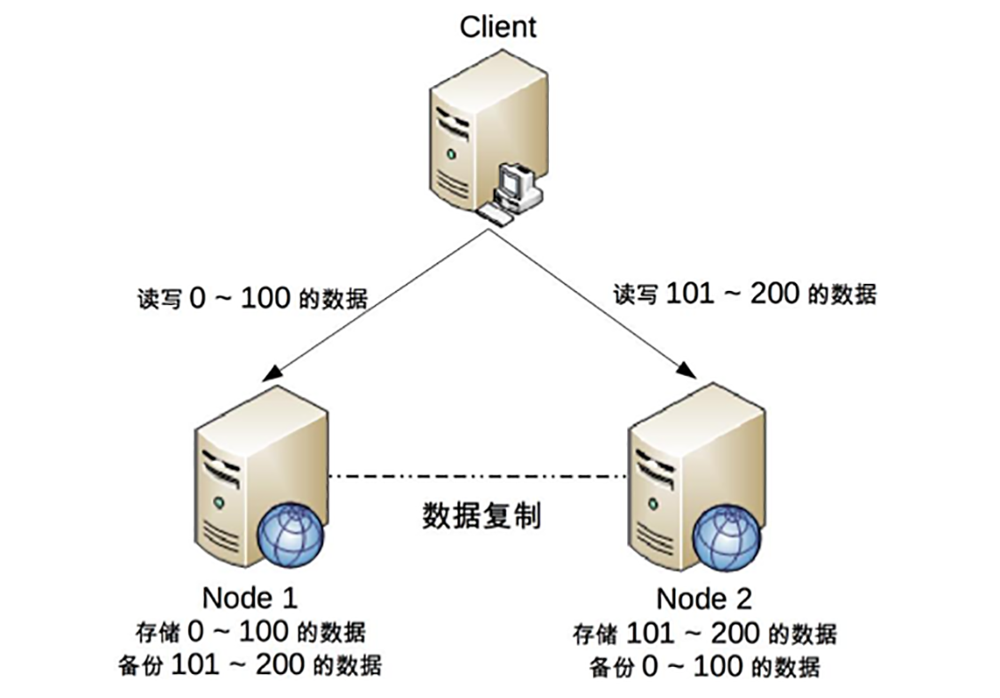

## 原文

理论的优点在于清晰简洁、易于理解，但缺点就是高度抽象化，省略了很多细节，导致在将理论应用到实践时，由于各种复杂情况，可能出现误解和偏差，CAP 理论也不例外。如果我们没有意识到这些关键的细节点，那么在实践中应用 CAP 理论时，就可能发现方案很难落地。

而且当谈到数据一致性时，CAP、ACID、BASE 难免会被我们拿出来讨论，原因在于这三者都是和数据一致性相关的理论，如果不仔细理解三者之间的差别，则可能会陷入一头雾水的状态，不知道应该用哪个才好。

今天，我来讲讲**CAP 的具体细节，简单对比一下 ACID、BASE 几个概念的关键区别点。**

### CAP关键细节点

埃里克·布鲁尔（Eric Brewer）在《CAP 理论十二年回顾：“规则”变了》（http://www.infoq.com/cn/articles/cap-twelve-years-later-how-the-rules-have-changed）一文中详细地阐述了理解和应用 CAP 的一些细节点，可能是由于作者写作风格的原因，对于一些非常关键的细节点一句话就带过了，这里我特别提炼出来重点阐述。

+ CAP 关注的粒度是数据，而不是整个系统。

原文就只有一句话：

> C 与 A 之间的取舍可以在同一系统内以非常细小的粒度反复发生，而每一次的决策可能因为具体的操作，乃至因为牵涉到特定的数据或用户而有所不同。

但这句话是理解和应用 CAP 理论非常关键的一点。CAP 理论的定义和解释中，用的都是 system、node 这类系统级的概念，这就给很多人造成了很大的误导，认为我们在进行架构设计时，整个系统要么选择 CP，要么选择 AP。但在实际设计过程中，每个系统不可能只处理一种数据，而是包含多种类型的数据，有的数据必须选择 CP，有的数据必须选择 AP。而如果我们做设计时，从整个系统的角度去选择 CP 还是 AP，就会发现顾此失彼，无论怎么做都是有问题的。

以一个最简单的用户管理系统为例，用户管理系统包含用户账号数据（用户 ID、密码）、用户信息数据（昵称、兴趣、爱好、性别、自我介绍等）。通常情况下，用户账号数据会选择 CP，而用户信息数据会选择 AP，如果限定整个系统为 CP，则不符合用户信息数据的应用场景；如果限定整个系统为 AP，则又不符合用户账号数据的应用场景。

所以在 CAP 理论落地实践时，我们需要将系统内的数据按照不同的应用场景和要求进行分类，每类数据选择不同的策略（CP 还是 AP），而不是直接限定整个系统所有数据都是同一策略。

+ CAP 是忽略网络延迟的。

这是一个非常隐含的假设，布鲁尔在定义一致性时，并没有将延迟考虑进去。也就是说，当事务提交时，数据能够瞬间复制到所有节点。但实际情况下，从节点 A 复制数据到节点 B，总是需要花费一定时间的。如果是相同机房，耗费时间可能是几毫秒；如果是跨地域的机房，例如北京机房同步到广州机房，耗费的时间就可能是几十毫秒。这就意味着，CAP 理论中的 C 在实践中是不可能完美实现的，在数据复制的过程中，节点 A 和节点 B 的数据并不一致。

不要小看了这几毫秒或者几十毫秒的不一致，对于某些严苛的业务场景，例如和金钱相关的用户余额，或者和抢购相关的商品库存，技术上是无法做到分布式场景下完美的一致性的。而业务上必须要求一致性，因此单个用户的余额、单个商品的库存，理论上要求选择 CP 而实际上 CP 都做不到，只能选择 CA。也就是说，只能单点写入，其他节点做备份，无法做到分布式情况下多点写入。

需要注意的是，这并不意味着这类系统无法应用分布式架构，只是说“单个用户余额、单个商品库存”无法做分布式，但系统整体还是可以应用分布式架构的。例如，下面的架构图是常见的将用户分区的分布式架构。

我们可以将用户 id 为 0 ~ 100 的数据存储在 Node 1，将用户 id 为 101 ~ 200 的数据存储在 Node 2，Client 根据用户 id 来决定访问哪个 Node。对于单个用户来说，读写操作都只能在某个节点上进行；对所有用户来说，有一部分用户的读写操作在 Node 1 上，有一部分用户的读写操作在 Node 2 上。

这样的设计有一个很明显的问题就是某个节点故障时，这个节点上的用户就无法进行读写操作了，但站在整体上来看，这种设计可以降低节点故障时受影响的用户的数量和范围，毕竟只影响 20% 的用户肯定要比影响所有用户要好。这也是为什么挖掘机挖断光缆后，支付宝只有一部分用户会出现业务异常，而不是所有用户业务异常的原因。

+ 正常运行情况下，不存在 CP 和 AP 的选择，可以同时满足 CA。

CAP 理论告诉我们分布式系统只能选择 CP 或者 AP，但其实这里的前提是系统发生了“分区”现象。如果系统没有发生分区现象，也就是说 P 不存在的时候（节点间的网络连接一切正常），我们没有必要放弃 C 或者 A，应该 C 和 A 都可以保证，这就要求架构设计的时候**既要考虑分区发生时选择 CP 还是 AP，也要考虑分区没有发生时如何保证 CA**。

同样以用户管理系统为例，即使是实现 CA，不同的数据实现方式也可能不一样：用户账号数据可以采用“消息队列”的方式来实现 CA，因为消息队列可以比较好地控制实时性，但实现起来就复杂一些；而用户信息数据可以采用“数据库同步”的方式来实现 CA，因为数据库的方式虽然在某些场景下可能延迟较高，但使用起来简单。

+ 放弃并不等于什么都不做，需要为分区恢复后做准备。
  
CAP 理论告诉我们三者只能取两个，需要“牺牲”（sacrificed）另外一个，这里的“牺牲”是有一定误导作用的，因为“牺牲”让很多人理解成什么都不做。实际上，CAP 理论的“牺牲”只是说在分区过程中我们无法保证 C 或者 A，但并不意味着什么都不做。因为在系统整个运行周期中，大部分时间都是正常的，发生分区现象的时间并不长。例如，99.99% 可用性（俗称 4 个 9）的系统，一年运行下来，不可用的时间只有 50 分钟；99.999%（俗称 5 个 9）可用性的系统，一年运行下来，不可用的时间只有 5 分钟。分区期间放弃 C 或者 A，并不意味着永远放弃 C 和 A，我们可以在分区期间进行一些操作，从而让分区故障解决后，系统能够重新达到 CA 的状态。

最典型的就是在分区期间记录一些日志，当分区故障解决后，系统根据日志进行数据恢复，使得重新达到 CA 状态。同样以用户管理系统为例，对于用户账号数据，假设我们选择了 CP，则分区发生后，节点 1 可以继续注册新用户，节点 2 无法注册新用户（这里就是不符合 A 的原因，因为节点 2 收到注册请求后会返回 error），此时节点 1 可以将新注册但未同步到节点 2 的用户记录到日志中。当分区恢复后，节点 1 读取日志中的记录，同步给节点 2，当同步完成后，节点 1 和节点 2 就达到了同时满足 CA 的状态。

而对于用户信息数据，假设我们选择了 AP，则分区发生后，节点 1 和节点 2 都可以修改用户信息，但两边可能修改不一样。例如，用户在节点 1 中将爱好改为“旅游、美食、跑步”，然后用户在节点 2 中将爱好改为“美食、游戏”，节点 1 和节点 2 都记录了未同步的爱好数据，当分区恢复后，系统按照某个规则来合并数据。例如，按照“最后修改优先规则”将用户爱好修改为“美食、游戏”，按照“字数最多优先规则”则将用户爱好修改为“旅游，美食、跑步”，也可以完全将数据冲突报告出来，由人工来选择具体应该采用哪一条。

### ACID

ACID 是数据库管理系统为了保证事务的正确性而提出来的一个理论，ACID 包含四个约束，下面我来解释一下。

1. Atomicity（原子性）

一个事务中的所有操作，要么全部完成，要么全部不完成，不会在中间某个环节结束。事务在执行过程中发生错误，会被回滚到事务开始前的状态，就像这个事务从来没有执行过一样。

2. Consistency（一致性）

在事务开始之前和事务结束以后，数据库的完整性没有被破坏。

3. Isolation（隔离性）

数据库允许多个并发事务同时对数据进行读写和修改的能力。隔离性可以防止多个事务并发执行时由于交叉执行而导致数据的不一致。事务隔离分为不同级别，包括读未提交（Read uncommitted）、读提交（read committed）、可重复读（repeatable read）和串行化（Serializable）。

4. Durability（持久性）

事务处理结束后，对数据的修改就是永久的，即便系统故障也不会丢失。

可以看到，ACID 中的 A（Atomicity）和 CAP 中的 A（Availability）意义完全不同，而 ACID 中的 C 和 CAP 中的 C 名称虽然都是一致性，但含义也完全不一样。ACID 中的 C 是指数据库的数据完整性，而 CAP 中的 C 是指分布式节点中的数据一致性。再结合 ACID 的应用场景是数据库事务，CAP 关注的是分布式系统数据读写这个差异点来看，其实 CAP 和 ACID 的对比就类似关公战秦琼，虽然关公和秦琼都是武将，但其实没有太多可比性。

### BASE

BASE 是指基本可用（Basically Available）、软状态（ Soft State）、最终一致性（ Eventual Consistency），核心思想是即使无法做到强一致性（CAP 的一致性就是强一致性），但应用可以采用适合的方式达到最终一致性。

1. 基本可用（Basically Available）

分布式系统在出现故障时，允许损失部分可用性，即保证核心可用。这里的关键词是“**部分**”和“**核心**”，具体选择哪些作为可以损失的业务，哪些是必须保证的业务，是一项有挑战的工作。例如，对于一个用户管理系统来说，“登录”是核心功能，而“注册”可以算作非核心功能。因为未注册的用户本来就还没有使用系统的业务，注册不了最多就是流失一部分用户，而且这部分用户数量较少。如果用户已经注册但无法登录，那就意味用户无法使用系统。例如，充了钱的游戏不能玩了、云存储不能用了……这些会对用户造成较大损失，而且登录用户数量远远大于新注册用户，影响范围更大。

2. 软状态（Soft State）

允许系统存在中间状态，而该中间状态不会影响系统整体可用性。这里的中间状态就是 CAP 理论中的数据不一致。

3. 最终一致性（Eventual Consistency）

系统中的所有数据副本经过一定时间后，最终能够达到一致的状态。

这里的关键词是“一定时间” 和 “最终”，“一定时间”和数据的特性是强关联的，不同的数据能够容忍的不一致时间是不同的。举一个微博系统的例子，用户账号数据最好能在 1 分钟内就达到一致状态，因为用户在 A 节点注册或者登录后，1 分钟内不太可能立刻切换到另外一个节点，但 10 分钟后可能就重新登录到另外一个节点了；而用户发布的最新微博，可以容忍 30 分钟内达到一致状态，因为对于用户来说，看不到某个明星发布的最新微博，用户是无感知的，会认为明星没有发布微博。“最终”的含义就是不管多长时间，最终还是要达到一致性的状态。

BASE 理论本质上是对 CAP 的延伸和补充，更具体地说，**是对 CAP 中 AP 方案的一个补充**。前面在剖析 CAP 理论时，提到了其实和 BASE 相关的两点：

+ CAP 理论是忽略延时的，而实际应用中延时是无法避免的。

这一点就意味着完美的 CP 场景是不存在的，即使是几毫秒的数据复制延迟，在这几毫秒时间间隔内，系统是不符合 CP 要求的。因此 CAP 中的 CP 方案，实际上也是实现了最终一致性，只是“一定时间”是指几毫秒而已。

+ AP 方案中牺牲一致性只是指分区期间，而不是永远放弃一致性。

这一点其实就是 BASE 理论延伸的地方，分区期间牺牲一致性，但分区故障恢复后，系统应该达到最终一致性。

综合上面的分析，ACID 是数据库事务完整性的理论，CAP 是分布式系统设计理论，BASE 是 CAP 理论中 AP 方案的延伸。

### 小结

今天我为你讲了深入理解 CAP 理论所需要特别关注的细节点，以及 ACID 和 BASE 两个相似的术语，这些技术细节在架构设计中非常关键，希望对你有所帮助。

这就是今天的全部内容，留一道思考题给你吧，假如你来设计电商网站的高可用系统，按照 CAP 理论的要求，你会如何设计？

## 读者观点

**luop：**
结合这两期对 CAP 的学习和思考，谈下个人的理解。

设计分布式系统的两大初衷：横向扩展（scalability）和高可用性（availability）。“横向扩展”是为了解决单点瓶颈问题，进而保证高并发量下的「可用性」；“高可用性”是为了解决单点故障（SPOF）问题，进而保证部分节点故障时的「可用性」。由此可以看出，分布式系统的核心诉求就是「可用性」。这个「可用性」正是 CAP 中的 A：用户访问系统时，可以在合理的时间内得到合理的响应。

为了保证「可用性」，一个分布式系统通常由多个节点组成。这些节点各自维护一份数据，但是不管用户访问到哪个节点，原则上都应该读取到相同的数据。为了达到这个效果，一个节点收到写入请求更新自己的数据后，必须将数据同步到其他节点，以保证各个节点的数据「一致性」。这个「一致性」正是 CAP 中的 C：用户访问系统时，可以读取到最近写入的数据。

需要注意的是：CAP 并没有考虑数据同步的耗时，所以现实中的分布式系统，理论上无法保证任何时刻的绝对「一致性」；不同业务系统对上述耗时的敏感度不同。

分布式系统中，节点之间的数据同步是基于网络的。由于网络本身固有的不可靠属性，极端情况下会出现网络不可用的情况，进而将网络两端的节点孤立开来，这就是所谓的“网络分区”现象。“网络分区”理论上是无法避免的，虽然实际发生的概率较低、时长较短。没有发生“网络分区”时，系统可以做到同时保证「一致性」和「可用性」。

发生“网络分区”时，系统中多个节点的数据一定是不一致的，但是可以选择对用户表现出「一致性」，代价是牺牲「可用性」：将未能同步得到新数据的部分节点置为“不可用状态”，访问到这些节点的用户显然感知到系统是不可用的。发生“网络分区”时，系统也可以选择「可用性」，此时系统中各个节点都是可用的，只是返回给用户的数据是不一致的。这里的选择，就是 CAP 中的 P。

分布式系统理论上一定会存在 P，所以理论上只能做到 CP 或 AP。如果套用 CAP 中离散的 C/A/P 的概念，理论上没有 P 的只可能是单点（子）系统，所以理论上可以做到 CA。但是单点（子）系统并不是分布式系统，所以其实并不在 CAP 理论的描述范围内。
> 作者回复: 写的非常好👍👍

**空档滑行:**
一个电商网站核心模块有会员，订单，商品，支付，促销管理等。
对于会员模块，包括登录，个人设置，个人订单，购物车，收藏夹等，这些模块保证AP，数据短时间不一致不影响使用。
订单模块的下单付款扣减库存操作是整个系统的核心，我觉得CA都需要保证，在极端情况下牺牲P是可以的。
商品模块的商品上下架和库存管理保证CP,搜索功能因为本身就不是实时性非常高的模块，所以保证AP就可以了。
促销是短时间的数据不一致，结果就是优惠信息看不到，但是已有的优惠要保证可用，而且优惠可以提前预计算，所以可以保证AP
现在大部分的电商网站对于支付这一块是独立的系统，或者使用第三方的支付宝，微信。其实CAP是由第三方来保证的，支付系统是一个对CAP要求极高的系统，C是必须要保证的，AP中A相对更重要，不能因为分区，导致所有人都不能支付
> 作者回复: 分析思路很清晰

**乘风:**
老师 你上面说redis集群是互联且数据共享，但按官网上说redis集群后，每个主节点的数据是不一致的，也不存在共享数据，现在对cap中指的分布式系统(互联且数据共享)还是不太明白，谢谢老师
> 作者回复: 这里的共享是指同一份数据在多个节点都有，但并不一定在所有节点都有，简单理解有数据复制的系统就是CAP应用的场景。
一份数据在多个节点有但不是所有节点都有，这是非对称集群；例如ES
所有数据在所有节点都有，这是对称集群，例如zookeeper

**刘毅:**
CAP理解：
任何一个正常运行的分布式系统，起源于CA状态，中间（发生分区时）可能经过CP和AP状态，最后回到CA状态。
所以一个分布式系统，需要考虑实现三点：
1.正常运行时的CA状态。
2.发生分区时转变为CP或AP状态。
3.分区解决时变会CA状态。
> 作者回复: 总结的非常好，第三点可以优化为“分区解决时如何恢复为CA状态”

**xiao皮孩。。:**
理解CAP理论的最简单方式是想象两个节点分处分区两侧。允许至少一个节点更新状态会导致数据不一致，即丧失了C性质。如果为了保证数据一致性，将分区一侧的节点设置为不可用，那么又丧失了A性质。除非两个节点可以互相通信，才能既保证C又保证A，这又会导致丧失P性质。
> 作者回复: 是的👍👍

**正是那朵玫瑰:**
老师有个疑问，像电商这样的系统，有订单系统和库存系统，创建订单会调用库存系统，这两个系统是互联的，但是并没有数据共享，但超时的情况下，会造成订单数据和库存数据状态不一致，这种算不算cap讨论范畴呢？
> 作者回复: 不算，CAP的应用范围已经明确了：互联，共享数据。
这种情况下的不一致靠对账，人工修复等方式解决

## 我的观点