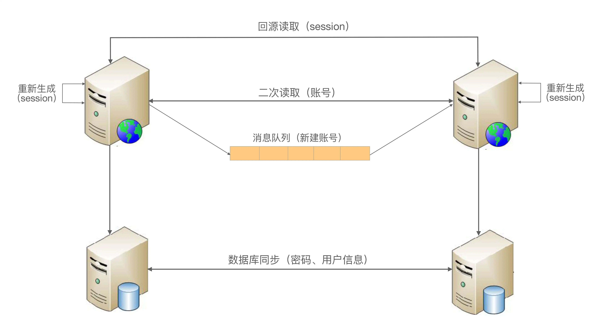

## 原文

专栏上一期我介绍了三种不同类型的异地多活架构，复习一下每个架构的关键点：

+ 同城异区

关键在于搭建高速网络将两个机房连接起来，达到近似一个本地机房的效果。架构设计上可以将两个机房当作本地机房来设计，无须额外考虑。

+ 跨城异地

关键在于数据不一致的情况下，业务不受影响或者影响很小，这从逻辑的角度上来说其实是矛盾的，架构设计的主要目的就是为了解决这个矛盾。

+ 跨国异地

主要是面向不同地区用户提供业务，或者提供只读业务，对架构设计要求不高。

基于这个分析，跨城异地多活是架构设计复杂度最高的一种，接下来我将介绍**跨城异地多活架构设计的一些技巧和步骤**，今天我们先来看 4 大技巧，掌握这些技巧可以说是完成好设计步骤的前提。

### 技巧 1：保证核心业务的异地多活

“异地多活”是为了保证业务的高可用，但很多架构师在考虑这个“业务”时，会不自觉地陷入一个思维误区：我要保证所有业务都能“异地多活”！

假设我们需要做一个“用户子系统”，这个子系统负责“注册”“登录”“用户信息”三个业务。为了支持海量用户，我们设计了一个“用户分区”的架构，即正常情况下用户属于某个主分区，每个分区都有其他数据的备份，用户用邮箱或者手机号注册，路由层拿到邮箱或者手机号后，通过 Hash 计算属于哪个中心，然后请求对应的业务中心。基本的架构如下：

这样一个系统，如果 3 个业务要同时实现异地多活，会发现这些难以解决的问题：

+ 注册问题

A 中心注册了用户，数据还未同步到 B 中心，此时 A 中心宕机，为了支持注册业务多活，可以挑选 B 中心让用户去重新注册。看起来很容易就支持多活了，但仔细思考一下会发现这样做会有问题：一个手机号只能注册一个账号，A 中心的数据没有同步过来，B 中心无法判断这个手机号是否重复，如果 B 中心让用户注册，后来 A 中心恢复了，发现数据有冲突，怎么解决？实际上是无法解决的，因为同一个手机号注册的账号不能以后一次注册为准；而如果 B 中心不支持本来属于 A 中心的业务进行注册，注册业务的多活又成了空谈。

如果我们修改业务规则，允许一个手机号注册多个账号不就可以了吗？

这样做是不可行的，类似一个手机号只能注册一个账号这种规则，是核心业务规则，修改核心业务规则的代价非常大，几乎所有的业务都要重新设计，为了架构设计去改变业务规则（而且是这么核心的业务规则）是得不偿失的。

+ 用户信息问题

用户信息的修改和注册有类似的问题，即 A、B 两个中心在异常的情况下都修改了用户信息，如何处理冲突？

由于用户信息并没有账号那么关键，一种简单的处理方式是按照时间合并，即最后修改的生效。业务逻辑上没问题，但实际操作也有一个很关键的“坑”：怎么保证多个中心所有机器时间绝对一致？在异地多中心的网络下，这个是无法保证的，即使有时间同步也无法完全保证，只要两个中心的时间误差超过 1 秒，数据就可能出现混乱，即先修改的反而生效。

还有一种方式是生成全局唯一递增 ID，这个方案的成本很高，因为这个全局唯一递增 ID 的系统本身又要考虑异地多活，同样涉及数据一致性和冲突的问题。

综合上面的简单分析可以发现，如果“注册”“登录”“用户信息”全部都要支持异地多活，实际上是挺难的，有的问题甚至是无解的。那这种情况下我们应该如何考虑“异地多活”的架构设计呢？答案其实很简单：**优先实现核心业务的异地多活架构！**

对于这个模拟案例来说，“登录”才是最核心的业务，“注册”和“用户信息”虽然也是主要业务，但并不一定要实现异地多活，主要原因在于业务影响不同。对于一个日活 1000 万的业务来说，每天注册用户可能是几万，修改用户信息的可能还不到 1 万，但登录用户是 1000 万，很明显我们应该保证登录的异地多活。

对于新用户来说，注册不了的影响并不明显，因为他还没有真正开始使用业务。用户信息修改也类似，暂时修改不了用户信息，对于其业务不会有很大影响。而如果有几百万用户登录不了，就相当于几百万用户无法使用业务，对业务的影响就非常大了：公司的客服热线很快就被打爆，微博、微信上到处都在传业务宕机，论坛里面到处是抱怨的用户，那就是互联网大事件了！

而登录实现“异地多活”恰恰是最简单的，因为每个中心都有所有用户的账号和密码信息，用户在哪个中心都可以登录。用户在 A 中心登录，A 中心宕机后，用户到 B 中心重新登录即可。

如果某个用户在 A 中心修改了密码，此时数据还没有同步到 B 中心，用户到 B 中心登录是无法登录的，这个怎么处理？这个问题其实就涉及另外一个设计技巧了，我卖个关子稍后再谈。

### 技巧 2：保证核心数据最终一致性

异地多活本质上是通过异地的数据冗余，来保证在极端异常的情况下业务也能够正常提供给用户，因此数据同步是异地多活架构设计的核心。但大部分架构师在考虑数据同步方案时，会不知不觉地陷入完美主义误区：我要所有数据都实时同步！

数据冗余是要将数据从 A 地同步到 B 地，从业务的角度来看是越快越好，最好和本地机房一样的速度最好。但让人头疼的问题正在这里：异地多活理论上就不可能很快，因为这是物理定律决定的（我在上一期已有说明）。

因此异地多活架构面临一个无法彻底解决的矛盾：业务上要求数据快速同步，物理上正好做不到数据快速同步，因此所有数据都实时同步，实际上是一个无法达到的目标。

既然是无法彻底解决的矛盾，那就只能想办法尽量减少影响。有几种方法可以参考：

+ 尽量减少异地多活机房的距离，搭建高速网络

这和我上一期讲到的同城异区架构类似，但搭建跨城异地的高速网络成本远远超过同城异区的高速网络，成本巨大，一般只有巨头公司才能承担。

+ 尽量减少数据同步，只同步核心业务相关的数据

简单来说就是不重要的数据不同步，同步后没用的数据不同步，只同步核心业务相关的数据。

以前面的“用户子系统”为例，用户登录所产生的 token 或者 session 信息，数据量很大，但其实并不需要同步到其他业务中心，因为这些数据丢失后重新登录就可以再次获取了。

这时你可能会想到：这些数据丢失后要求用户重新登录，影响用户体验！

确实如此，毕竟需要用户重新输入账户和密码信息，或者至少要弹出登录界面让用户点击一次，但相比为了同步所有数据带来的代价，这个影响完全可以接受。为什么这么说呢，还是卖个关子我会在后面分析。

+ 保证最终一致性，不保证实时一致性

最终一致性就是专栏第 23 期在介绍 CAP 理论时提到的 BASE 理论，即业务不依赖数据同步的实时性，只要数据最终能一致即可。例如，A 机房注册了一个用户，业务上不要求能够在 50 毫秒内就同步到所有机房，正常情况下要求 5 分钟同步到所有机房即可，异常情况下甚至可以允许 1 小时或者 1 天后能够一致。

最终一致性在具体实现时，还需要根据不同的数据特征，进行差异化的处理，以满足业务需要。例如，对“账号”信息来说，如果在 A 机房新注册的用户 5 分钟内正好跑到 B 机房了，此时 B 机房还没有这个用户的信息，为了保证业务的正确，B 机房就需要根据路由规则到 A 机房请求数据。

而对“用户信息”来说，5 分钟后同步也没有问题，也不需要采取其他措施来弥补，但还是会影响用户体验，即用户看到了旧的用户信息，这个问题怎么解决呢？好像又是一个解决不了的问题，和前面我留下的两个问题一起，在最后我来给出答案。

### 技巧 3：采用多种手段同步数据

数据同步是异地多活架构设计的核心，幸运的是基本上存储系统本身都会有同步的功能。例如，MySQL 的主备复制、Redis 的 Cluster 功能、Elasticsearch 的集群功能。这些系统本身的同步功能已经比较强大，能够直接拿来就用，但这也无形中将我们引入了一个思维误区：只使用存储系统的同步功能！

既然说存储系统本身就有同步功能，而且同步功能还很强大，为何说只使用存储系统是一个思维误区呢？因为虽然绝大部分场景下，存储系统本身的同步功能基本上也够用了，但在某些比较极端的情况下，存储系统本身的同步功能可能难以满足业务需求。

以 MySQL 为例，MySQL 5.1 版本的复制是单线程的复制，在网络抖动或者大量数据同步时，经常发生延迟较长的问题，短则延迟十几秒，长则可能达到十几分钟。而且即使我们通过监控的手段知道了 MySQL 同步时延较长，也难以采取什么措施，只能干等。

Redis 又是另外一个问题，Redis 3.0 之前没有 Cluster 功能，只有主从复制功能，而为了设计上的简单，Redis 2.8 之前的版本，主从复制有一个比较大的隐患：从机宕机或者和主机断开连接都需要重新连接主机，重新连接主机都会触发全量的主从复制。这时主机会生成内存快照，主机依然可以对外提供服务，但是作为读的从机，就无法提供对外服务了，如果数据量大，恢复的时间会相当长。

综合上面的案例可以看出，存储系统本身自带的同步功能，在某些场景下是无法满足业务需要的。尤其是异地多机房这种部署，各种各样的异常情况都可能出现，当我们只考虑存储系统本身的同步功能时，就会发现无法做到真正的异地多活。

解决的方案就是拓开思路，避免只使用存储系统的同步功能，可以将多种手段配合存储系统的同步来使用，甚至可以不采用存储系统的同步方案，改用自己的同步方案。

还是以前面的“用户子系统”为例，我们可以采用如下几种方式同步数据：

+ 消息队列方式

对于账号数据，由于账号只会创建，不会修改和删除（假设我们不提供删除功能），我们可以将账号数据通过消息队列同步到其他业务中心。

+ 二次读取方式

某些情况下可能出现消息队列同步也延迟了，用户在 A 中心注册，然后访问 B 中心的业务，此时 B 中心本地拿不到用户的账号数据。为了解决这个问题，B 中心在读取本地数据失败时，可以根据路由规则，再去 A 中心访问一次（这就是所谓的二次读取，第一次读取本地，本地失败后第二次读取对端），这样就能够解决异常情况下同步延迟的问题。

+ 存储系统同步方式

对于密码数据，由于用户改密码频率较低，而且用户不可能在 1 秒内连续改多次密码，所以通过数据库的同步机制将数据复制到其他业务中心即可，用户信息数据和密码类似。

+ 回源读取方式

对于登录的 session 数据，由于数据量很大，我们可以不同步数据；但当用户在 A 中心登录后，然后又在 B 中心登录，B 中心拿到用户上传的 session id 后，根据路由判断 session 属于 A 中心，直接去 A 中心请求 session 数据即可；反之亦然，A 中心也可以到 B 中心去获取 session 数据。

+ 重新生成数据方式

对于“回源读取”场景，如果异常情况下，A 中心宕机了，B 中心请求 session 数据失败，此时就只能登录失败，让用户重新在 B 中心登录，生成新的 session 数据。

注意：以上方案仅仅是示意，实际的设计方案要比这个复杂一些，还有很多细节要考虑。

综合上述的各种措施，最后“用户子系统”同步方式整体如下：

### 技巧 4：只保证绝大部分用户的异地多活

前面我在给出每个思维误区对应的解决方案时，留下了几个小尾巴：某些场景下我们无法保证 100% 的业务可用性，总是会有一定的损失。例如，密码不同步导致无法登录、用户信息不同步导致用户看到旧的信息等，这个问题怎么解决呢？

其实这个问题涉及异地多活架构设计中一个典型的思维误区：我要保证业务 100% 可用！但极端情况下就是会丢一部分数据，就是会有一部分数据不能同步，有没有什么巧妙能做到 100% 可用呢？

很遗憾，答案是没有！异地多活也无法保证 100% 的业务可用，这是由物理规律决定的，光速和网络的传播速度、硬盘的读写速度、极端异常情况的不可控等，都是无法 100% 解决的。所以针对这个思维误区，我的答案是“忍”！也就是说我们要忍受这一小部分用户或者业务上的损失，否则本来想为了保证最后的 0.01% 的用户的可用性，做一个完美方案，结果却发现 99.99% 的用户都保证不了了。

对于某些实时强一致性的业务，实际上受影响的用户会更多，甚至可能达到 1/3 的用户。以银行转账这个业务为例，假设小明在北京 XX 银行开了账号，如果小明要转账，一定要北京的银行业务中心才可用，否则就不允许小明自己转账。如果不这样的话，假设在北京和上海两个业务中心实现了实时转账的异地多活，某些异常情况下就可能出现小明只有 1 万元存款，他在北京转给了张三 1 万元，然后又到上海转给了李四 1 万元，两次转账都成功了。这种漏洞如果被人利用，后果不堪设想。

当然，针对银行转账这个业务，虽然无法做到“实时转账”的异地多活，但可以通过特殊的业务手段让转账业务也能实现异地多活。例如，转账业务除了“实时转账”外，还提供“转账申请”业务，即小明在上海业务中心提交转账请求，但上海的业务中心并不立即转账，而是记录这个转账请求，然后后台异步发起真正的转账操作，如果此时北京业务中心不可用，转账请求就可以继续等待重试；假设等待 2 个小时后北京业务中心恢复了，此时上海业务中心去请求转账，发现余额不够，这个转账请求就失败了。小明再登录上来就会看到转账申请失败，原因是“余额不足”。

不过需要注意的是“转账申请”的这种方式虽然有助于实现异地多活，但其实还是牺牲了用户体验的，对于小明来说，本来一次操作的事情，需要分为两次：一次提交转账申请，另外一次是要确认是否转账成功。

虽然我们无法做到 100% 可用性，但并不意味着我们什么都不能做，为了让用户心里更好受一些，我们可以采取一些措施进行安抚或者补偿，例如：

+ 挂公告

说明现在有问题和基本的问题原因，如果不明确原因或者不方便说出原因，可以发布“技术哥哥正在紧急处理”这类比较轻松和有趣的公告。

+ 事后对用户进行补偿

例如，送一些业务上可用的代金券、小礼包等，减少用户的抱怨。

+ 补充体验

对于为了做异地多活而带来的体验损失，可以想一些方法减少或者规避。以“转账申请”为例，为了让用户不用确认转账申请是否成功，我们可以在转账成功或者失败后直接给用户发个短信，告诉他转账结果，这样用户就不用时不时地登录系统来确认转账是否成功了。

### 核心思想

异地多活设计的理念可以总结为一句话：**采用多种手段，保证绝大部分用户的核心业务异地多活！**

### 小结

今天我为你讲了异地多活的设计技巧，这些技巧是结合 CAP、BASE 等理论，以及我在具体业务实践的经验和思考总结出来的，希望对你有所帮助。

这就是今天的全部内容，留一道思考题给你吧，异地多活的 4 大技巧需要结合业务进行分析取舍，这样没法通用，如果底层存储采用 OceanBase 这种分布式强一致性的数据存储系统，是否就可以做到和业务无关的异地多活？

## 读者观点

**空档滑行：**
oceanbase的强一致分布式数据库可以使业务不需要考虑持久层的跨地域数据同步问题。
但应该付出的代价是单个请求的rt会变大，可用性也有降低，所以对rt要求非常高的业务可能不会选择，其实还是对业务有影响的。
如果代价可以承受，业务端还要解决缓存的一致性问题，流量切到其它可用区的压力是不是承受的住。可能还是需要部分业务降级。
所以分布式数据库不能完全做到业务无感知的异地多活
> 作者回复: 分析正确，异地多活并不是单单持久层考虑就够了

**冈鑫:**
有几个疑问，请问A和B两个城市机房，
1.假如在A改了密码，在B是不是有可以通过旧密码登陆的可能呢？
2.以此类推，假如是存款金额，怎么判断B的数据是最新的呢？
3.银行转账通过申请的方式，需要所有城市节点反馈，才确定扣款吗？
4.银行转账通过申请的方式，如果其中一个城市宕机了，是不是所有城市都无法扣款呢
> 作者回复: 1. 有，我自己都遇到过QQ密码和淘宝密码不同步的问题，当然是十几年都各自只有一次
2. 没法判断，余额只能做只读备份，不能双活，除非底层存储是基于paxos做的分布式一致性，但理论上paxos的分布式系统也会整体挂掉，因为目前的技术，节点间连接的问题是解决不了的，除非量子通信😄
3. 不会，两个账户所在的节点正常就可以了
4. 不会，只是这个城市的用户没法扣款，其它城市的用户不受影响

**Geek_88604f:**
首先为应对自然灾害保重证高可用，oceanbase集群必须跨城分区，那么如下两个问题就不可避免:一是跨城分区带来的时延问题会导致集群对某次写入达成一致的时间变长出现数据不一致;二是成本问题，为保证跨城分区之间网络的可靠性可能要考虑公网和内网共存，部署成本上升。

再说当发生故障时如果恰好是[n/2+1]个节点所在的分区发生故障，那么整个集群将由于无法达成多数派而停服。

最后一点，paxos协议的使用场景通常是读多写少，写操作会存在瓶颈，集群的规模不会很大。
> 作者回复: 赞同

## 我的观点