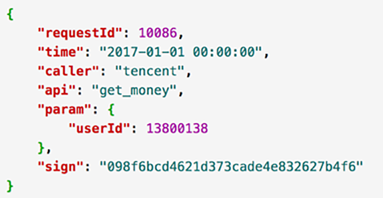
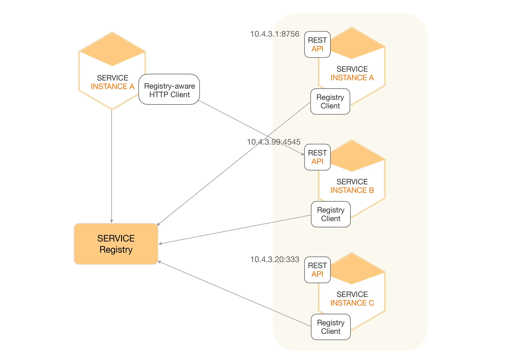
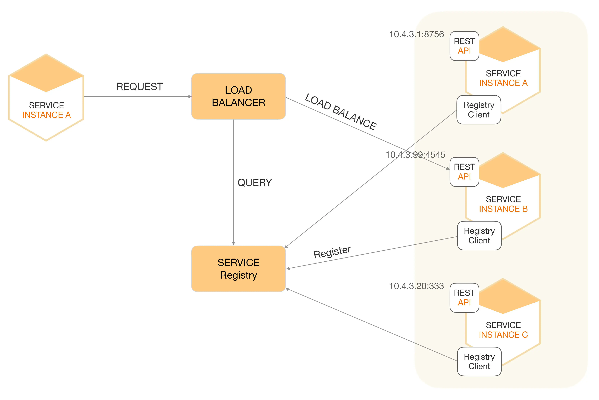

## 原文

每项微服务基础设施都是一个平台、一个系统、一个解决方案，如果要自己实现，其过程和做业务系统类似，都需要经过需求分析、架构设计、开发、测试、部署上线等步骤，专栏里我来简单介绍一下每个基础设施的主要作用，更多详细设计你可以参考 Spring Cloud 的相关资料（https://projects.spring.io/spring-cloud/）。

下面进入今天的内容，**微服务架构最佳实践的基础设施篇**。

### 自动化测试

微服务将原本大一统的系统拆分为多个独立运行的“微”服务，微服务之间的接口数量大大增加，并且微服务提倡快速交付，版本周期短，版本更新频繁。如果每次更新都靠人工回归整个系统，则工作量大，效率低下，达不到“快速交付”的目的，因此必须通过自动化测试系统来完成绝大部分测试回归的工作。

自动化测试涵盖的范围包括代码级的单元测试、单个系统级的集成测试、系统间的接口测试，理想情况是每类测试都自动化。如果因为团队规模和人力的原因无法全面覆盖，至少要做到接口测试自动化。

### 自动化部署

相比大一统的系统，微服务需要部署的节点增加了几倍甚至十几倍，微服务部署的频率也会大幅提升（例如，我们的业务系统 70% 的工作日都有部署操作），综合计算下来，微服务部署的次数是大一统系统部署次数的几十倍。这么大量的部署操作，如果继续采用人工手工处理，需要投入大量的人力，且容易出错，因此需要自动化部署的系统来完成部署操作。

自动化部署系统包括版本管理、资源管理（例如，机器管理、虚拟机管理）、部署操作、回退操作等功能。

### 配置中心

微服务的节点数量非常多，通过人工登录每台机器手工修改，效率低，容易出错。特别是在部署或者排障时，需要快速增删改查配置，人工操作的方式显然是不行的。除此以外，有的运行期配置需要动态修改并且所有节点即时生效，人工操作是无法做到的。综合上面的分析，微服务需要一个统一的配置中心来管理所有微服务节点的配置。

配置中心包括配置版本管理（例如，同样的微服务，有 10 个节点是给移动用户服务的，有 20 个节点给联通用户服务的，配置项都一样，配置值不一样）、增删改查配置、节点管理、配置同步、配置推送等功能。

### 接口框架

微服务提倡轻量级的通信方式，一般采用 HTTP/REST 或者 RPC 方式统一接口协议。但在实践过程中，光统一接口协议还不够，还需要统一接口传递的数据格式。例如，我们需要指定接口协议为 HTTP/REST，但这还不够，还需要指定 HTTP/REST 的数据格式采用 JSON，并且 JSON 的数据都遵循如下规范。

如果我们只是简单指定了 HTTP/REST 协议，而不指定 JSON 和 JSON 的数据规范，那么就会出现这样混乱的情况：有的微服务采用 XML，有的采用 JSON，有的采用键值对；即使同样都是 JSON，JSON 数据格式也不一样。这样每个微服务都要适配几套甚至几十套接口协议，相当于把曾经由 ESB 做的事情转交给微服务自己做了，这样做的效率显然是无法接受的，因此需要统一接口框架。

接口框架不是一个可运行的系统，一般以库或者包的形式提供给所有微服务调用。例如，针对上面的 JSON 样例，可以由某个基础技术团队提供多种不同语言的解析包（Java 包、Python 包、C 库等）。

### API 网关

系统拆分为微服务后，内部的微服务之间是互联互通的，相互之间的访问都是点对点的。如果外部系统想调用系统的某个功能，也采取点对点的方式，则外部系统会非常“头大”。因为在外部系统看来，它不需要也没办法理解这么多微服务的职责分工和边界，它只会关注它需要的能力，而不会关注这个能力应该由哪个微服务提供。

除此以外，外部系统访问系统还涉及安全和权限相关的限制，如果外部系统直接访问某个微服务，则意味着每个微服务都要自己实现安全和权限的功能，这样做不但工作量大，而且都是重复工作。

综合上面的分析，微服务需要一个统一的 API 网关，负责外部系统的访问操作。

API 网关是外部系统访问的接口，所有的外部系统接⼊系统都需要通过 API 网关，主要包括接入鉴权（是否允许接入）、权限控制（可以访问哪些功能）、传输加密、请求路由、流量控制等功能。

### 服务发现

微服务种类和数量很多，如果这些信息全部通过手工配置的方式写入各个微服务节点，首先配置工作量很大，配置文件可能要配几百上千行，几十个节点加起来后配置项就是几万几十万行了，人工维护这么大数量的配置项是一项灾难；其次是微服务节点经常变化，可能是由于扩容导致节点增加，也可能是故障处理时隔离掉一部分节点，还可能是采用灰度升级，先将一部分节点升级到新版本，然后让新老版本同时运行。不管哪种情况，我们都希望节点的变化能够及时同步到所有其他依赖的微服务。如果采用手工配置，是不可能做到实时更改生效的。因此，需要一套服务发现的系统来支撑微服务的自动注册和发现。

服务发现主要有两种实现方式：自理式和代理式。

1. 自理式

自理式结构如下：

自理式结构就是指每个微服务自己完成服务发现。例如，图中 SERVICE INSTANCE A 访问 SERVICE REGISTRY 获取服务注册信息，然后直接访问 SERVICE INSTANCE B。

自理式服务发现实现比较简单，因为这部分的功能一般通过统一的程序库或者程序包提供给各个微服务调用，而不会每个微服务都自己来重复实现一遍；并且由于每个微服务都承担了服务发现的功能，访问压力分散到了各个微服务节点，性能和可用性上不存在明显的压力和风险。

2. 代理式

代理式结构如下：

代理式结构就是指微服务之间有一个负载均衡系统（图中的 LOAD BALANCER 节点），由负载均衡系统来完成微服务之间的服务发现。

代理式的方式看起来更加清晰，微服务本身的实现也简单了很多，但实际上这个方案风险较大。第一个风险是可用性风险，一旦 LOAD BALANCER 系统故障，就会影响所有微服务之间的调用；第二个风险是性能风险，所有的微服务之间的调用流量都要经过 LOAD BALANCER 系统，性能压力会随着微服务数量和流量增加而不断增加，最后成为性能瓶颈。因此 LOAD BALANCER 系统需要设计成集群的模式，但 LOAD BALANCER 集群的实现本身又增加了复杂性。

不管是自理式还是代理式，服务发现的核心功能就是服务注册表，注册表记录了所有的服务节点的配置和状态，每个微服务启动后都需要将自己的信息注册到服务注册表，然后由微服务或者 LOAD BALANCER 系统到服务注册表查询可用服务。

### 服务路由

有了服务发现后，微服务之间能够方便地获取相关配置信息，但具体进行某次调用请求时，我们还需要从所有符合条件的可用微服务节点中挑选出一个具体的节点发起请求，这就是服务路由需要完成的功能。

服务路由和服务发现紧密相关，服务路由一般不会设计成一个独立运行的系统，通常情况下是和服务发现放在一起实现的。对于自理式服务发现，服务路由是微服务内部实现的；对于代理式服务发现，服务路由是由 LOAD BALANCER 系统实现的。无论放在哪里实现，服务路由核心的功能就是路由算法。常见的路由算法有：随机路由、轮询路由、最小压力路由、最小连接数路由等。

### 服务容错

系统拆分为微服务后，单个微服务故障的概率变小，故障影响范围也减少，但是微服务的节点数量大大增加。从整体上来看，系统中某个微服务出故障的概率会大大增加。专栏第 34 期我在分析微服务陷阱时提到微服务具有故障扩散的特点，如果不及时处理故障，故障扩散开来就会导致看起来系统中很多服务节点都故障了，因此需要微服务能够自动应对这种出错场景，及时进行处理。否则，如果节点一故障就需要人工处理，投入人力大，处理速度慢；而一旦处理速度慢，则故障就很快扩散，所以我们需要服务容错的能力。

常见的服务容错包括请求重试、流控和服务隔离。通常情况下，服务容错会集成在服务发现和服务路由系统中。

### 服务监控

系统拆分为微服务后，节点数量大大增加，导致需要监控的机器、网络、进程、接口调用数等监控对象的数量大大增加；同时，一旦发生故障，我们需要快速根据各类信息来定位故障。这两个目标如果靠人力去完成是不现实的。举个简单例子：我们收到用户投诉说业务有问题，如果此时采取人工的方式去搜集、分析信息，可能把几十个节点的日志打开一遍就需要十几分钟了，因此需要服务监控系统来完成微服务节点的监控。

服务监控的主要作用有：

+ 实时搜集信息并进行分析，避免故障后再来分析，减少了处理时间。
+ 服务监控可以在实时分析的基础上进行预警，在问题萌芽的阶段发觉并预警，降低了问题影响的范围和时间。

通常情况下，服务监控需要搜集并分析大量的数据，因此建议做成独立的系统，而不要集成到服务发现、API 网关等系统中。

### 服务跟踪

服务监控可以做到微服务节点级的监控和信息收集，但如果我们需要跟踪某一个请求在微服务中的完整路径，服务监控是难以实现的。因为如果每个服务的完整请求链信息都实时发送给服务监控系统，数据量会大到无法处理。

服务监控和服务跟踪的区别可以简单概括为宏观和微观的区别。例如，A 服务通过 HTTP 协议请求 B 服务 10 次，B 通过 HTTP 返回 JSON 对象，服务监控会记录请求次数、响应时间平均值、响应时间最高值、错误码分布这些信息；而服务跟踪会记录其中某次请求的发起时间、响应时间、响应错误码、请求参数、返回的 JSON 对象等信息。

目前无论是分布式跟踪还是微服务的服务跟踪，绝大部分请求跟踪的实现技术都基于 Google 的 Dapper 论文《Dapper, a Large-Scale Distributed Systems Tracing Infrastructure》。

### 服务安全

系统拆分为微服务后，数据分散在各个微服务节点上。从系统连接的角度来说，任意微服务都可以访问所有其他微服务节点；但从业务的角度来说，部分敏感数据或者操作，只能部分微服务可以访问，而不是所有的微服务都可以访问，因此需要设计服务安全机制来保证业务和数据的安全性。

服务安全主要分为三部分：接入安全、数据安全、传输安全。通常情况下，服务安全可以集成到配置中心系统中进行实现，即配置中心配置微服务的接入安全策略和数据安全策略，微服务节点从配置中心获取这些配置信息，然后在处理具体的微服务调用请求时根据安全策略进行处理。由于这些策略是通用的，一般会把策略封装成通用的库提供给各个微服务调用。基本架构如下：

### 小结

今天我为你讲了微服务架构相关的基础设施的概要介绍和关键设计点，希望对你有所帮助。

这就是今天的全部内容，这一期的思考题很特别，给你一个由 10 位 Java 高级软件工程师组成的开发团队，采用自研的方式，完成所有的微服务基础设施开发，你预测需要多长时间？理由是什么呢？

## 读者观点

**孙振超:**
文章中一共列了11个部分，但只有10个人，很明显是不可能是同时开工的，即使能够同时开工也是需要经过几轮迭代才能达到一个比较完善的状态。

依据简单原则和演化原则以及“三个火枪手”的人员分配原则，首先可以做API 网关、配置中心、服务发现、服务路由这4部分，经过一个月的开发+半个月的联调的先让基础框架搭建起来，业务能够运行起来。
业务上线后，为了保证用户体验和问题跟踪，在保留一两个留守同学的情况下，开始服务容错、服务监控、服务跟踪这几部分的开发，因为这个阶段中可能还要回头修改已完成的部分让这几个部分配合的更好，联调的工作量也多了不少，这个过程大概要2.5月。
而后随着业务逐渐增多，流量逐渐增加，为避免被黑产“薅羊毛”需要把服务安全部分给完成，同时为了快速响应新的业务需要把接口框架给完成，但此时有些同学会被已完成部分的日常维护、修bug等，这些初步需要两个月时间。
在这里都完成后，可以开始自动化测试、自动化部署这部分，也按照两个月的时间，这样一轮下来总体需要8个月时间。

经过第一轮后微服务的基础实施是有了，但要真正的运作起来还需要经过几轮的迭代才可以，但此时面对老系统的维护新系统的开发整体的进度会变慢不少，这样一个合格的比较完善的微服务基础设施差不多要两年时间了。
> 作者回复: 你是第一个认真分析且抓住重点的同学👍👍

**成功:**
30天左右
> 作者回复: 太乐观，30天就算用spring全家桶，都不可能上线的

## 我的观点