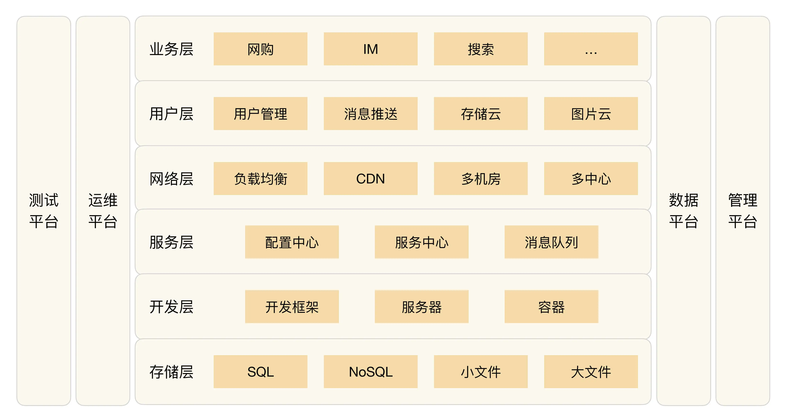
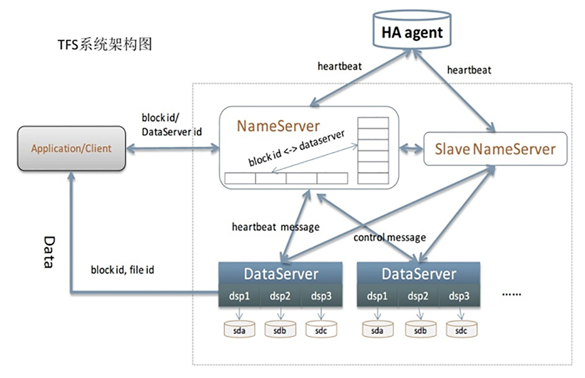

## 原文

很多人对于 BAT 的技术有一种莫名的崇拜感，觉得只有天才才能做出这样的系统，但经过前面对架构的本质、架构的设计原则、架构的设计模式、架构演进等多方位的探讨和阐述，你可以看到，其实并没有什么神秘的力量和魔力融合在技术里面，而是业务的不断发展推动了技术的发展，这样一步一个脚印，持续几年甚至十几年的发展，才能达到当前技术复杂度和先进性。

抛开 BAT 各自差异很大的业务，站在技术的角度来看，其实 BAT 的技术架构基本是一样的。再将视角放大，你会发现整个互联网行业的技术发展，最后都是殊途同归。

如果你正处于一个创业公司，或者正在为成为另一个 BAT 拼搏，那么深入理解这种技术模式（或者叫技术结构、技术架构），对于自己和公司的发展都大有裨益。

互联网的标准技术架构如下图所示，这张图基本上涵盖了互联网技术公司的大部分技术点，不同的公司只是在具体的技术实现上稍有差异，但不会跳出这个框架的范畴。

从本期开始，我将逐层介绍每个技术点的产生背景、应用场景、关键技术，有的技术点可能已经在前面的架构模式部分有所涉及，因此就不再详细展开技术细节了，而是将关键技术点分门别类，进而形成一张架构大图，让架构师对一个公司的整体技术架构有一个完整的全貌认知。

今天我们首先来聊聊**互联网架构模板的“存储层”技术。**

### SQL

SQL 即我们通常所说的关系数据。前几年 NoSQL 火了一阵子，很多人都理解为 NoSQL 是完全抛弃关系数据，全部采用非关系型数据。但经过几年的试验后，大家发现关系数据不可能完全被抛弃，NoSQL 不是 No SQL，而是 Not Only SQL，即 NoSQL 是 SQL 的补充。

所以互联网行业也必须依赖关系数据，考虑到 Oracle 太贵，还需要专人维护，一般情况下互联网行业都是用 MySQL、PostgreSQL 这类开源数据库。这类数据库的特点是开源免费，拿来就用；但缺点是性能相比商业数据库要差一些。随着互联网业务的发展，性能要求越来越高，必然要面对一个问题：将数据拆分到多个数据库实例才能满足业务的性能需求（其实 Oracle 也一样，只是时间早晚的问题）。

数据库拆分满足了性能的要求，但带来了复杂度的问题：数据如何拆分、数据如何组合？这个复杂度的问题解决起来并不容易，如果每个业务都去实现一遍，重复造轮子将导致投入浪费、效率降低，业务开发想快都快不起来。

所以互联网公司流行的做法是业务发展到一定阶段后，就会将这部分功能独立成中间件，例如百度的 DBProxy、淘宝的 TDDL。不过这部分的技术要求很高，将分库分表做到自动化和平台化，不是一件容易的事情，所以一般是规模很大的公司才会自己做。中小公司建议使用开源方案，例如 MySQL 官方推荐的 MySQL Router、360 开源的数据库中间件 Atlas。

假如公司业务继续发展，规模继续扩大，SQL 服务器越来越多，如果每个业务都基于统一的数据库中间件独立部署自己的 SQL 集群，就会导致新的复杂度问题，具体表现在：

+ 数据库资源使用率不高，比较浪费。
+ 各 SQL 集群分开维护，投入的维护成本越来越高。

因此，实力雄厚的大公司此时一般都会在 SQL 集群上构建 SQL 存储平台，以对业务透明的形式提供资源分配、数据备份、迁移、容灾、读写分离、分库分表等一系列服务，例如淘宝的 UMP（Unified MySQL Platform）系统。

### NoSQL

首先 NoSQL 在数据结构上与传统的 SQL 的不同，例如典型的 Memcache 的 key-value 结构、Redis 的复杂数据结构、MongoDB 的文档数据结构；其次，NoSQL 无一例外地都会将性能作为自己的一大卖点。NoSQL 的这两个特点很好地弥补了关系数据库的不足，因此在互联网行业 NoSQL 的应用基本上是基础要求。

由于 NoSQL 方案一般自己本身就提供集群的功能，例如 Memcache 的一致性 Hash 集群、Redis 3.0 的集群，因此 NoSQL 在刚开始应用时很方便，不像 SQL 分库分表那么复杂。一般公司也不会在开始时就考虑将 NoSQL 包装成存储平台，但如果公司发展很快，例如 Memcache 的节点有上千甚至几千时，NoSQL 存储平台就很有意义了。首先是存储平台通过集中管理能够大大提升运维效率；其次是存储平台可以大大提升资源利用效率，2000 台机器，如果利用率能提升 10%，就可以减少 200 台机器，一年几十万元就节省出来了。

所以，NoSQL 发展到一定规模后，通常都会在 NoSQL 集群的基础之上再实现统一**存储平台**，统一存储平台主要实现这几个功能：

+ 资源动态按需动态分配：例如同一台 Memcache 服务器，可以根据内存利用率，分配给多个业务使用。
+ 资源自动化管理：例如新业务只需要申请多少 Memcache 缓存空间就可以了，无需关注具体是哪些 Memcache 服务器在为自己提供服务。
+ 故障自动化处理：例如某台 Memcache 服务器挂掉后，有另外一台备份 Memcache 服务器能立刻接管缓存请求，不会导致丢失很多缓存数据。

当然要发展到这个阶段，一般也是大公司才会这么做，简单来说就是如果只有几十台 NoSQL 服务器，做存储平台收益不大；但如果有几千台 NoSQL 服务器，NoSQL 存储平台就能够产生很大的收益。

### 小文件存储

除了关系型的业务数据，互联网行业还有很多用于展示的数据。例如，淘宝的商品图片、商品描述；Facebook 的用户图片；新浪微博的一条微博内容等。这些数据具有三个典型特征：一是数据小，一般在 1MB 以下；二是数量巨大，Facebook 在 2013 年每天上传的照片就达到了 3.5 亿张；三是访问量巨大，Facebook 每天的访问量超过 10 亿。

由于互联网行业基本上每个业务都会有大量的小数据，如果每个业务都自己去考虑如何设计海量存储和海量访问，效率自然会低，重复造轮子也会投入浪费，所以自然而然就要将小文件存储做成统一的和业务无关的平台。

和 SQL 和 NoSQL 不同的是，小文件存储不一定需要公司或者业务规模很大，基本上认为业务在起步阶段就可以考虑做小文件统一存储。得益于开源运动的发展和最近几年大数据的火爆，在开源方案的基础上封装一个小文件存储平台并不是太难的事情。例如，HBase、Hadoop、Hypertable、FastDFS 等都可以作为小文件存储的底层平台，只需要将这些开源方案再包装一下基本上就可以用了。

典型的小文件存储有：淘宝的 TFS、京东 JFS、Facebook 的 Haystack。

下图是淘宝 TFS 的架构：

### 大文件存储

互联网行业的大文件主要分为两类：一类是业务上的大数据，例如 Youtube 的视频、电影网站的电影；另一类是海量的日志数据，例如各种访问日志、操作日志、用户轨迹日志等。和小文件的特点正好相反，大文件的数量没有小文件那么多，但每个文件都很大，几百 MB、几个 GB 都是常见的，几十 GB、几 TB 也是有可能的，因此在存储上和小文件有较大差别，不能直接将小文件存储系统拿来存储大文件。

说到大文件，特别要提到 Google 和 Yahoo，Google 的 3 篇大数据论文（Bigtable/Map- Reduce/GFS）开启了一个大数据的时代，而 Yahoo 开源的 Hadoop 系列（HDFS、HBase 等），基本上垄断了开源界的大数据处理。当然，江山代有才人出，长江后浪推前浪，Hadoop 后又有更多优秀的开源方案被贡献出来，现在随便走到大街上拉住一个程序员，如果他不知道大数据，那基本上可以确定是“火星程序员”。

对照 Google 的论文构建一套完整的大数据处理方案的难度和成本实在太高，而且开源方案现在也很成熟了，所以大数据存储和处理这块反而是最简单的，因为你没有太多选择，只能用这几个流行的开源方案，例如，Hadoop、HBase、Storm、Hive 等。实力雄厚一些的大公司会基于这些开源方案，结合自己的业务特点，封装成大数据平台，例如淘宝的云梯系统、腾讯的 TDW 系统。

下面是 Hadoop 的生态圈：

### 小结

今天我为你讲了互联网架构模板中的存储层技术，可以看到当公司规模发展到一定阶段后，基本上都是基于某个开源方案搭建统一的存储平台，希望对你有所帮助。

这就是今天的全部内容，留一道思考题给你吧，既然存储技术发展到最后都是存储平台，为何没有出现存储平台的开源方案，但云计算却都提供了存储平台方案？

## 读者观点

**feifei:**
我觉得是几个方面导致的问题：
1，存储平台的开发成本高，由于存储平台是核心的平台，高可用，高性能是必须的，这就导致需要经验丰富的高级工程师来开发。而云平台作为服务提供商，有能力开发出来存储平台。
2，需要使用存储平台的公司不多，而且一般是大型的公司，小公司的业务规模都不大，对于存储平台的需求基本不高，云平台面向的是所以用户，众口难调，必然提供基础服务
3，云平台的存储平台是收费的，能为企业带来经济效益，而开源的存储平台，投入巨大，能使用的却很少，也就失去了意义

总结一下，云平台的存储平台，面向的是所有用户，包括大公司，有这方面的需求，而且是收费的，能够为平台带来收入；开源存储平台，服务的用户很少，投入巨大，所以没有
> 作者回复: 分析很正确👍

**公告-SRE运维实践:**
上云方案对于很多小型公司来说，是一种最简单的方式了，成本低，性能可用性都能达到很高的水平。而开源的平台存储受限于几个条件 1 涉及到的存储太多，开发测试都需要很大的人力 2 小公司没条件采用，大公司有自己的，使用的人不多，不能快速迭代发展 3 没有大型公司的参与，无法推广使用
> 作者回复: 赞同👍

**Geek_88604f:**
存储平台都是各大互联网公司根据自身的业务发展特点、业务复杂度、业务规模量身打造的，逐步演进来的。其特点是功能强、规模大、复杂度高、有很高技术门槛。即使开源出来也几乎没有人用，小公司用不了（没有发展到那个阶段），大公司不会用（因为业务特点不一样，虽然有规模有技术）
小公司没有能力用不代表他们不想用。这些小公司如果能在底层存储方面得到支持，一方面可以降低业务开发的复杂度加快业务上线的时间，另一方面能保证底层存储的稳定性，保证良好的质量口碑，对业务发展还是很有好处的。
对于大公司来说放着这么优秀的存储平台技术不去变现那也是很大的浪费。况且大规模的存储平台到云华的距离已经很近了。有需求就有供给，如果将存储平台技术以云服务的形式开放出去，一方面推动了中小公司的发展，另一方面自己也赚得盆满钵溢。
> 作者回复: 写的很好，目前基本上就是云服务了

## 我的观点