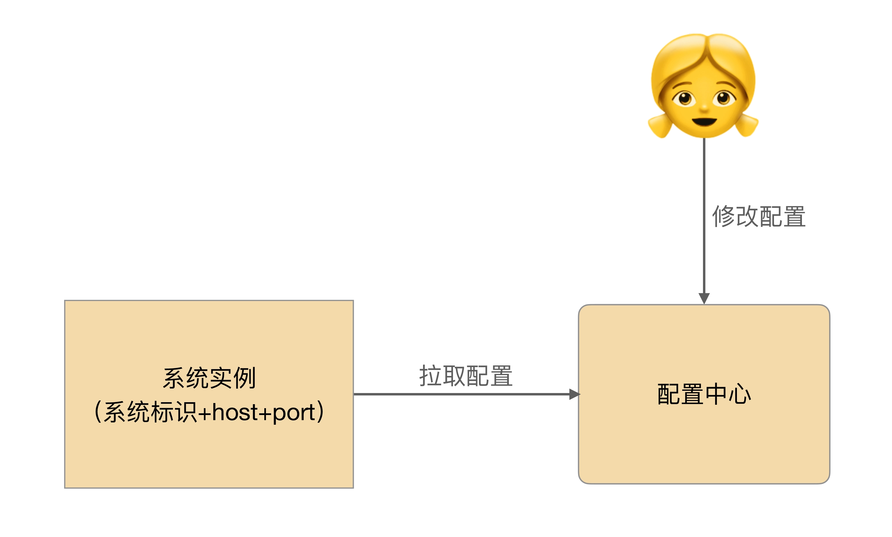
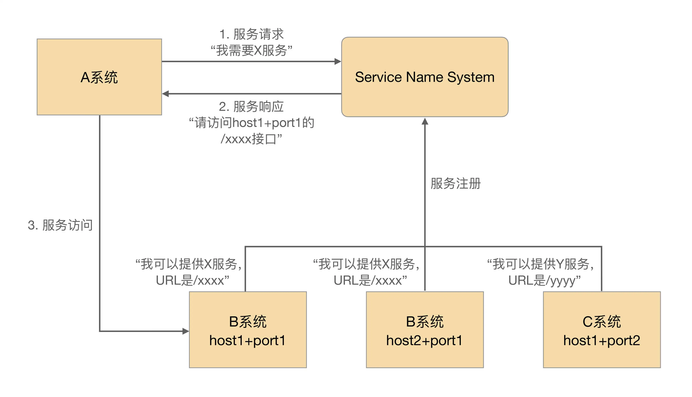
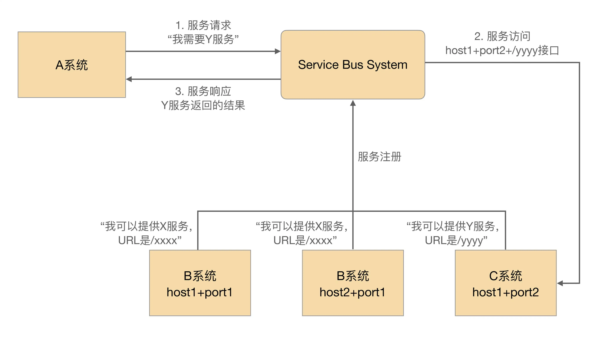
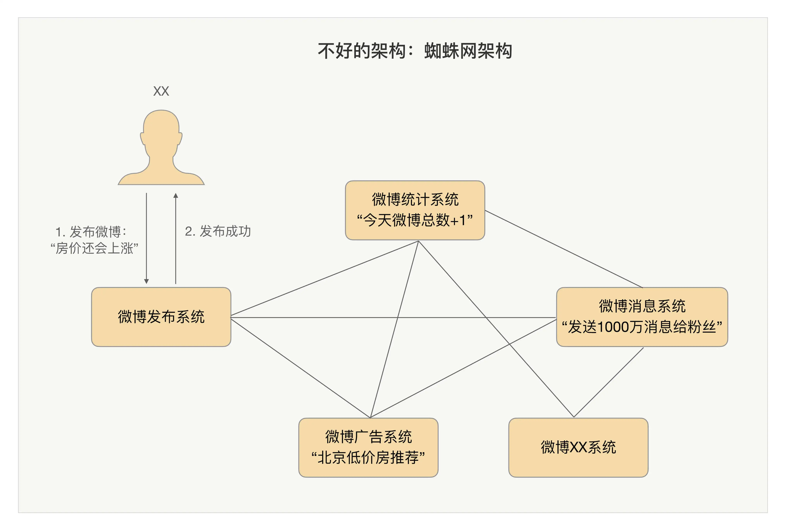
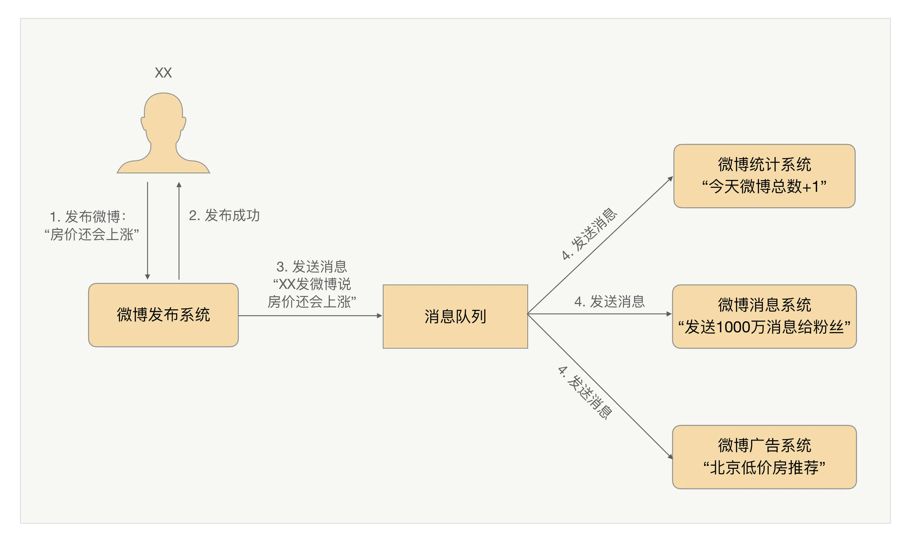

## 原文

上一期，我介绍了互联网架构模板中的存储层技术。关于这部分内容，我将逐层介绍每个技术点的产生背景、应用场景和关键技术，希望让你可以对整体的技术架构有一个全貌认知。

今天我们来聊聊**互联网架构模板的“开发层”和“服务层”技术**。

### 开发层技术

1. 开发框架

在专栏第 38、39 期中，我们深入分析了互联网业务发展的一个特点：复杂度越来越高。复杂度增加的典型现象就是系统越来越多，不同的系统由不同的小组开发。如果每个小组用不同的开发框架和技术，则会带来很多问题，典型的问题有：

+ 技术人员之间没有共同的技术语言，交流合作少。
+ 每类技术都需要投入大量的人力和资源并熟练精通。
+ 不同团队之间人员无法快速流动，人力资源不能高效的利用。

所以，互联网公司都会指定一个大的技术方向，然后使用统一的开发框架。例如，Java 相关的开发框架 SSH、SpringMVC、Play，Ruby 的 Ruby on Rails，PHP 的 ThinkPHP，Python 的 Django 等。使用统一的开发框架能够解决上面提到的各种问题，大大提升组织和团队的开发效率。

对于框架的选择，有一个总的原则：**优选成熟的框架，避免盲目追逐新技术！**

为什么呢？

首先，成熟的框架资料文档齐备，各种坑基本上都有人踩过了，遇到问题很容易通过搜索来解决。

其次，成熟的框架受众更广，招聘时更加容易招到合适的人才。

第三，成熟的框架更加稳定，不会出现大的变动，适合长期发展。

2. Web 服务器

开发框架只是负责完成业务功能的开发，真正能够运行起来给用户提供服务，还需要服务器配合。

独立开发一个成熟的 Web 服务器，成本非常高，况且业界又有那么多成熟的开源 Web 服务器，所以互联网行业基本上都是“拿来主义”，挑选一个流行的开源服务器即可。大一点的公司，可能会在开源服务器的基础上，结合自己的业务特点做二次开发，例如淘宝的 Tengine，但一般公司基本上只需要将开源服务器摸透，优化一下参数，调整一下配置就差不多了。

选择一个服务器主要和开发语言相关，例如，Java 的有 Tomcat、JBoss、Resin 等，PHP/Python 的用 Nginx，当然最保险的就是用 Apache 了，什么语言都支持。

你可能会担心 Apache 的性能之类的问题，其实不用过早担心这个，等到业务真的发展到 Apache 撑不住的时候再考虑切换也不迟，那时候你有的是钱，有的是人，有的是时间。

3. 容器

容器是最近几年才开始火起来的，其中以 Docker 为代表，在 BAT 级别的公司已经有较多的应用。例如，腾讯万台规模的 Docker 应用实践（http://www.infoq.com/cn/articles/tencent-millions-scale-docker-application-practice）、新浪微博红包的大规模 Docker 集群（http://www.infoq.com/cn/articles/large-scale-docker-cluster-practise-experience-share）等。

传统的虚拟化技术是虚拟机，解决了跨平台的问题，但由于虚拟机太庞大，启动又慢，运行时太占资源，在互联网行业并没有大规模应用；而 Docker 的容器技术，虽然没有跨平台，但启动快，几乎不占资源，推出后立刻就火起来了，预计 Docker 类的容器技术将是技术发展的主流方向。

千万不要以为 Docker 只是一个虚拟化或者容器技术，它将在很大程度上改变目前的技术形势：

+ 运维方式会发生革命性的变化：Docker 启动快，几乎不占资源，随时启动和停止，基于 Docker 打造自动化运维、智能化运维将成为主流方式。
+ 设计模式会发生本质上的变化：启动一个新的容器实例代价如此低，将鼓励设计思路朝“微服务”的方向发展。

例如，一个传统的网站包括登录注册、页面访问、搜索等功能，没有用容器的情况下，除非有特别大的访问量，否则这些功能开始时都是集成在一个系统里面的；有了容器技术后，一开始就可以将这些功能按照服务的方式设计，避免后续访问量增大时又要重构系统。

### 服务层技术

互联网业务的不断发展带来了复杂度的不断提升，业务系统也越来越多，系统间相互依赖程度加深。比如说为了完成 A 业务系统，可能需要 B、C、D、E 等十几个其他系统进行合作。从数学的角度进行评估，可以发现系统间的依赖是呈指数级增长的：3 个系统相互关联的路径为 3 条，6 个系统相互关联的路径为 15 条。

服务层的主要目标其实就是为了降低系统间相互关联的复杂度。

1. 配置中心

故名思议，配置中心就是集中管理各个系统的配置。

当系统数量不多的时候，一般是各系统自己管理自己的配置，但系统数量多了以后，这样的处理方式会有问题：

+ 某个功能上线时，需要多个系统配合一起上线，分散配置时，配置检查、沟通协调需要耗费较多时间。
+ 处理线上问题时，需要多个系统配合查询相关信息，分散配置时，操作效率很低，沟通协调也需要耗费较多时间。
+ 各系统自己管理配置时，一般是通过文本编辑的方式修改的，没有自动的校验机制，容易配置错误，而且很难发现。

例如，我曾经遇到将 IP 地址的数字 0 误敲成了键盘的字母 O，肉眼非常难发现，但程序检查其实就很容易。

实现配置中心主要就是为了解决上面这些问题，将配置中心做成通用的系统的好处有：

+ 集中配置多个系统，操作效率高。
+ 所有配置都在一个集中的地方，检查方便，协作效率高。
+ 配置中心可以实现程序化的规则检查，避免常见的错误。比如说检查最小值、最大值、是否 IP 地址、是否 URL 地址，都可以用正则表达式完成。
+ 配置中心相当于备份了系统的配置，当某些情况下需要搭建新的环境时，能够快速搭建环境和恢复业务。

整机磁盘坏掉、机器主板坏掉……遇到这些不可恢复的故障时，基本上只能重新搭建新的环境。程序包肯定是已经有的，加上配置中心的配置，能够很快搭建新的运行环境，恢复业务。否则几十个配置文件重新一个个去 Vim 中修改，耗时很长，还很容易出错。

下面是配置中心简单的设计，其中通过“系统标识 + host + port”来标识唯一一个系统运行实例是常见的设计方法。

2. 服务中心

当系统数量不多的时候，系统间的调用一般都是直接通过配置文件记录在各系统内部的，但当系统数量多了以后，这种方式就存在问题了。

比如说总共有 10 个系统依赖 A 系统的 X 接口，A 系统实现了一个新接口 Y，能够更好地提供原有 X 接口的功能，如果要让已有的 10 个系统都切换到 Y 接口，则这 10 个系统的几十上百台机器的配置都要修改，然后重启，可想而知这个效率是很低的。

除此以外，如果 A 系统总共有 20 台机器，现在其中 5 台出故障了，其他系统如果是通过域名访问 A 系统，则域名缓存失效前，还是可能访问到这 5 台故障机器的；如果其他系统通过 IP 访问 A 系统，那么 A 系统每次增加或者删除机器，其他所有 10 个系统的几十上百台机器都要同步修改，这样的协调工作量也是非常大的。

服务中心就是为了解决上面提到的跨系统依赖的“配置”和“调度”问题。

服务中心的实现一般来说有两种方式：服务名字系统和服务总线系统。

+ 服务名字系统（Service Name System）

看到这个翻译，相信你会立刻联想到 DNS，即 Domain Name System。没错，两者的性质是基本类似的。

DNS 的作用将域名解析为 IP 地址，主要原因是我们记不住太多的数字 IP，域名就容易记住。服务名字系统是为了将 Service 名称解析为“host + port + 接口名称”，但是和 DNS 一样，真正发起请求的还是请求方。

基本的设计如下：

+ 服务总线系统（Service Bus System）

看到这个翻译，相信你可能立刻联想到计算机的总线。没错，两者的本质也是基本类似的。

相比服务名字系统，服务总线系统更进一步了：由总线系统完成调用，服务请求方都不需要直接和服务提供方交互了。

基本的设计如下：

“服务名字系统”和“服务总线系统”简单对比如下表所示：

3. 消息队列

互联网业务的一个特点是“快”，这就要求很多业务处理采用异步的方式。例如，大 V 发布一条微博后，系统需要发消息给关注的用户，我们不可能等到所有消息都发送给关注用户后再告诉大 V 说微博发布成功了，只能先让大 V 发布微博，然后再发消息给关注用户。

传统的异步通知方式是由消息生产者直接调用消息消费者提供的接口进行通知的，但当业务变得庞大，子系统数量增多时，这样做会导致系统间交互非常复杂和难以管理，因为系统间互相依赖和调用，整个系统的结构就像一张蜘蛛网，如下图所示：

息队列就是为了实现这种跨系统异步通知的中间件系统。消息队列既可以“一对一”通知，也可以“一对多”广播。以微博为例，可以清晰地看到异步通知的实现和作用，如下图所示。

对比前面的蜘蛛网架构，可以清晰地看出引入消息队列系统后的效果：

+ 整体结构从网状结构变为线性结构，结构清晰；
+ 消息生产和消息消费解耦，实现简单；
+ 增加新的消息消费者，消息生产者完全不需要任何改动，扩展方便；
+ 消息队列系统可以做高可用、高性能，避免各业务子系统各自独立做一套，减轻工作量；
+ 业务子系统只需要聚焦业务即可，实现简单。

消息队列系统基本功能的实现比较简单，但要做到高性能、高可用、消息时序性、消息事务性则比较难。业界已经有很多成熟的开源实现方案，如果要求不高，基本上拿来用即可，例如，RocketMQ、Kafka、ActiveMQ 等。但如果业务对消息的可靠性、时序、事务性要求较高时，则要深入研究这些开源方案，否则很容易踩坑。

开源的用起来方便，但要改就很麻烦了。由于其相对比较简单，很多公司也会花费人力和时间重复造一个轮子，这样也有好处，因为可以根据自己的业务特点做快速的适配开发。

### 小结

今天我为你讲了互联网架构模板中的开发层和服务层技术，希望对你有所帮助。

这就是今天的全部内容，留一道思考题给你吧，使用统一的开发框架和开发语言可以让团队开发效率更高，但这样做会带来什么问题？如何解决？

## 读者观点

**feifei:**

1，程序没有用适合的语言开发，程序效率低下，比如现在需要开发内存的缓存系统，但团队开发语言是java，java是一门高级语言，适合做业务系统，用java做内存操作内存会效率低下，而且浪费严重
2，开发框架和开发语言，都是有场景限制的，尺有所短，寸有所长这个道理在哪里都是一样的，c的优势在底层，java在应用，每一个都有所长所短

解决方案
1，将业务服务化，对外提供统一的API，各业务通过API调用完成，这样每一个业务都可以使用不同的开发语言和框架完成，各系统完全解耦。
2，容器化，使用docker将平台统一化，更好的可维护和扩展
> 作者回复: 分析到位👍

**narry:**
问题就是可能发生“手里有锤子后，看到什么都是钉子”的情况，在业务规模小的时候采用单一语言单一框架，当规模大了还是应该有一定的灵活性，有一个主力的语言和框架，合适的工作用合适语言和框架，而微服务架构的比较适合混合语言和架构的模式
> 作者回复: 赞同👍

## 我的观点

