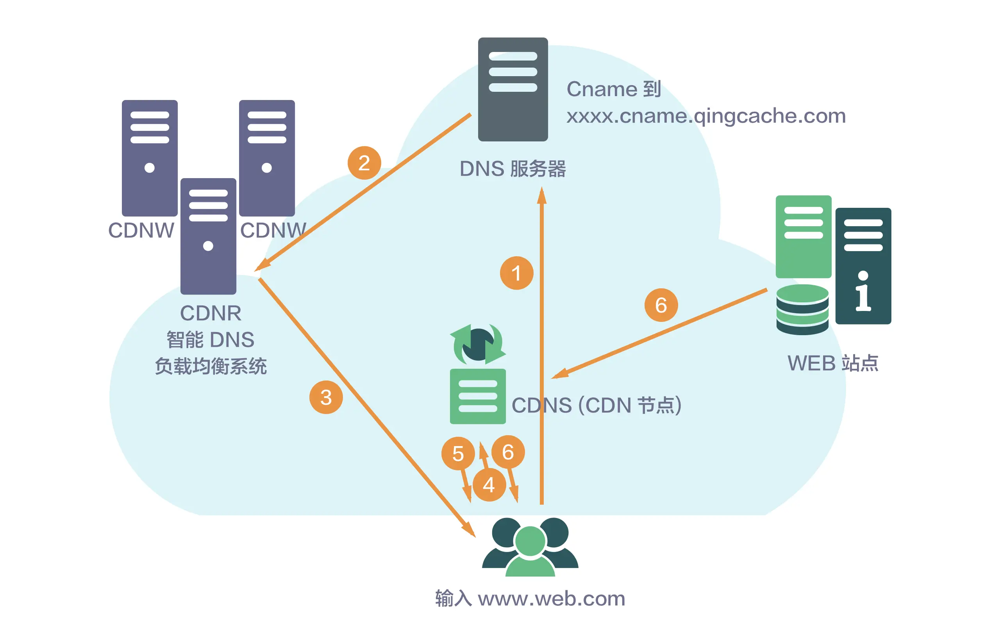

## 原文

除了复杂度，互联网业务发展的另外两个关键特点是“高性能”和“高可用”。通常情况下，我们在设计高可用和高性能系统的时候，主要关注点在系统本身的复杂度，然后通过各种手段来实现高可用和高性能的要求，例如我前面介绍的计算高性能架构模式、存储高可用架构模式等。但是当我们站在一个公司的的角度来思考架构的时候，单个系统的高可用和高性能并不等于整体业务的高可用和高性能，互联网业务的高性能和高可用需要从更高的角度去设计，这个高点就是“网络”，所以我将相关措施统一划归为“网络层”。注意这里的网络层和通常理解的如何搭建一个局域网这种概念不一样，这里强调的是站在网络层的角度整体设计架构，而不是某个具体网络的搭建。

接下来我将介绍**互联网架构模板的“网络层”**技术的几个关键架构设计点，部分内容专栏前面已经有深入阐述，今天作为概要的总结把它们归纳一下。

### 负载均衡

顾名思议，负载均衡就是将请求均衡地分配到多个系统上。使用负载均衡的原因也很简单：每个系统的处理能力是有限的，为了应对大容量的访问，必须使用多个系统。例如，一台 32 核 64GB 内存的机器，性能测试数据显示每秒处理 Hello World 的 HTTP 请求不超过 2 万，实际业务机器处理 HTTP 请求每秒可能才几百 QPS，而互联网业务并发超过 1 万是比较常见的，遇到双十一、过年发红包这些极端场景，每秒可以达到几十万的请求。

1. DNS

DNS 是最简单也是最常见的负载均衡方式，一般用来实现地理级别的均衡。例如，北方的用户访问北京的机房，南方的用户访问广州的机房。一般不会使用 DNS 来做机器级别的负载均衡，因为太耗费 IP 资源了。例如，百度搜索可能要 10000 台以上机器，不可能将这么多机器全部配置公网 IP，然后用 DNS 来做负载均衡。有兴趣的读者可以在 Linux 用“dig baidu.com”命令看看实际上用了几个 IP 地址。

DNS 负载均衡的优点是通用（全球通用）、成本低（申请域名，注册 DNS 即可），但缺点也比较明显，主要体现在：

+ DNS 缓存的时间比较长，即使将某台业务机器从 DNS 服务器上删除，由于缓存的原因，还是有很多用户会继续访问已经被删除的机器。
+ DNS 不够灵活。DNS 不能感知后端服务器的状态，只能根据配置策略进行负载均衡，无法做到更加灵活的负载均衡策略。比如说某台机器的配置比其他机器要好很多，理论上来说应该多分配一些请求给它，但 DNS 无法做到这一点。

所以对于时延和故障敏感的业务，有实力的公司可能会尝试实现 HTTP-DNS 的功能，即使用 HTTP 协议实现一个私有的 DNS 系统。HTTP-DNS 主要应用在通过 App 提供服务的业务上，因为在 App 端可以实现灵活的服务器访问策略，如果是 Web 业务，实现起来就比较麻烦一些，因为 URL 的解析是由浏览器来完成的，只有 Javascript 的访问可以像 App 那样实现比较灵活的控制。

HTTP-DNS 的优缺点有：

+ 灵活：HTTP-DNS 可以根据业务需求灵活的设置各种策略。
+ 可控：HTTP-DNS 是自己开发的系统，IP 更新、策略更新等无需依赖外部服务商。
+ 及时：HTTP-DNS 不受传统 DNS 缓存的影响，可以非常快地更新数据、隔离故障。
+ 开发成本高：没有通用的解决方案，需要自己开发。
+ 侵入性：需要 App 基于 HTTP-DNS 进行改造。

2. Nginx 、LVS 、F5

DNS 用于实现地理级别的负载均衡，而 Nginx、LVS、F5 用于同一地点内机器级别的负载均衡。其中 Nginx 是软件的 7 层负载均衡，LVS 是内核的 4 层负载均衡，F5 是硬件的 4 层负载均衡。

软件和硬件的区别就在于性能，硬件远远高于软件，Ngxin 的性能是万级，一般的 Linux 服务器上装个 Nginx 大概能到 5 万 / 秒；LVS 的性能是十万级，没有具体测试过，据说可达到 80 万 / 秒；F5 性能是百万级，从 200 万 / 秒到 800 万 / 秒都有。硬件虽然性能高，但是单台硬件的成本也很高，一台最便宜的 F5 都是几十万，但是如果按照同等请求量级来计算成本的话，实际上硬件负载均衡设备可能会更便宜，例如假设每秒处理 100 万请求，用一台 F5 就够了，但用 Nginx，可能要 20 台，这样折算下来用 F5 的成本反而低。因此通常情况下，如果性能要求不高，可以用软件负载均衡；如果性能要求很高，推荐用硬件负载均衡。

4 层和 7 层的区别就在于协议和灵活性。Nginx 支持 HTTP、E-mail 协议，而 LVS 和 F5 是 4 层负载均衡，和协议无关，几乎所有应用都可以做，例如聊天、数据库等。

目前很多云服务商都已经提供了负载均衡的产品，例如阿里云的 SLB、UCloud 的 ULB 等，中小公司直接购买即可。

### CDN

CDN 是为了解决用户网络访问时的“最后一公里”效应，本质上是一种“以空间换时间”的加速策略，即将内容缓存在离用户最近的地方，用户访问的是缓存的内容，而不是站点实时的内容。

下面是简单的 CDN 请求流程示意图：

CDN 经过多年的发展，已经变成了一个很庞大的体系：分布式存储、全局负载均衡、网络重定向、流量控制等都属于 CDN 的范畴，尤其是在视频、直播等领域，如果没有 CDN，用户是不可能实现流畅观看内容的。

幸运的是，大部分程序员和架构师都不太需要深入理解 CDN 的细节，因为 CDN 作为网络的基础服务，独立搭建的成本巨大，很少有公司自己设计和搭建 CDN 系统，从 CDN 服务商购买 CDN 服务即可，目前有专门的 CDN 服务商，例如网宿和蓝汛；也有云计算厂家提供 CDN 服务，例如阿里云和腾讯云都提供 CDN 的服务。

### 多机房

从架构上来说，单机房就是一个全局的网络单点，在发生比较大的故障或者灾害时，单机房难以保证业务的高可用。例如，停电、机房网络中断、地震、水灾等都有可能导致一个机房完全瘫痪。

多机房设计最核心的因素就是如何处理时延带来的影响，常见的策略有：

1. 同城多机房

同一个城市多个机房，距离不会太远，可以投入重金，搭建私有的高速网络，基本上能够做到和同机房一样的效果。

这种方式对业务影响很小，但投入较大，如果不是大公司，一般是承受不起的；而且遇到极端的地震、水灾等自然灾害，同城多机房也是有很大风险的。

2. 跨城多机房

在不同的城市搭建多个机房，机房间通过网络进行数据复制（例如，MySQL 主备复制），但由于跨城网络时延的问题，业务上需要做一定的妥协和兼容，比如不需要数据的实时强一致性，只是保证最终一致性。

例如，微博类产品，B 用户关注了 A 用户，A 用户在北京机房发布了一条微博，B 在广州机房不需要立刻看到 A 用户发的微博，等 10 分钟看到也可以。

这种方式实现简单，但和业务有很强的相关性，微博可以这样做，支付宝的转账业务就不能这样做，因为用户余额是强一致性的。

3. 跨国多机房

和跨城多机房类似，只是地理上分布更远，时延更大。由于时延太大和用户跨国访问实在太慢，跨国多机房一般仅用于备份和服务本国用户。

### 多中心

多中心必须以多机房为前提，但从设计的角度来看，多中心相比多机房是本质上的飞越，难度也高出一个等级。

简单来说，多机房的主要目标是灾备，当机房故障时，可以比较快速地将业务切换到另外一个机房，这种切换操作允许一定时间的中断（例如，10 分钟、1 个小时），而且业务也可能有损失（例如，某些未同步的数据不能马上恢复，或者要等几天才恢复，甚至永远都不能恢复了）。因此相比多机房来说，多中心的要求就高多了，要求每个中心都同时对外提供服务，且业务能够自动在多中心之间切换，故障后不需人工干预或者很少的人工干预就能自动恢复。

多中心设计的关键就在于“数据一致性”和“数据事务性”如何保证，这两个难点都和业务紧密相关，目前没有很成熟的且通用的解决方案，需要基于业务的特性进行详细的分析和设计。以淘宝为例，淘宝对外宣称自己是多中心的，但是在实际设计过程中，商品浏览的多中心方案、订单的多中心方案、支付的多中心方案都需要独立设计和实现。

正因为多中心设计的复杂性，不一定所有业务都能实现多中心，目前国内的银行、支付宝这类系统就没有完全实现多中心，不然也不会出现挖掘机一铲子下去，支付宝中断 4 小时的故障。

有关多中心设计更详细的内容，你可以查看专栏第28、29、30期的内容。

### 小结

今天我为你讲了互联网架构模板中的“网络层”技术，希望对你有所帮助。

这就是今天的全部内容，留一道思考题给你吧，为什么可以购买负载均衡和 CDN 服务，但却不能购买多机房和多中心服务？

## 读者观点

**narry：**
负载均衡和cdn基本是和业务无关，具有通用性，而每个业务对数据的一致性和事务要求都不一样，需要单独设计，所以无法将多机房和多中心作为基础服务对外提供
> 作者回复: 赞同

**SMTCode:**
CDN和LB是基于通用技术和协议，实现请求的调度与转发等功能。而多机房、多中心，是与业务强相关，对业务有很大侵入性的，只能是服务的实现者根据自己的侧重点，选择合适的技术，有针对性的实现服务的三高指标。
> 作者回复: 正确👍

## 我的观点