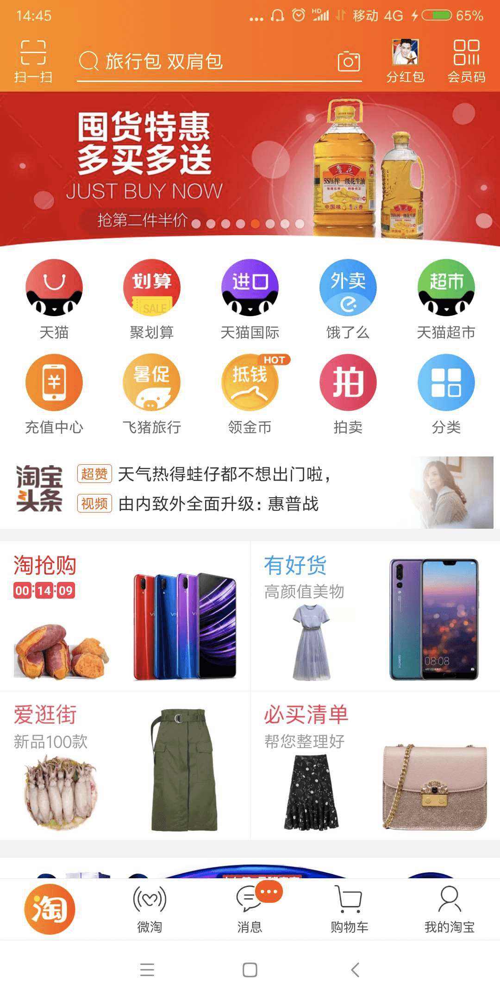
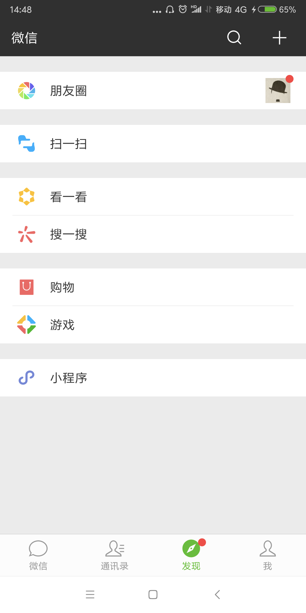

## 原文

专栏截止到上一期，架构设计相关的理念、技术、实践已经基本讲完，相信你一路学习过来会有一种感觉，这些内容主要都是讲后端系统的架构设计，例如存储高可用、微服务、异地多活等，都是后端系统才会涉及。事实上确实也是如此，通常情况下我们讲架构设计，主要聚焦在后端系统，但这并不意味着 App、前端就没有架构设计了，专栏所讲述的整套架构设计理念，虽然是来源于我的后端设计经验，但一旦形成完善的技术理论后，同样适应于 App 和前端。

首先，先来复习一下我的专栏所讲述的架构设计理念，可以提炼为下面几个关键点：

+ **架构是系统的顶层结构。**
+ **架构设计的主要目的是为了解决软件系统复杂度带来的问题。**
+ **架构设计需要遵循三个主要原则：合适原则、简单原则、演化原则。**
+ **架构设计首先要掌握业界已经成熟的各种架构模式，然后再进行优化、调整、创新。**

复习完我们就可以进入今天的正题，我来谈谈 **App 架构的演进**，以及上面这些架构设计关键点是如何体现的。

### Web App

最早的 App 有很多采用这种架构，大多数尝试性的业务，一开始也是这样的架构。Web App 架构又叫包壳架构，简单来说就是在 Web 的业务上包装一个 App 的壳，业务逻辑完全还是 Web 实现，App 壳完成安装的功能，让用户看起来像是在使用 App，实际上和用浏览器访问 PC 网站没有太大差别。

为何早期的 App 或者尝试新的业务采用这种架构比较多呢？简单来说，就是当时业务面临的复杂度决定的。我们以早期的 App 为例，大约在 2010 年前后，移动互联网虽然发展很迅速，但受限于用户的设备、移动网络的速度等约束，PC 互联网还是主流，移动互联网还是一个新鲜事物，未来的发展前景和发展趋势，其实当年大家也不一定能完全看得清楚。例如淘宝也是在 2013 年才开始决定“All in 无线”的，在这样的业务背景下，当时的业务重心还是在 PC 互联网上，移动互联网更多是尝试性的。既然是尝试，那就要求快速和低成本，虽然当时的 Android 和 iOS 已经都有了开发 App 的功能，但原生的开发成本太高，因此自然而然，Web App 这种包壳架构就被大家作为首选尝试架构了，其主要解决“快速开发”和“低成本”两个复杂度问题，架构设计遵循“合适原则”和“简单原则”。

### 原生 App

Web App 虽然解决了“快速开发”和“低成本”两个复杂度问题，但随着业务的发展，Web App 的劣势逐渐成为了主要的复杂度问题，主要体现在：

+ 移动设备的发展速度远远超过 Web 技术的发展速度，因此 Web App 的体验相比原生 App 的体验，差距越来越明显。
+ 移动互联网飞速发展，趋势越来越明显，App 承载的业务逻辑也越来越复杂，进一步加剧了 Web App 的体验问题。
+ 移动设备在用户体验方面有很多优化和改进，而 Web App 无法利用这些技术优势，只有原生 App 才能够利用这些技术优势。

因此，随着业务发展和技术演进，移动开发的复杂度从“快速开发”和“低成本”转向了“用户体验”，而要保证用户体验，采用原生 App 的架构是最合适的，这里的架构设计遵循“演化原则”。

原生 App 解决了用户体验问题，没记错的话大约在 2013 年前后开始快速发展，那个时候的 Android 工程师和 iOS 工程师就像现在的人工智能工程师一样非常抢手，很多同学也是那时候从后端转行到 App 开发的。

### Hybrid App

原生 App 很好的解决了用户体验问题，但业务和技术也在发展，移动互联网此时已经成为明确的大趋势，团队需要考虑的不是要不要转移动互联网的问题，而是要考虑如何在移动互联网更具竞争力的问题，因此各种基于移动互联网特点的功能和体验方式不断被创造出来，大家拼的竞争方式就是看谁更快抓住用户需求和痛点。因此，移动开发的复杂度又回到了“快速开发”，这时就发现了原生 App 开发的痛点：由于 Android、iOS、Windows Phone（你没看错，当年确实是这三个主流平台）的原生开发完全不能兼容，同样的功能需要三个平台重复开发，每个平台还有一些差异，因此自然快不起来。

为了解决“快速开发”的复杂度问题，大家自然又想到了 Web 的方式，但 Web 的体验还是远远不如原生，怎么解决这个问题呢？其实没有办法完美解决，但可以根据不同的业务要求选取不同的方案，例如对体验要求高的业务采用原生 App 实现，对体验要求不高的可以采用 Web 的方式实现，这就是 Hybrid App 架构的核心设计思想，主要遵循架构设计的“合适原则”。

### 组件化 & 容器化

Hybrid App 能够较好的平衡“用户体验”和“快速开发”两个复杂度问题（注意是“平衡”，不是“同时解决”），但对于一些超级 App 来说，随着业务规模越来越大、业务越来越复杂，虽然在用户看来可能是一个 App，但事实上承载了几十上百个业务。

以手机淘宝为例，阿里确认“All in 无线”战略后，手机淘宝定位为阿里集团移动端的“航空母舰”，上面承载了非常多的子业务，下图是淘宝的首页第一屏，相关的子业务初步估计就有 10 个以上。

再以微信为例，作为腾讯在移动互联网的“航空母舰”，其业务也是非常的多，如下图，“发现”tab 页就有 7 个子业务。

这么多业务集中在一个 App 上，每个业务又在不断地扩展，后续又可能会扩展新的业务，并且每个业务就是一个独立的团队负责开发，因此整个 App 的可扩展性引入了新的复杂度问题。

我在专栏第 32 期提到，可扩展的基本思想就是“拆”，但是这个思想应用到 App 和后端系统时，具体的做法就明显不同了。简单来说，App 和后端系统存在一个本质的区别，App 是面向用户的，后端系统是不面向用户的，因此 App 再怎么拆，对用户还是只能呈现同一个 App，不可能将一个 App 拆分为几十个独立 App；而后端系统就不一样了，采用微服务架构后，后端系统可以拆分为几百上千个子服务都没有问题。同时，App 的业务再怎么拆分，技术栈是一样的，不然没法集成在一个 App 里面；而后端就不同了，不同的微服务可以用不同的技术栈开发。

在这种业务背景下，组件化和容器化架构应运而生，其基本思想都是将超级 App 拆分为众多组件，这些组件遵循预先制定好的规范，独立开发、独立测试、独立上线。如果某个组件依赖其他组件，组件之间通过消息系统进行通信，通过这种方式来实现组件隔离，从而避免各个团队之间的互相依赖和影响，以提升团队开发效率和整个系统的可扩展性。组件化和容器化的架构出现遵循架构设计的“演化原则”，只有当业务复杂度发展到一定规模后才适应，因此我们会看到大厂应用这个架构的比较多，而中小公司的 App，业务没那么复杂，其实并不一定需要采用组件化和容器化架构。

对于组件化和容器化并没有非常严格的定义，我理解两者在规范、拆分、团队协作方面都是一样的，区别在于发布方式，组件化采用的是静态发布，即所有的组件各自独自开发测试，然后跟随 App 的某个版本统一上线；容器化采用的是动态发布，即容器可以动态加载组件，组件准备好了直接发布，容器会动态更新组件，无需等待某个版本才能上线。

关于手机淘宝 App 更详细的架构演进可以参考[《Atlas：手淘 Native 容器化框架和思考》](https://www.infoq.cn/article/shoutao-atlas/)，微信 App 的架构演进可以参考[《微信 Android 客户端架构演进之路》](https://www.infoq.cn/article/wechat-android-app-architecture/)。

### 跨平台 App

前面我介绍的各种 App 架构，除了 Web App 外，其他都面临着同一个问题：跨平台需要重复开发。同一个功能和业务，Android 开发一遍，iOS 也要开发一遍，这里其实存在人力投入的问题，违背了架构设计中的“简单原则”。站在企业的角度来讲，当然希望能够减少人力投入成本（虽然我站在程序员的角度来讲是不希望程序员被减少的），因此最近几年各种跨平台方案不断涌现，比较知名的有 Facebook 的 React Native、阿里的 Weex、Google 的 Flutter。虽然也有很多公司在尝试使用，但目前这几个方案都不算很成熟，且在用户体验方面与原生 App 还是有一定差距，例如 Airbnb 就宣布放弃使用 React Native，回归使用原生技术（https://www.oschina.net/news/97276/airbnb-sunsetting-react-native）。

前端的情况也是类似的，有兴趣的同学可以看看玉伯的文章[《Web 研发模式演变》](https://github.com/lifesinger/blog/issues/184)，专栏里我就不在赘述了。

## 读者观点

**李奋斗:**
端上的技术，山上的天儿，都变得太快。端上的架构怎么演进？我觉得要把答案交给想象力，把时间尺度拉大看，想象力才是端上复杂度的主要来源，交互革命和场景升级是端技术栈发展的重要推动力。鼠标的发明，颠覆了命令行的交互思维，iphone的问世，分分钟让习惯了上屏下键的人们大开眼界，手机和网络的突进，解锁了一堆令人兴奋的场景。VR，混合现实，AI，5G等技术都可能极大推进端技术的变革，未来端架构怎么演进？不清楚，但有一点是清晰的，一大波复杂度，就在路上。
> 作者回复: 学不动了😂😂😂

**江龙:**
有个api的设计原则问题最近困扰好久，请教下，就是图中的首页其实有多个资源聚合，那是应该app端去请求多个资源服务，然后聚合出来展示；还是有个后台服务去聚合后端的各个基础服务，然后只提供一个接口给app访问？这其中的粒度如何把握？
> 作者回复: 访问量大的，核心业务用服务器聚合，性能好；
访问量小的，非核心业务用app聚合，可扩展性好；

**kyll:**
其实，对于现在很多业务应用强制将用户绑到移动端很是反感。举个例子，第一次用丰巢寄件，竟然花了半小时，注册很麻烦。有些餐厅强制手机点餐，在pc端登录强制扫二维码，也很无语。多设备多渠道本质应该是为了方便快捷，随时随地享用服务。任何设备都有局限性，做好自己的本职即可。
> 作者回复: 我也有点反感😊

**borefo:**
一个系统架构设计出来后，如何预估这个系统能够支撑多大的请求量呢？
> 作者回复: 不是先预估请求量，再设计架构么？

**木得感情的编码机器:**
曾经做过一个移动端社交项目，开始就是用react native 开发的，但是工程里还是用了些原生的库和代码，而且是IM和拍照美化这两个核心功能。所以开发时既要边学边写原生代码，还要写RN，而且一旦RN在真机上报错，debug就是一头包。项目内测时就发现了RN光启动什么也不干就用掉了100多M内存，而且拍照美化是原生加RN，性能非常差。
内测之后就抛弃了RN，两个程序员很快就把安卓和苹果两个原生版本做出来了，因为很多原生代码可以复用，而且原生也有很好的开发框架和模式，调试非常方便和清晰。
我总结一下，是否用跨平台的方案取决于业务。如果做资讯类，信息聚合类，电商类对性能不苛求的项目，用RN这类东西完全可以。如果是游戏类，协同工具类，拍照视频类这些对性能有极高要求的，还是得用原生去开发，必要时也可以配合H5混合实现活动、任务、促销等业务。
未来前端的发展肯定是越来越复杂的，但要出现真正大一统跨平台开发框架还是需要很长一段时间，但是我这个东西一定是出至谷歌或苹果，而不会是FB或者其他大厂。现在有flutter ，但是说不准哪天swift 也能写安卓。
> 作者回复: 很好的案例

## 我的观点

