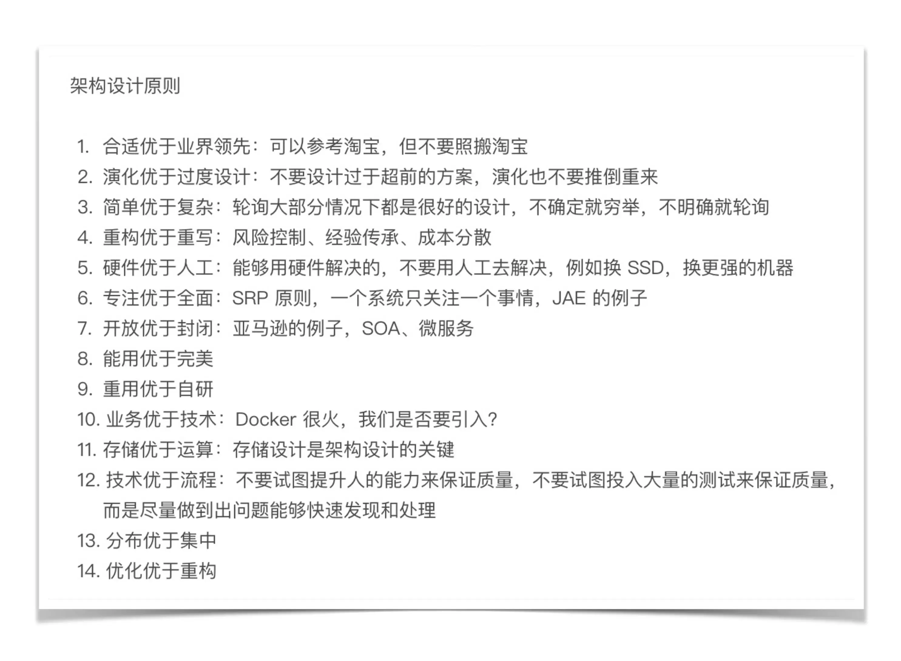

> Shawn：讲讲你总结“架构设计三原则”的过程吧？

华仔：“架构设计三原则”是综合各方面的信息和思考得来的。首先是我自己的经验，包括成功的经验和失败的教训；其次是分析了很多业界的架构演讲和技术发展历史；第三是看了一些关于技术本质的书籍而受到的启发，例如《技术的本质》《系统之美》等。其实最初整理的架构设计原则有 10 多条，但我觉得 10 多条太多了，不聚焦也不利于理解，因此去芜存菁，最终得到了“架构设计三原则”，这三个原则是最重要也是最核心的。

如下是我原来整理的设计原则，可以看到一共有 14 条：

> Shawn：“PPT 架构师”的口头禅是“细节不讨论”，一个优秀的架构师，需要对细节有多少考虑呢？

华仔：这是一个非常好的问题，也是很多同学困惑的问题，我分享一下我的做法，以我学习 Elasticsearch 为例，具体的做法是：

1. 搭建一个单机伪集群，搭建完成后看看安装路径下的文件和目录，看看配置文件有哪些配置项，不同的配置项会有什么样的影响。
2. 执行常用的操作，例如创建索引，插入、删除、查询文档，查看一下各种输出。
3. 研究其**基本原理**，例如索引、分片、副本等，研究的时候要多思考，例如索引应该如何建，分片数量和副本数量对系统有什么影响等。
4. 和其他类似系统对比，例如 Solr、Sphinx，研究其**优点、缺点、适用场景**。
5. 模拟一个案例看看怎么应用。例如，假设我用 Elasticsearch 来存储淘宝的商品信息，我应该如何设计索引和分片。
6. 查看业界使用的案例，思考一下别人为何这么用；看看别人测试的结果，大概了解性能范围。
7. 如果某部分特别有兴趣或者很关键，可能去看源码，例如 Elasticsearch 的选举算法（我目前还没看 ^_^）。
8. 如果确定要引入，会进行性能和可用性测试。

这样一套组合拳下来，基本上能够满足在架构设计时进行选型判断，而且花费的时间也不多。我并不建议拿到一个系统一开始就去读源码，效率太低，而且效果也不好。

> Shawn：谈谈架构师沟通能力的重要性吧？

华仔：架构师是业务和技术之间的桥梁，同时通常情况下还会确定整体项目的步骤。因此，架构师的沟通能力非常重要，既要说得动老板，让老板支持自己的设计决定；又要镇得住技术人员，让技术人员信服自己的设计选择；同时还要能够理解业务，结合业务不同发展阶段设计合适的架构，所以也要参与产品和项目决策。由于架构设计过程中存在很多判断和选择，而且不一定都有明确量化的标准，因此不同的人有不同的看法是普遍情况。这种情况下架构师既需要专业能力过硬，又需要具备良好的沟通技巧，才能促使业务、项目、技术三方达成一致。

当然，**架构师的核心能力还是技术能力，过硬的技术才是良好沟通的基础**，否则单纯靠沟通技巧甚至花言巧语，一次两次可能奏效，但后面被打脸打多了，也就没人信任了。

> Shawn：有同学留言说，给企业做项目，甲方会不顾业务需要，只要是业界流行的技术就要求在项目中采用，这种情况下怎样才能符合“架构设计三原则”？

华仔：首先，业务第一，先把订单签下来，才有后面的架构设计，如果硬要说甲方的要求不合理，不满足“架构设计三原则”，结果订单都拿不到，那是没有意义的。其次，这种情况我把它归为“架构约束”，即这不是架构师能够选择的，而是架构师必须遵守的，因此这里不需要使用“架构设计三原则”来判断。第三，这种情况下，架构师还是可以应用“架构设计三原则”来指导架构设计，比如说客户要求采用 Docker，Docker 的网络模式有 5 种，host 模式使用起来比 bridge 模式简单，那我们就用 host 模式；如果客户再要求需要对 Docker 进行统一管理，那我们是自己研发 Docker 管理平台，还是直接用 Kubernetes 呢？按照简单原则来说，肯定用 Kubernetes 了。

通过这个示例也可以看出，“架构设计三原则”主要是指架构师在选择和判断时采取的指导原则；但如果是架构的基本需求或者约束必须被满足时，架构师此时的选择是采取什么样的方案能够更好的满足这些需求和约束。