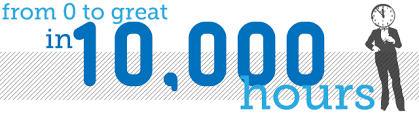
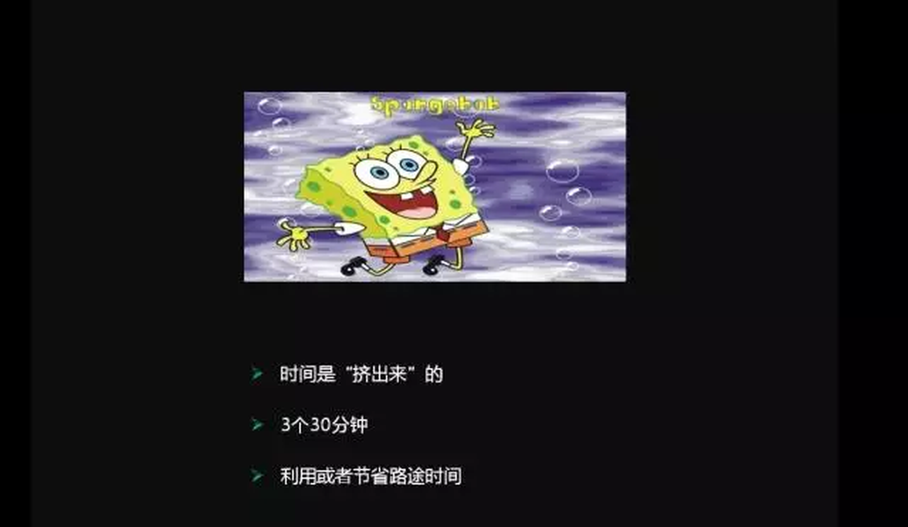

# 吃的草够多，你也能成为大牛

## 一碗有勺子的鸡汤

大家好！我是来自阿里游戏的李运华。今天我的分享主题是《吃的草够多，你也能成为大牛》，这个标题一看就是一个类似于鸡汤文字，确实它是一碗鸡汤，但同时我也会把勺子给大家，所以你们除了能看到这碗鸡汤以外，也能喝到这碗鸡汤。
大家看到我的第一印象是什么？（帅），年轻又帅？

帅的话我算不上，年轻的话，我看起来是比较年轻的，我感觉比刚才马总（马德龙）那张照片还年轻，但是大家不要担心，我工作时间挺长的，大家可以怀疑我的年龄，不用担心我的实力。

我工作已经将近12年了（其实12年才混到这个地步，天资实在是一般），在华为做了5年，在UC做了6年，现在主要负责阿里游戏的中间件和组件的架构设计和实现，包括用户消息推送、系统异步通知系统等等。

同时我还带了三四十人的研发团队，除了工作以外，我也喜欢写博客，是CSDN、云栖的社区之星和博客专家，InfoQ的签约作者。

这几张图是我个人比较喜欢的，上面的是全球运维技术大会，当时受邀去进行了一场高可用架构的演讲，而这张大宝剑的图片是成都的运维日，这都是高效运维组织的技术大会，因为他们觉得我在3月份于深圳讲的不错，所以邀请在成都再讲一次。最右边这张大图是我写的一本书叫《面向对象葵花宝典》。

总体上来说，我现在虽然还算不上业界顶级的大牛，但在公司也算一头小牛了，今天我的分享将综合自己的成长经历给大家谈一谈怎么样成为一个大牛。

我现在还在业界的大牛路上狂奔，但我觉得这些经验和技巧应该是每个同学都可以用到自己的日常工作和生活当中的。

## 一鸣惊人背后是1万小时的不断练习

哪有什么天才

如何成为大牛？这个问题之前有很多人问我：你是怎么成为技术上的一个大牛的？

最开始的时候我也经常跟他们讲你要去看看某某某开发方案，深入学习UNIX的开发等等这些“术”的东西，后来我在思考，是否有成为一种大牛的“道”上面的东西，也就是说不管你做产品、做运营、做运维、程序员还是测试，通过这个方式都能够成为一个大牛呢？

通过寻找和思考，后来真的让我找到了应用到所有行业、所有职业我称之为成为大牛的一个道，这是1万小时理论。

我先简单介绍一下1万小时理论，我最初看到1万小时理论是从《异类》这本书知道的，这是很出名的书，它非常有意思，我建议所有同学都去看一下，它分析了很多成功人士背后一些我们通常情况下不了解或没看到的一些现象，得出一些比较令人震撼的结论，其中有一个理论就是1万小时理论。

它里面有举了一些例子，比如说莫扎特，大家都知道他是音乐神童，6岁就开始作曲了，你看完这本书就知道他真正出人头地是20多岁的时候，也就是说他虽然6岁开始作曲，但他当时作的曲也是比较不好的。

第二个是甲壳虫乐队，他们每天在酒吧里面演出8小时、10小时，演出了几年，后来发行专辑之后才一鸣惊人。

第三个案例叫比尔乔伊，大家可能都知道比尔盖茨，但是不知道比尔乔伊，他是UNIX天才的程序员，从伯克利大学开始，包括他后面的工作，进行了将近1万小时的编程，在80年代能够编1万小时的是凤毛麟角。

**所以《异类》这本书里面提到了1万小时的理论，它对我是很有帮助的，成为世界上顶级的专家唯一的方法就是1万小时持续不断地进行练习，大家要特别注意“唯一”，也就是说绝大部分专业是没有什么天才的，所谓的天才只是他一鸣惊人之后我们才这样觉得，在他成为天才之前至少要经过1万小时持续不断的练习。**

我第一次看到1万小时的理论，觉得没什么神奇的，我算了算，我工作五年就会成为业界顶级的专家了，但想想这是不可能的，为什么呢？我反思了一下我自己的工作状态，对于大部分人来说每天的工作很多时候是重复劳动，虽然我们一天工作8小时，但是只是重复以往的经验，并没有刻意去训练提升自己。

有一个笑话是有一个10年工作经验的人去面试，面试完了之后面试官跟他说其实你只有1年工作经验，你把它重复了9年。

**对于1万小时理论来说如果你深入思考其实它并没有那么简单，这意味着什么呢？意味着你每天要花3小时时间用于提升自己的技能，这样一直做，要持续大约10年时间。**

大家想想每天持续十年去做一件事情去提升自己，有几个能做到，所以我们看到虽然有些人工作了10年，但是也不一定能成为业界的专家。

为什么我要强调每天3小时？持续10年提升自己，你不能把你重复的工作算进去，你要在专业广度和深度上面不断扩展，才能业界一个顶尖的大牛或者专家。

举一个例子，一个小孩子每天唱《两个老虎》，唱10年，你觉得他会成为周杰伦吗？肯定不会。当然1万小时理论不适合一些领域，尤其是不适合炒股，特别是中国的故事，如果你花1万小时去炒股，可能会倾家荡产。

## 如何找到10000小时？

*碎片化时间管理*

1万小时理论听起来好像很简单，每天持续3小时，也不难，但实际上真正做起来是很难的，就像我们互联网的人加班加成狗，感觉身体天天被掏空，时间从哪来，这是一个现实问题，不要说每天抽3个小时提升自己，每天抽1个小时陪女朋友或者找女朋友的时间都不够。

那么到底怎么办呢？接下来我给大家一把勺子，看一下我们的应对之道，就是说我们怎样做到每天持续3小时10年来提升自己。

怎么把时间挤出来？这是海绵宝宝，简单来说**时间就像海绵里的水，挤一挤总会有的**，当然现在也流行另外一种说法，**时间就像美女的胸，挤一挤也总是会有的**。

也就是说我们为了达到1万小时的联系成为一个专家，我们不能指望老板大发善心说你每天上午9点到12点自行学习，下午才工作，也不能说辞掉工作每天坐在家里去持续提升，最有效的方法就是从日常生活中把时间挤出来。

怎么去挤呢？

### 首先是3个30分钟

具体是哪3个30分钟呢？

第一个30分钟就是早上的30分钟，假设你习惯8点起床，明天你把闹钟改成7点半，这就多了半个小时。

第二个30分钟是睡觉前的30分钟，假设你习惯玩游戏到12点，明天晚上你玩游戏就玩到11点半。

第三个30分钟就是上班到你座位上的30分钟，有的同学担心说我这30分钟会不会影响我这一天的工作效率，可能加班完不成，还让我挤出30分钟来，这不用担心，从我的经历来看挤30分钟不会影响你整体的工作效率，持续一两年，你会发现自己的收益非常大。

### 第二点是利用或节省路途时间

我们每天上下班都是一两个小时，比如像我这种，怎么去利用时间呢？

首先是可以利用上下班路上的时间去看书、听书，也是可以做的。如果你觉得上班路上是不能看书的，或者是不可能学习的，比如你坐广州的3号线，这是举世闻名的挤得要命的，不要说看书了，把手伸出去都不知道去哪了，那就建议大家搬到离公司近一点位置，虽然每个月多几百块钱的房租，但是你要相信这个投资节省下来的时间用于提升自己，它最终的收益是10倍回报都不止的。

### 第三点是周末4小时

周末还是不用怎么加班的，周末用于放松、睡觉、看电影、娱乐，你也可以在周末里面规定自己挤出4个小时，也就是每天2个小时，这样算下来，一天大概就两个多小时，再加上你在工作中的积累，每天3小时也不是很难。

接下来讲一下我是怎么做的，我现在有2个小孩，而且我住的比较远，应该在座的比我忙的也不会很多，看一下我是怎么做的，我是坐广州的四号线，坐四号线每天来回可以看一个小时的书，每天早晚30分钟，周末4小时，有的同学可能会有疑问，周末肯定要带小孩玩，自己也要休息，哪里有4个小时，其实只要你去找，时间都会有的，我找的方法就是当我小孩睡觉的时候，因为小孩子睡觉一般要睡三四个小时，大人一般睡一个小时、半个小时就差不多了，所以通过这种方式，大家可以看到2015年我一共看了84本书，有专业的，也有非专业的，人文社科、历史这些都有。

**不过特别提醒一下对于男程序员来说有一个时间千万不能少，就是陪女朋友的时间，因为对程序员来说找女朋友不容易**，别听了我的演讲回去之后女朋友也不要了，就天天回去提升，这也不是我们想要的生活。

## 激情支撑10年不间断的坚持

前面我讲了1万小时理论，也讲了怎么样具体实现，我相信大家听完之后觉得还是比较简单的，只要有毅力执行下去，成为大牛也不难。

为什么我这里还要讲一个最重要的点呢？最重要的难道不是坚持吗？对，但要怎样才能做到坚持呢？

**我的答案是一定要找到你有激情的一份工作或者是你的事业。**

为什么我要特别讲到激情，因为10年的时间其实很难，而且每天3小时，这更难，在这个过程中会遇到挫折，有时候你遇到一个困难，比如你遇到一个问题一周都解决不了，两周都解决不了，别人都在问你怎么还不解决，甚至有人说你是不是能力有问题。

我们在持续的积累和发力过程中有时候也会遇到很多很沮丧的事情，也许你的同事技术很差，但人家2010年在深圳买了一套房，现在一看，什么都没做，就是千万富翁了，你天天每天3小时，拼死拼活，好像还是在付首付，**在这个过程中你会遇到困难，会遇到挫折，你会沮丧，那是什么东西支持我们坚持下去，我觉得只有激情和兴趣**，你对这个事情有没有激情，有没有兴趣，如果没有激情，没有兴趣的话，其实坚持是挺难的。

**怎么判断你对这个事情有没有激情呢？**

**首先一个很理性的指标是，你晚上睡不着觉的时候你会想什么**

比如我晚上睡不着觉的时候，基本上都是在想方案怎么实现，想某某开源系统牛逼在哪里。

**第二是你遇到问题，你会怎么想**

我们在工作中可能会遇到很多问题，如果你没有激情的话，遇到问题就会说哎呀，怎么回事，老是让我遇到这种问题，怎么办呢？哎呀，是不是不合适这份工作，但对于有激情的人来说，遇到问题，越有问题，越兴奋，越激动。我有一个同事遇到了一个很疑难的问题，他花了两周的时间去深入了解和解决，解决完之后他对那个领域的认识是我们整个组最高的。

**第三是大家知道的科比案例**

见过凌晨4点的洛杉矶么？虽然开玩笑说有时候我们早上4点钟还没有下班，但你可以想想自己是否真的有类似的经历，**一大早因为某个事情让你兴奋得连觉都不睡了就开始干了**。这三点是很好地衡量你对这个事情有没有激情的方法。

举一个我自己的例子。我为什么离开华为？

大部分同学听到我从华为离职的第一反应是华为加班太多了，其实我在华为加班并不多，我做了3年左右就提升到华为的系统部了，华为系统部私下里我们叫它养老部，也就是说你只需要分析一下需求，设计一下方案就行了，加班并不是很严重。

我当时为什么决定离开呢？很简单，就是在那边我找不到我做技术的激情。当然华为是一家非常令人钦佩和值得尊敬的公司，但并不意味着这就一定适合每个人，所以我后来在没有找到工作的情况下，我就辞职了，其实我是辞职之后才找到UC的，为什么加入UC，是因为当时的氛围和面试官的聊天，让我找到了激情和热情，而且在UC的这些年，确实也让我感受到了技术的激情，个人的能力也有了质的飞越。

由于演讲的时间比较短，俗话说师傅领进门，更多在个人，需要大家探索，我比较喜欢看书，最后推荐两本书给大家，分别是《异类》和《优秀到不能被忽视》，这是关于技能持续提升的。

---

**Tacey：**技术人员要会做、会说、会写